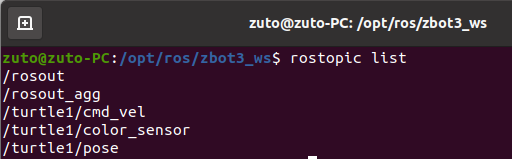
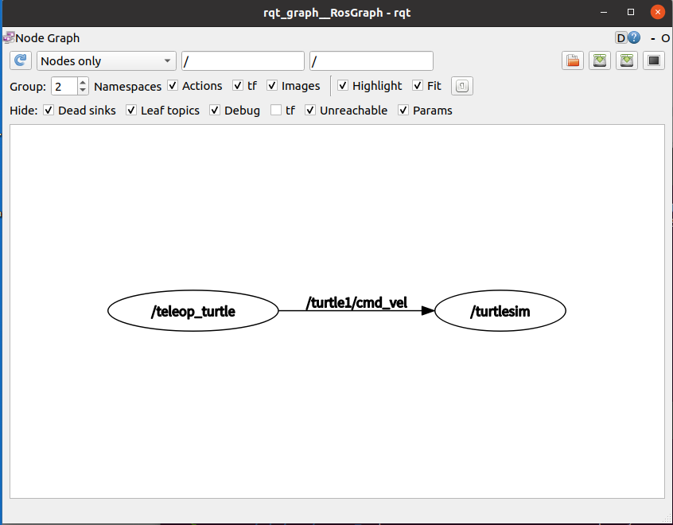
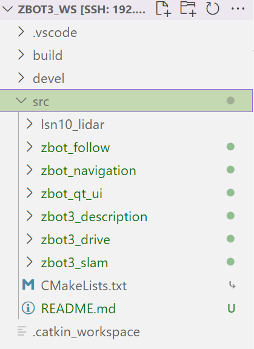
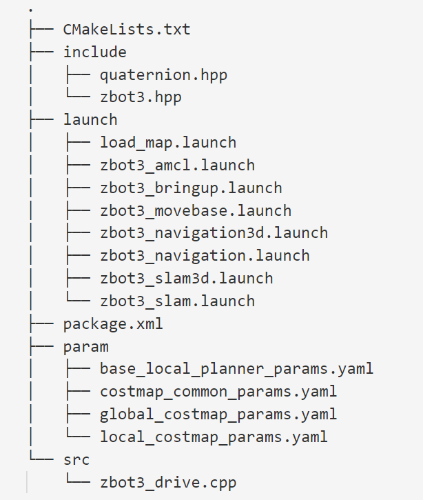

# ROS 极简概念简述

## 序言

本文档主要讲解最基础且最重要有关 ROS 的概念和指令，本文档分成两个部分：第一部分以 ROS 的结构、通信机制展开；第二部分以工作空间的文件结构、内容展开。主要是便于有部分用户可以快速了解 ROS。

ROS 是 Robot Operating System 的缩写，通常称为“机器人操作系统”。但它并不是一个真正的操作系统，而是一个面向机器人的开源的元操作系统（meta-operating system），提供类似传统操作系统的诸多功能：硬件抽象、底层设备控制、常用功能实现、进程间消息传递、程序包管理等。并且提供相关工具和库，用于获取、编译、编辑代码以及在多个计算机之间运行程序完成分布式计算。需要说明的是ROS并不是一个真正独立的操作系统，其自身运行仍需借助Windows或各Linux发行版等常规操作系统。使用ROS开发机器人的优势：

## ROS 的结构和通信机制

### ROS 的结构

ROS 中有一些很重要的基础概念：节点，节点管理器，工作空间，功能包
等，基础概念的理解对后续 ROS 的学习和理解有很大的帮助。

- 节点（node）
在机器人系统中，需要同时实现多个功能，例如我想让机器人实现跟踪射击，
那么可以拆分成，镜头跟踪，调整枪的位置，开枪射击。那么这里就需要三个节
点，每一个节点实现一个功能，每个节点对应功能包中一个可执行文件。
- 节点管理器（master）：
节点通过节点管理器报告注册信息，只有通过节点管理器，节点和节点之间
才能建立起联系。只有通过节点管理器注册，才能实现后续的节点间的通信。
- 工作空间（workspace）：
简单来说工作空间是一个文件夹，用于是存放工程开发的相关文件。类似使
用 Keil 这个 IDE 开发 STM32 时，会有一个工程文件，文件下包含头文件，编译
过程生程的文件，源码等等。关于工作空间的详细结构可以看下文的“2.1 工作
空间”小节。
- 功能包（pkg）：
功能包是放置源码的最小单元，源码（.cpp 文件或者.py 文件）必须放在功
能包里面，功能包的路径一定要在 src 的路径下。除了源码文件，功能包还可以
放置：cpp 的.h 头文件 launch 文件、param 参数文件、map 地图文件等。关于功
能包的详细结构可以看下文的“2.2 功能包”小节。

1 roscore：启动 ROS

```Bash
roscore
```

使用 ROS 的第一件事就是运行 roscore 命令，roscore 启动 master，master
负责 ros 的节点注册，参数服务器，话题通信管理等等。


2 rostopic :ros 话题相关命令

- rostopic list 列出当前话题列表
在运行别的功能之前，我们先使用图 1-2-2 的指令查看当前的话题。可以看
到只有跟随 roscore 一起启动的“/rosout”,“/rosout_agg”两个系统话题

```Bash
rostopic list
```


- rostopic info 查看某一话题的详细信息

```Bash
rostopic info rosout 
```

- rostopic echo 输出某一话题消息内容

```Bash
rostopic echo rosout
```

- rostopic find 根据消息类型查找消息
- rostopic hz 查看某一话题发布频率
- rostopic type 查看某一消息类型

更多相关指令及使用可通过**rostopic -h**查看

3 rosrun：运行 ROS 节点
下面我们新打开一个新的终端，使用如下命令，运行海龟仿真器的节点:

```Bash
rosrun turtlesim turtlesim_node
```

接着我们再新打开一个新的终端，使用图 1-2-4 的命令运行海龟仿真器的键
盘控制节点。

```Bash
rosrun turtlesim turtle_teleop_key
```

这时我们再输入**rostopic list**指令重新查看当前的话题，可以看到对比之前多
了/turtle1/cmd_vel , /turtle1/color_sensor , /turtle1/pose，这三个话题，分别是键盘
控制节点的话题通信，海龟仿真器的颜色话题和海龟的位姿话题.


### 用rqt_graph 工具查看ROS各节点间的关系

保持运行上面的小海龟仿真节点，新开终端，运行如下指令

```Bash
rosrun rqt_graph rqt_graph
```


窗口内显示当前运行的话题，可以看到话题名是/turtle1/cmd_vel，话题的发布者是“/teleop_turtle”，
话题的订阅者是“/turtlesim”。当功能运行的比较多，节点开的比较多的时候，rqt_graph是非常方便的工具方便我们理清节点运行依赖关系。

### ROS的通信机制

通信就是节点与节点间的数据传输与服务请求，ROS中有四种通信方式：**Topic(话题)、Service(服务)、Parameter Serivce(参数服务器)、Actionlib(动作库)**。ROS 通信常用的通信方式包括话题通信和服务请求通信。


上一节的海龟仿真器使用的是话题通信的方式，这里由于篇幅我们只对话题通信的方式进行叙述，实际上话题通信也是更常用的一种。
话题的概念（topic）：节点可以发布消息到话题，也可以从话题订阅消息，
一个节点可以订阅和发布多个话题。
ROS话题通信依赖ROS消息（msg）。每一个消息都是一个严格的数据结构。原来标准的数据类型（整型，浮点型，布尔型等等）都是支持的，同时也支持原始数组类型。消息可以包含任意的嵌套结构和数组（很类似于C语言的结构体）。消息以一种发布/订阅的方式传递。一个节点可以在一个给定的主题中发布消息。一个节点针对某个主题关注与订阅特定类型的数据。可能同时有多个节点发布或者订阅同一个主题的消息。总体上，发布者和订阅者不了解彼此的存在。 虽然基于话题的发布/订阅模型是很灵活的通讯模式，但是它广播式的路径规划对于可以简化节点设计的同步传输模式并不适合。在ROS中，我们称之为一个服务，用一个字符串和一对严格规范的消息定义：一个用于请求，一个用于回应。参数服务器用于方便的跨节点获取一些配置参数。

## ROS 工作空间文件结构

需要注意的是，在下文中出现很多关于文件路径的截图，是使用了一个
“subl”的插件查看文件路径。

### 工作空间
  
ROS 需要在工作空间的环境下运行，工作空间简单来说是一个文件夹，里
面装载了 ROS 的工程项目，其中包括三个文件夹：src、devel、bulid。在工作空
间下的三个文件夹中，src 文件夹是我们重点需要去理解的。其中功能包就是放
在 src 的路径下的.如下图为一个工作空间的目录结构。


- build 目录存放当前工作空间编译过程文件
- devel 存放编译后的生成文件
- src 存放工作空间源代码，里面存放各功能包
  
如下为zbot3_drive 包的目录结构


通常，一个新建的ROS包有**CMakeList.txt package.xml** 两个文件和**src、include、launch**三个目录。

- CMakeList.txt 为c++程序编制配置文件
- package.xml 为ROS包的配置和描述文件
- src目录存放c++ 程序源文件
- include 目录存放c++程序头文件
  
**此外，通常会由开发者新增如下文件夹**
- scripts 存放python程序文件
- lib 存放依赖库文件
- launch 存放批量节点运行配置文件

*这里提一下编译工作空间的指令，使用 C++开发 ROS 需要在工作空间下编译源码生成可执行文件，编译的指令是在工作空间路径下执行*

```Bash
catkin_make
```
