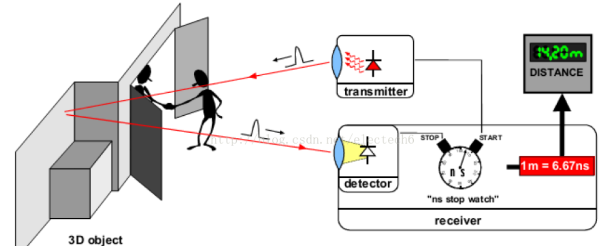
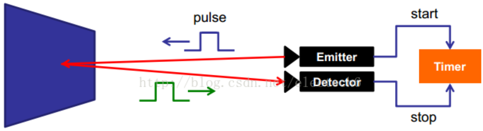
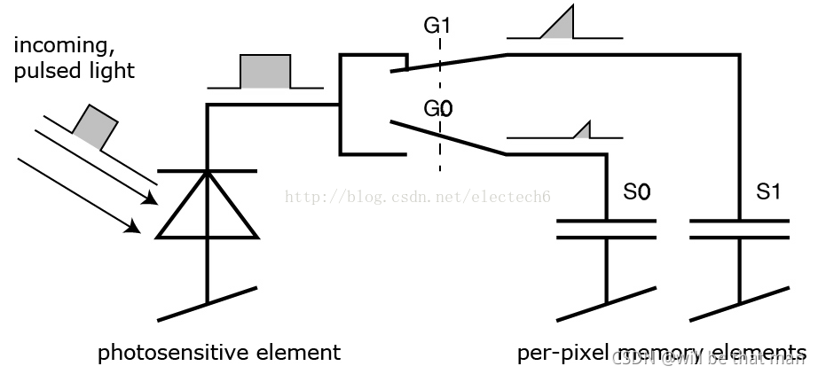
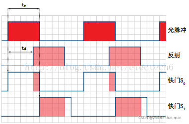
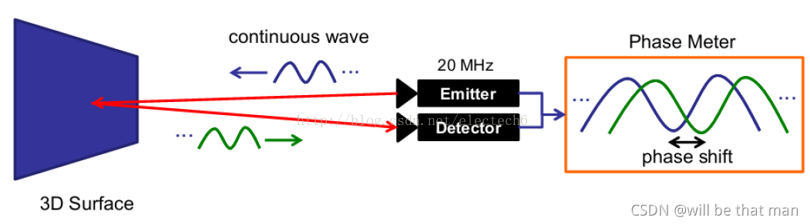
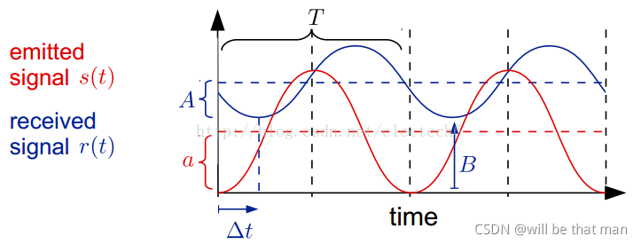
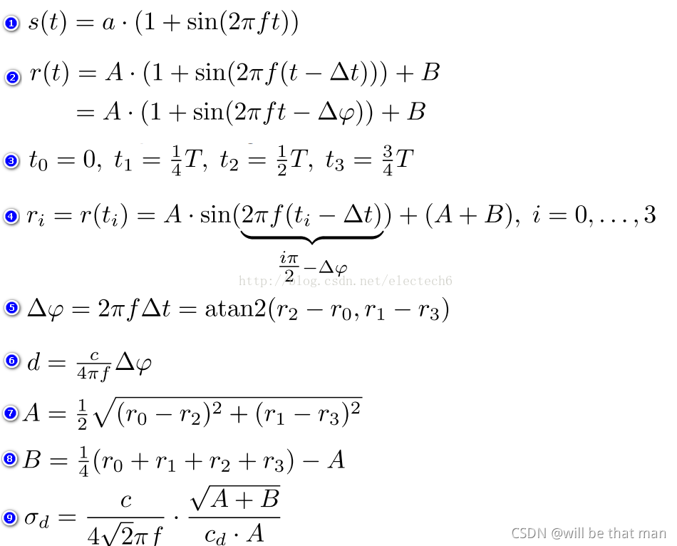

## TOF 激光雷达原理

ToF（Time of flight）是飞行时间法，它是一种深度测量的方法，精度为厘米级。因为其原理简单，小型化，测量距离范围较大，抗干扰能力较强，而得到广泛的应用，比如，微软的Kinect 2.0，Iphone 12手机的ToF相机，无人驾驶都应用到了ToF技术。下面就对ToF的基本原理，优缺点，影响ToF精度的因素这几方面展开描述。

ToF的基本原理是通过连续发射光脉冲（一般为不可见光）到被测物体上，然后接收从物体反射回去的光脉冲，通过探测光脉冲的飞行（往返）时间来计算被测物体离相机的距离。下图是飞行时间法深度测量基本原理示意图。

ToF根据调制方法的不同，可以分为两种：脉冲调制（Pulsed Modulation）和连续波调制（Continuous Wave Modulation）。由于脉冲调制是直接测量飞行时间，因此也称为dToF（直接ToF）（Lidar，也叫激光雷达，就是dToF），连续波调制是通过相位差来计算飞行时间，因此也称为iToF。
### 脉冲调制（dToF）

脉冲调制直接根据脉冲发射和接收的时间差来测算距离。下图是脉冲调制测距的示意图：

脉冲调制方案的照射光源一般采用方波脉冲调制，这是因为它用数字电路来实现相对容易。接收端的每个像素都是由一个感光单元（如光电二极管）组成，它可以将入射光转换为电流，感光单元连接着多个高频转换开关（下图的G0，G1）可以把电流导入不同的可以储存电荷(下图S0，S1)的电容里。

相机上的控制单元打开光源然后再关闭，发出一个光脉冲。在同一时刻，控制单元打开和关闭接收端的电子快门。接收端接收到的电荷S0被存储在感光元件中。

然后，控制单元第二次打开并关闭光源。这次快门打开时间较晚，即在光源被关闭的时间点打开。新接收到的电荷S1也被存储起来。具体过程如下图所示。

因为单个光脉冲的持续时间非常短，此过程会重复几千次，直到达到曝光时间。然后感光传感器中的值会被读出，实际距离可以根据这些值来计算。

记光的速度为c，tp为光脉冲的持续时间， S0表示较早的快门收集的电荷， S1表示延迟的快门收集的电荷，那么距离d可以由如下公式计算：

$$
    d=c/2*tp*(s 1)/(s0+s1)
$$
最小的可测量距离是：在较早的快门期间S0中收集了所有的电荷，而在延迟的快门期间S1没有收集到电荷，即S1 = 0。代入公式会得出最小可测量距离d=0。

最大的可测量的距离是：在S1中收集了所有电荷，而在S0中根本没有收集到电荷。然后，该公式得出d= 0.5 x c × tp。因此最大可测量距离是通过光脉冲宽度来确定的。例如，tp = 50 ns，代入上式，得到最大测量距离d = 7.5m。

- 优点：
  - 测量方法简单，响应较快
  - 由于发射端能量较高，所以一定程度上降低了背景光的干扰

- 缺点：
    - 发射端需要产生高频高强度脉冲，对物理器件性能要求很高
    - 对时间测量精度要求较高
    - 环境散射光对测量结果有一定影响

### 连续波调制（dToF）
实际应用中，通常采用的是正弦波调制。由于接收端和发射端正弦波的相位偏移和物体距离摄像头的距离成正比(见后面推导)，因此可以利用相位偏移来测量距离。下图是连续波调制原理示意图：

其实相移偏移来测量距离相位差的方法与四步相移法的推导基本一样。下图是发射的正弦波和接收的正弦波的示意图：

连续正弦波调制测量方法，具体的推导过程如下。序号1-9对应下图的公式1-9。

假设发射的正弦信号s(t)振幅是a，调制频率是f

经过时延 △t后接收到的信号为接收r(t)，衰减后的振幅为A，强度偏移（由环境光引起）为B

四个采样时间间隔相等，均为T/4

根据上述采样时间可以列出四个方程组

从而可以计算出发射和接收的正弦信号的相位偏移△φ

据此可以根据（6）中公式计算物体和深度相机的距离d

接收信号的衰减后的振幅A的计算结果

接收信号强度偏移B的计算结果，反映了环境光

A, B的值间接的反应了深度的测量精度，深度测量方差可以用公式9近似表示.
