# Zbot3功能使用教程

## Zbot与ROS 基础篇

### Zbot3 的启动与设置

## ROS基础功能讲解

### ROS常用工具与指令

1.**rosnode** -ROS节点管理工具

```bash
rosnode -h #查看rosnode 相关命令与使用方法
```

```bash
rosnode list #查看当前运行节点
```

```bash
rosnode info [节点名] #查看某一节点的相关信息
```

```bash
rosnode ping [节点名] #测试当前PC到 某一节点的连通性和延时
```

```bash
rosnode kill [节点名] #杀死某一节点
```

```bash
rosnode cleanup #清楚不可达节点的注册信息
```

```bash
rosnode mechine [主机hostname] #查看运行在某一机器上的节点列表
```

2.**rostopic** ROS话题管理工具

```bash
rostopic -h #查看rostopic 相关命令与使用方法
```

```bash
rostopic list #查看当前所有话题
```

```bash
rostopic echo [话题名] #实时输出该话题的发布消息内容
```

```bash
rostopic info [话题名] #查看该话题的详细信息
```

```bash
rostopic type [话题名] #查看该话题的类型
```

```bash
rostopic pub [话题名] [话题类型] [需要改的参数以及值] #发布一次话题,可指定参数-r 指定发布频率
```

```bash
rostopic find [话题类型] #根据话题类型查找话题消息
```

```bash
rostopic hz [话题名] #查看某一话题发布频率
```

3.**rosservice** ROS服务管理工具

```bash
rosservice -h #查看rosservice 相关命令及用法
```

```bash
rosservice args [服务名] #查看该服务相关参数
```

```bash
rosservice call [服务名] [参数] #调用该服务
```

```bash
rosservice info [服务名] #查看该服务的详细信息
```

```bash
rosservice list #查看当前所有服务列表
```

```bash
rosservice type [服务名] #查看服务类型
```

```bash
rosservice uri [服务名] #查看该服务的访问地址
```

```bash
rosservice find [服务类型] #根据服务类型查找相关服务
```

4.**rosparam** ROS参数管理工具

```bash
rosparam -h #查看rosparam 相关命令和用法
```

```bash
rosparam list #列出当前所有参数
```

```bash
rosparam set [参数名] [参数值] #设置或更新参数值
```

```bash
rosparam get [参数名] #获取参数当前值
```

```bash
rosparam load [文件名] [命名空间] #从文件中加载参数配置
```

```bash
rosparam dump [文件名] [命名空间] #将该命名空间的参数保存至文件
```

```bash
rosparam delete [参数名] #删除该参数
```

5.**rosmsg** ROS消息管理工具

```bash
rosmsg -h #查看rosmsg 相关命令和用法
```

```bash
rosmsg list #列出当前所有消息
```

```bash
rosmsg show [消息名] #查看关于该消息的描述
```

```bash
rosmsg info [消息名] #查看关于该消息的相关信息
```

```bash
rosmsg package [ros包名] #查看该ROS包下所有的消息
```

```bash
rosmsg packages #列出所有包含消息的ros包
```

6.**roscore** 运行ROS主节点，主节点负责其他节点的注册于管理

```bash
roscore
```

7.**rosrun** 运行ros节点

```bash
rosrun [ros包名] [ros节点名]
```

8.**roslaunch** 批量运行ros节点,当master节点未运行时，会自动开启一个master节点。

```bash
roslaunch [ros包名] [launch配置文件]
```

9.**rqt** 工具
一款用Qt制作的ROS 界面管理工具，里面包含许多方便好用的功能,包括但不限于动态参数调试、ros TF图查看 ros 节点关系图查看 ros 日志管理工具等。

```bash
rqt
```

10.**rqt_graph**  rqt中的节点关系图查看工具

```bash
rosrun rqt_graph rqt_graph
```

11.**rqt_tf_tree** rqt中的TF树（坐标变换树状图）查看工具

```bash
rosrun rqt_tf_tree rqt_tf_tree
```

12.rqt_image_view rqt中的图像话题查看工具

```bash
rosrun rqt_image_view rqt_image_view
```

*以上命令与工具是ROS开发与使用过程中经常用到的工具，学会使用会对ROS的学习与理解有非常大的帮助。上面只是快速介绍了相关工具和命令。详细使用在接下来的具体过程中说明。*

## 用键盘控制Zbot3小车移动

本节学习通过运行ROS相关节点实现用键盘控制zbot小车的移动功能。

- 前提条件 ：
  - 了解rosrun 和roslaunch命令
  - 了解ROS各节点与master 节点间的管理关系

- 操作步骤：
  
   1.通过ssh 或vncviwer 远程连接到Zbot3小车（可选）

        由于该步骤没有运行界面程序，故无需用到vncviewer。 教程以ssh 远程连接为例。

   2.连接后在终端中运行roscore 启动master节点

   ```bash
        roscore
   ```

   

   3.新开远程连接终端运行Zbot3 驱动节点

   ```bash
      rosrun zbot3_drive zbot3_drive_node
   ```

   4.新开远程连接终端运行通用键盘控制节点

   ```bash
      rosrun teleop_twist_keyboard teleop_twist_keyboard.py
   ```

   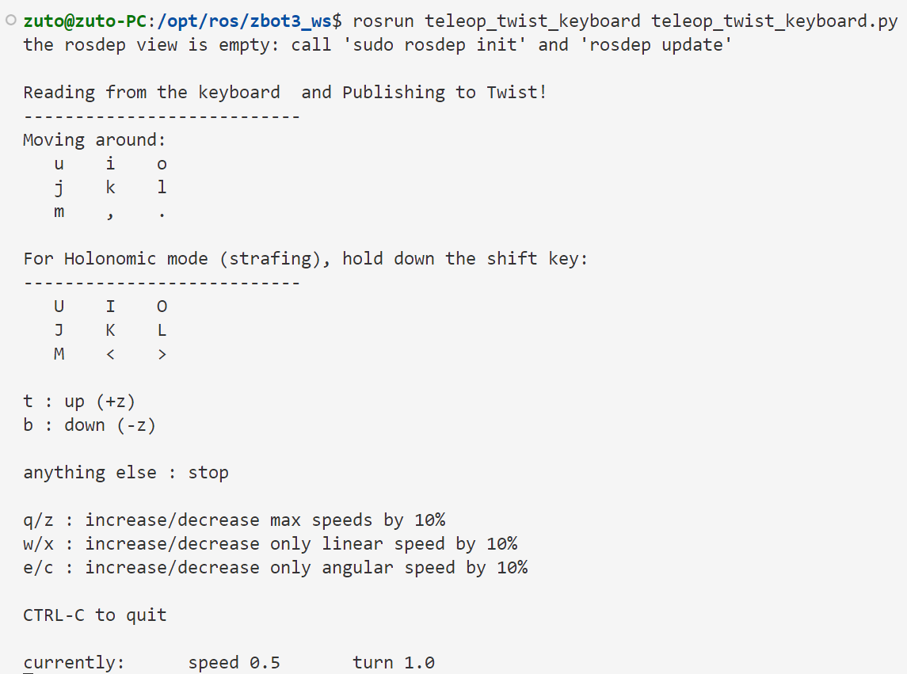
    可以看到开启键盘控制节点后，终端输出了按键控制说明帮助信息，依据帮助信息往开启键盘控制节点的终端中敲入响应字母控制小车移动。

现在，我们来关注一下zbot3 小车的运行原理。

zbot3小车控制原理简述：Zbot3 小车中包含一块控制板和一块驱动板。其中，控制板用来通过Ubuntu跑ROS系统，我们借助控制板实现zbot3小车的控制节点。驱动板顾名思义用来驱动我们的小车，包括带动电机转动，解码传感器数据，主要为陀螺仪传感器实时采集的小车运动状态数据和电池电压信息。当小车驱动板收到来自控制板发出的运动指令后，会根据包含的速度控制值解算为各个轮子对应的目标转速，再控制电机达到相应的转速。驱动板与控制板间的通信经由串口实现。

在上述实验中，我们开启了两个节点，一个是zbot3小车的驱动控制节点，位与zbot3_drive包中的zbot3_drive_node 节点，由c++编写：该节点主要实现如下功能：1. 接收其他节点发布的**/cmd_vel** 速度控制话题（话题类型为ROS中标准的速度控制话题类型**geometry_msg::Twist**）并通过串口发送到驱动板；2. 接收由驱动板发出的陀螺仪传感器数据并根据传感器数据发布ROS 机器人里程计话题 **/odom_raw**和惯导传感器话题 **/imu**。另一个开启的节点是ROS中的键盘控制功能节点，位于teleop_twist_keyboard 包中的teleop_twist_keyboard节点。该节点由python编写，直接运行的python脚本文件。该节点的功能为监测用户输入的按键值，并依据按键值修改geometry_msg::Twist 类型的消息中的速度值并发布出去，话题名为 **/cmd_vel**.

保持上述节点运行。为了更直观的看清以上运行逻辑，我们借助rqt_graph工具查看下节点关系。因为rqt_graph 需要UI显示，我们首先通过vnc连接zbot3。（当然你也可以给zbot3接上键鼠直接在zbot3上运行）.为了方便，我们开启VNC连接。zbot3上运行

```bash
vncserver -geometry 1920x1080 -localhost no :1
```

然后在自己的电脑上用vncviewer 访问远程桌面，然后，在远程桌面中启动终端，运行如下命令

```bash
    rosrun rqt_graph rqt_graph
```

我们可以看到如下节点关系图,图中，teleop_twist_keyboard 节点发出/cmd_vel话题到zbot3_drive_node。由于控制板与驱动板间的串口通信不属于ROS系统的一部分，故不会在图中显示。


## 查看Zbot小车发布的话题

新开终端，我们通过rostopic list 查看下当前所有话题。

```bash
    rostopic list 
```

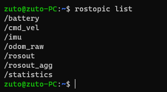
可以看到其中有上面提到的 **/cmd_vel**, **/imu**, **/odom_raw**。我们通过rostopic echo 指令查看下/cmd_vel的消息内容。

```bash
rostopic echo cmd_vel
```

运行上述指令后，在运行键盘控制节点的终端中尝试控制小车，然后回到当前终端，查看消息内容。其中，linear标示线速度，angular 表示角速度，x,y,z代表相对zbot3小车的方向，x朝前，y朝左，z朝上。


 *请按上述方法自行查看并理解 /odom_raw，/imu话题内容。下面给出参考链接*

相关参考：

- [Odometry](http://wiki.ros.org/navigation/Tutorials/RobotSetup/Odom#The_nav_msgs.2FOdometry_Message)
- [Imu](http://docs.ros.org/en/noetic/api/sensor_msgs/html/msg/Imu.html)
  
## 理解launch文件

前面我们提到过可以通过roslaunch指令可以一次启动多个节点，现在，我们尝试通过roslaunch运行上述用键盘控制zbot3运动的功能。

ROS中的许多配置文件均为xml格式的。xml为类似网页文件html的标签配置语言。通过标签来指定内容和属性。标签由符号<>包裹，分为开始标签<标签>和结束标签</标签>。在标签中完成各项属性配置。更多关于xml文件参考[xml文件](https://baike.baidu.com/item/%E5%8F%AF%E6%89%A9%E5%B1%95%E6%A0%87%E8%AE%B0%E8%AF%AD%E8%A8%80/2885849?fromtitle=xml&fromid=86251&fr=aladdin)
对于xml无需学习，只需简单了解即可。

现在，我们来写一个launch文件来运行上述两个节点。

为了方便开发，我们用VSCode连接zbot3。参考[快速搭建ROS开发环境中的VSCode安装与配置](./%E5%BF%AB%E9%80%9F%E6%90%AD%E5%BB%BAROS%E5%BC%80%E5%8F%91%E7%8E%AF%E5%A2%83.md)。

在 VScode 中打开zbot3 Ubuntu中的 zbot3_ws 工作空间，路径 /opt/ros/zbot3_ws，并找到zbot3_drive包中launch目录。鼠标选中该目录，右键->新建文件 在该目录中新建zbot3_keycontrol.launch文件。然后输入以下内容：

```xml
<launch>
    <node pkg="zbot3_drive" name="zbot3_drive" type="zbot3_drive_node" output="screen" respawn="true"/>
    <node pkg="teleop_twist_keyboard" name="teleop_twist_keyboard" type="teleop_twist_keyboard.py"/>
</launch>
```

查看文件内容，不难看出，launch内容文件由标签"<launch></launch>"包括，里面是两个节点启动配置的子标签。格式如下：

```xml
<node pkg=[节点所在ROS包名],name=[运行时的节点名称]" type=[节点文件], output=[日志输出位置] ,respawn=["true"/"false"]>
```

其中，pkg,name,type是必须指定的，respawn=True设置该节点为必须节点，确保在意外停止运行后自动重新恢复该节点运行。保存该文件，
然后在终端中运行如下指令（先关闭前面运行的这两个节点）

```bash
roslaunch zbot3_drive zbot3_keycontrol.launch
```

运行后在终端中敲击按键控制小车移动。可以发现实现了同样的效果。今后运行该功能只需通过roslaunch命令启动该文件即可。

有关roslaunch文件及roslaunch指令更进一步的学习，参考下面连接:

- [roslaunch](http://wiki.ros.org/roslaunch/Commandline%20Tools)
- [launch文件格式](http://wiki.ros.org/roslaunch/XML)

现在，请尝试理解 zbot3_drive/launch 目录下的其他launch文件。

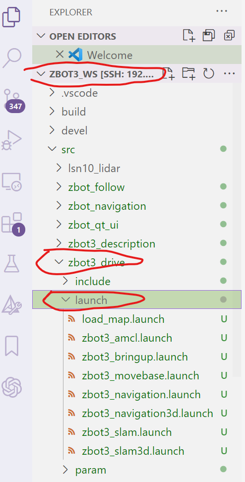

## Zbot3 通过雷达SLAM 建图

### [TOF激光雷达测距原理](./TOF%20%E6%BF%80%E5%85%89%E9%9B%B7%E8%BE%BE.md)

### SLAM建图原理

参考资料中 **ROS SLAM建图原理与算法**

ROS 开源社区汇集了多种 SLAM 算法，我们都可以直接使用或者对其进行二
次开发，gmapping 是基于滤波 SLAM 框架的常用开源 SLAM 算法，也是目前最为
常用和成熟的功能包。除了 gmapping 算法建图之外，我们也提供了 hector 和
karto 的建图算法。
gmapping 可以实时构建室内地图，在构建小场景地图所需的计算量较小且
精度较高。相比 hector SLAM 对激光雷达频率要求低、鲁棒性高，Hector 在机
器人快速转向时很容易发生错误匹配，建出的地图发生错位，原因主要是优化算
法容易陷入局部最小值。而相比 cartographer 在构建小场景地图时，gmapping
不需要太多的粒子并且没有回环检测因此计算量小于 cartographer 而精度并没
有差太多。gmapping 有效利用了车轮里程计信息，这也是 gmapping 对激光雷达
频率要求低的原因：里程计可以提供机器人的位姿先验。karto 建图算法与
gmapping 原理相同，都是主要依赖里程计信息来完成建图。
相对于以上的两种建图算法，hector 和 cartographer 的设计初衷不是为了
解决平面移动机器人定位和建图，hector 主要用于救灾等地面不平坦的情况，
因此无法使用里程计。而 cartographer 是用于手持激光雷达完成 SLAM 过程，也
就是说可以完全不需要里程计的信息。

### Zbot3 自身运动状态信息的发布

在zbot3_drive_node 节点中，我们已经实现了将ROS速度消息发送到驱动板，并接受驱动板反馈的传感器数据来发布 **/odom_raw** 里程计话题和 **/imu**惯导传感器话题。感兴趣的可在 /opt/ros/zbot3_ws/src/zbot3_drive/include/zbot3.hpp文件中查看源代码学习。这里不做过多讲解。我们的驱动节点通过发布这两个话题即可实时将zbot3小车的位姿信息和运动状态信息发送给其他订阅相应话题的节点。

### 机器人TF坐标变换解析

机器人系统通常具有随时间变化的许多 3D 坐标系，例如世界坐标系，基础
坐标系等。tf 随时间跟踪所有这些框架，是处理机器人不同坐标系的一个包，
机器人不同部位和世界的坐标系以 tree structure 的形式存储起来，tf 可以使
任何两个坐标系之间的点、向量相互转化。
对于从单片机控制转到 ROS 上的读者，ROS 自带的 tf 可以大大加深其对机
器人的理解。为了方便理解 tf 坐标变换，我们需要借助 rqt 工具，下面我们执
行如下指令可以查看TF树。

```bash
    rosrun rqt_tf_tree rqt_tf_tree
```

如下图为运行gmapping建图时的TF树


### 创建小车机器人模型

在进行建图前，我们有必要先建立小车的机器人模型。这样我们就不必写过多的坐标变换。在ROS中，我们可以设定不同的坐标系，这在ROS建图与导航中是经常用到的。通过指定不同坐标的的相对空间位置关系，我们可以很容易获得该坐标系空间某一点在其他坐标系下的空间位置。举个例子：在建图时，雷达通过扫描周围空间可以得到障碍物相对雷达中心的位置关系。但我们的雷达并没有处在zbot3小车中心，我们就需要发布雷达中心到zbot3小车中心的TF变换才能在建图时准确求得地图上每一点相对小车的准确位置。

在上图所展示的坐标变换关系中。robot_pose_ekf 是
ROS 官方提供功能包，/odom 是 IMU、里程计融合得
到的里程计坐标系。base_link 与机器人中心重合，
坐标系原点可以是机器人的旋转中心,base_footprint 坐标系原点为 base_link
原点在地面的投影，两者有一点区别 ， z值有时候不一 样。可以看到odom_combined->base_footprint 的 tf 变换是由 robot_pose_ekf 广播的，也就是说里程计位置的偏差是通过 ekf（拓展卡尔曼滤波）得到的。

我们可以通过在launch文件中添加tf节点发布两个坐标系的位置关系。如下示例

```xml
<launch>
    <!--其他节点-->
    ...
    ...
    <!--tf坐标变换-->
    <node pkg="tf2_ros" type="static_transform_publisher" name="static_tf_publisher" args="1 0 0 0 0 0 parent_frame child_frame"/> 
</launch>
```

上述launch文件中通过static_transform_publisher 节点发布了子坐标系 **child_frame** 到 父坐标系 **parent_frame** 的坐标变换。args参数依次制定了 x,y,z方向的偏差和raw,pitch,yaw 三个角度。

当坐标系多的时候，这样子就不太方便管理，且随着功能日趋复杂，launch文件包括launch文件的情况时，就会容易出错。为了解决这个问题，我们先创建创建机器人模型描述文件。

zbot3的机器人模型描述文件在 **/opt/ros/zbot3_ws/src/zbot3_description/urdf/**目录中。可以自行打开查看。**xacro文件核心包含两部分：一部分是link标签**。如下所示zbot3的base_link关节。 其中geometry 指定形状，对于复杂形体，我们可以将其拆分简化成简单几何体的组合。origin指定空间坐标位置和朝向。x,y,z为相对自身位置在前方、左方、上方的偏移。r,p,y代表roll,pitch,yaw 三个角度，分别为绕x,y,z三个方向的旋转，单位为弧度。 material指定材质，我们只指定颜色方便我们区分zbot3小车各部分。

```bash
    <link name="base_link">
      <visual>
        <geometry>
          <box size="${car_length} ${car_width} ${car_height}" />
        </geometry>
        <origin xyz="0 0 0" rpy="0 0 0" />
        <material name="yellow">
          <color rgba="0.5 0.3 0 1" />
        </material>
      </visual>
    </link>
    <link name="leftfront_wheel">
        <visual>
            <geometry>
                <cylinder radius="${wheel_radius}" length="${wheel_width}" />
            </geometry>
            <origin xyz="0 0 0" rpy="-1.57 0 0" />
            <material name="left_w">
                <color rgba="0 0 0 1" />
            </material>
        </visual>
    </link>
```

**另一部分是joint（关节）标签，指定两个坐标系间的位置关联。** 如下所示为leftfront_wheel相对base_link的空间关系，即zbot3小车左前轮相对zbot3小车中心的空间位置关系。

```xml
<joint name="lfwheel2baselink" type="continuous">
        <parent link="base_link" />
        <child link="leftfront_wheel"/>
        <origin xyz="${car_length/2-wheel_radius} ${car_width/2+wheel_width/2} ${-wheel_radius}" />
        <axis xyz="0  1  0" />
    </joint>
```

在xacro文件中，我们可以将常用的数值设置为属性值。如下所示我们通过xcaro:property 标签指定双目相机的长，宽，高。然后在需要的地方使用它们。

```xml
<xacro:property name="camera_length" value="0.04" /> 
    <xacro:property name="camera_width" value="0.16485" />
    <xacro:property name="camera_height" value="0.03" />
    ...
    ...
    <link name="camera">
        <visual>
            <geometry>
                <box size="${camera_length} ${camera_width} ${camera_height}"/>
            </geometry>
            <origin xyz="0 0 0" rpy="0 0 0" />
            <material name="black">
                <color rgba="0 0 0 0.8" />
            </material>
        </visual>
    </link>
```

查看 **/opt/ros/zbot3_ws/src/zbot3_description/urdf/** 文件夹可以发现zbot3小车相机，雷达，小车本体分别自己的urdf模型文件，这样分别写可以方便管理。准备完小车模型文件后，我们在launch文件中 借助 **joint_state_publisher** 和 **robot_state_publisher** 节点根据我们的机器人模型统一描述文件实时发送各部分的相对位置关系。

### 查看我们的机器人模型

在zbot3端或借助VNC,我们启动zbot3_model.launch。

```bash
     roslaunch zbot3_description zbot3_model.launch
```

然后借助rviz工具查看机器人人模型。新开终端运行rviz。

```bash
    rviz
```

在左下角点击add,找到RobotModel,点击完成添加。可以在主窗口中看到我们的简易机器人模型。

现在，可以把 **zbot3_model.launch** 文件放入到 **zbot3_bringup.launch** 中作为小车的一部分。

### SLAM建图算法

gmapping 可以实时构建室内地图，在构建小场景地图所需的计算量较小且
精度较高。相比 hector SLAM 对激光雷达频率要求低、鲁棒性高，Hector 在机
器人快速转向时很容易发生错误匹配，建出的地图发生错位，原因主要是优化算
法容易陷入局部最小值。而相比 cartographer 在构建小场景地图时，gmapping
不需要太多的粒子并且没有回环检测因此计算量小于 cartographer 而精度并没
有差太多。gmapping 有效利用了车轮里程计信息，这也是 gmapping 对激光雷达
频率要求低的原因：里程计可以提供机器人的位姿先验。karto 建图算法与
gmapping 原理相同，都是主要依赖里程计信息来完成建图。
相对于以上的两种建图算法，hector 和 cartographer 的设计初衷不是为了
解决平面移动机器人定位和建图，hector 主要用于救灾等地面不平坦的情况，
因此无法使用里程计。而 cartographer 是用于手持激光雷达完成 SLAM 过程，也
就是说可以完全不需要里程计的信息。

在运行建图节点之前我们先打开建图节点的 launch 文件查看里面的内容，文件名为 **zbot3_slam.launch**,可以看到支持建图的方式选择，默认是使用 gmapping 方式建图，也可以自定义修改成使用 karto 和 hector 方式建图。在运行时可以指定**slamMethod** 参数切换其他建图算法。

gmapping建图作为最广泛使用的建图算法，网上和官网有着大堆的参考资料。这里不作过多介绍。想做进一步了解的可参考如下链接：
[Gmapping 漫谈](https://zhuanlan.zhihu.com/p/57566566)

我们直接讲运行gmapping建图。在zbot3_drive中**zbot3_slam.launch**已经完成了zbot3建图的通用配置文件。其运行工作主要包含

- 启动小车驱动
- 开启激光雷达
- 启动对应的SLAM算法

在终端中我们运行gmapping建图并打开rviz。

```bash
    roslaunch zbot3_drive zbot3_slam.launch slamMethod:=gmapping openRviz:=true
```

在Rviz中，我们添加RobotModel，Map ,并指定固定帧 **fixed_frame** 为map。
然后，以合适的速度控制小车移动，使得雷达扫过小车周围空间。完成建图。
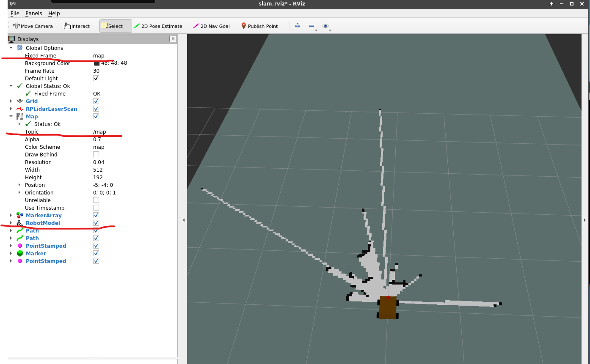

### 保存SLAM建图

保持上述节点运行，通过**map_sever** 节点保存地图到指定目录。这里以 zbot3_drive/maps/ 路径为例，保存的地图文件名为 default。

```bash
rosrun map_server map_saver -f /opt/ros/zbot3_ws/src/zbot3_drive/maps/default
```

### 查看SLAM建图

现在，我们可以转到 maps文件夹，查看保存到此处的地图文件。可以看到里面有两个文件，分别为地图的图像文件和地图的配置文件。图像文件可以用图片查看器打开。配置文件包含了地图的配置信息，如分辨率，地图大小等。

现在，请尝试切换不同的建图方法，并比较他们的建图效果。

### Gmapping 配置文件一览

针对每种不同的SLAM建图方法，都有对应的配置文件。合理的参数配置能提高建图效果。现在，以Gmapping建图方法为例，我们查看其配置文件。在 **zbot3_slam**包中，打开slam_gmapping.launch, 在gmapping 节点下，我们可以看到具体配置内容。
以下作简单说明：

```xml
    base_frame: 指定机器人基础坐标系，通常为base_link或base_footprint
    odom_frame:里程计坐标系
    map_frame:地图坐标系
    maxUrange: 激光有效照射范围
    maxRange:激光最大照射范围
    delta:地图分辨率
    particles: 粒子数
    minimumScore:最小匹配得分，决定激光数据匹配置信度
    linearUpdate:机器人移动该距离，进行一次扫描匹配
    angularUpdate:机器人旋转angularUpdate,进行一次扫描匹配
    lskip：跳过的扫描光束数，尽可能为0
    lstep：平移优化步长
    astep：旋转优化步长
```

有关gmapping更详细的配置说明，参考：[gmapping roswiki](http://wiki.ros.org/gmapping#External_Documentation)

### 切换建图算法

在运行gmapping时，启动zbot3_slam.launch的时候，想必你已经发现可以通过slamMethod参数 指定建图方法。现在，请分别指定slamMethod 为hector,carto。

**注意:各建图方法都需要依赖对应的功能包，如gmapping 依赖 ros-{distro}-slam-gmapping，。请确保已经安装。**

### 使用Google Cartographer 建图

Cartographer是Google推出的一套基于图优化的激光SLAM算法，它同时支持2D和3D激光SLAM，可以跨平台使用，支持Laser、IMU、Odemetry、GPS等多种传感器配置。该算法可以实现实时定位和建图。Cartographer建立的栅格地图可以达到5cm的精度，该算法广泛应用于服务机器人、扫地机器人、仓储机器人、自动驾驶等领域，是最优秀的激光SLAM框架之一。


Cartographer 建图在各平台和各Ubuntu版本配置较为复杂，且需要自行解决部分动态链接库依赖问题。难以有通用的配置教程。但Google 官方还是给出了在ROS中使用Cartographer的通用指导。有关Cartographer的原理和配置请参考

- 
  
- 

Cartographer 建图方法有着较高精度的建图分辨率，甚至对精度要求不高的场合可以进行手持建图。如下启动Cartographer ROS建图：

```bash
roslaunch zbot3_drive zbot3_slam.launch slamMethod:=cartographer
```

下图为Cartographer建图启动后Rviz中显示的状态。用键盘控制小车移动，雷达扫过的建图区域地图会逐渐加深。具体表现为空白区域呈现白色，障碍物区域呈现黑色。


Cartographer ROS 作为Cartographer在ROS上的移植，其默认数据保存方式为通过rosbag 文件将建图过程中的各传感器数据写入rosbag文件。这使我们难以在导航中使用这些数据。但我们仍可以在建图过程中通过mapserver 节点保存地图。此外，zbot也提供了Cartographer 默认的传感器数据写入文件的方法。如下

```bash
roslaunch zbot3_drive zbot3_cartographer_savemap.launch
```

## Zbot3 导航

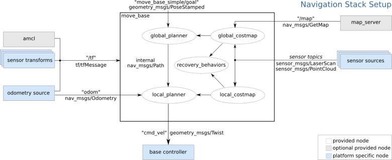

机器人导航的关键是实现自身定位和路径规划。在实现自主导航之前，我们需要配置如下两个包，实现机器人在导航过程中的定位和路径规划。此处需要确保已安装功能包 ros-noetic-navigation。

- **move_base** 功能包整合了导航的全局路径规划、局部路径规划以及恢复行为模块。
- **amcl** 自适应蒙特卡洛定位法，实现机器人在2维空间中的定位。
  
为了实现机器人全局最优路径规划与实时避障路径规划，move_base需要订阅机器人发布的深度传感器信息（sensor_msgs/LaserScan或 sensor_msgs/PointCloud）和里程计信息（nav_msgs/Odometry），同时完整的TF坐标变换也是实现路径规划的重要基础。

导航框架最终的输出是控制机器人的速度指令（geometry_msgs/Twist），这就要求机器人控制节点具备解析控制指令中线速度、角速度的能力，并且控制机器人完成相应的运动。

### 配置movebase

 move_base 是一个开源 2D 移动机器人导航包，用于将机器人在指定的导航框架内运动到任务位置。 move_base 包执行一个完成给定导航任务的ROS行为，基于全局地图的路径规划是在机器人向下一个目的地出发前开始的，这个过程会考虑到已知的障碍物和被标记成“未知"的区域。要使机器人实际执行动作行为，本地路径规划器会监听传回来的传感器数据，并选择合适的线速度和角速度来让机器人完整地执行完全局路径规划上的当前段路径。

 movebase路径规划包括全局路径规划和局部路径规划。全局路径规划常用Dijkstra算法和A*算法。Dijkstra算法深度优先，往往可以找到全局最优路径，不过搜索时间长、消耗资源多，而A*算法加入了启发函数，虽然不一定可以找到全局最优路径，但搜索时间更快，适合大空间范围的规划。移动机器人大部分是在室内有限范围内使用，两者搜索时间和消耗资源的差距并不明显。

 本地实时规划常用Dynamic Window Approaches（DWA）和Time Elastic Band（TEB）算法，两种算法的核心思想如下。

 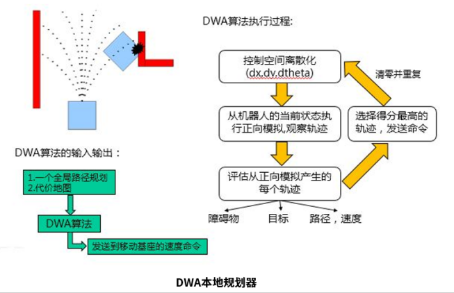
 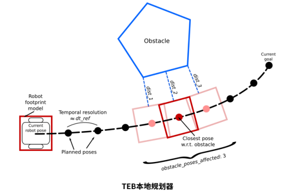

 move_base导航使用两种代价地图存储周围环境中的障碍信息：一种用于全局路径规划（global_costmap），一种用于本地实时路径规划（local_costmap）。两种代价地图需要使用一些共用的或独立的配置文件：通用配置文件（costmap_common_params）、全局规划配置文件（global_costmap_params）和本地规划配置文件（local_costmap_params）。

 有关movebase的参数配置，见 **zbot3_drive/params/** 文件夹下几个文件。

- base_local_planner_params.yaml 配置局部路径规划器的相关参数
- global_planner_params.yaml 配置全局路径规划器的相关参数
- costmap_common_params.yaml 全局代价地图和局部代价地图共有参数
- local_costmap_params.yaml 局部代价地图参数
- global_costmap_params.yaml 全局代价地图参数

在这几个文件中，一些关键参数在后面都做了说明，可自行打开查看，此处不再过多赘述。

 **给定导航目标**
 使用MoveBaseActionGoal消息类型来指定目标，目标由一个包含一个frame_id的ROS标准header、一个goal_id和一个PoseStamped消息类型的goal组成。其中，PoseStamped消息类型是由一个header和一个包含position和orintation的pose组成。

### 配置amcl

导航功能的顺利进行，离不开机器人的精准定位。自主定位即机器人在任意状态下都可以推算出自己在地图中所处的位置。ROS为开发者提供了一种自适蒙特卡罗定位方法（Adaptive Monte Carlo Localization，amcl），这是一种概率统计方法，针对已有地图使用粒子滤波器跟踪一个机器人的姿态。

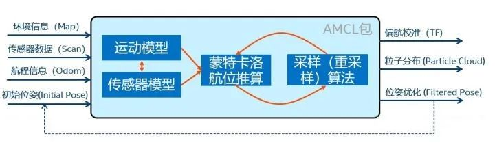

给定初始位姿后，AMCL会在机器人周围随机撒一些粒子，随着机器人的运动，每个粒子也会实时跟随机器人的速度更新位姿，当粒子周边的环境状态与机器人差距较大时，就会被逐渐淘汰，反之，则会在机器人周边产生更多粒子。以此类推，粒子都集中在机器人所在位置可能性高的地方，也就是定位的结果。

### 使用map_server 加载地图

导航时需要我们加载我们前面已经建图生成的地图文件，并将zbot3小车放到对应的现实场景中。加载地图文件可以用如下命令：

```bash
    rosrun map_server map_server -f /[path]/[map_name].yaml
```

### 运行zbot3 导航

为了方便启动，zbot3的整个导航启动配置都写在了zbot3_drive 包 **zbot3_navigation.launch**文件中。经过前面的学习，相信现在你已经能够轻松的理解该文件的内容。我们直接运行即可。

```bash
    roslaunch zbot3_drive zbot3_navigation.launch
```

在打开的rviz中，我们添加RobotModel，Map插件，让插件订阅**/map**话题。
不出意外，地图和小车模型都已出现在了rviz窗口中。在线，借助姿态评估工具**pose estimate** 手动在rviz中指定小车在场景中的初始位置。然后，利用 导航工具在rviz中指定目标点和目标位姿，观察小车已开启向着目标点移动过去。

有关movebase的参数配置远不止这些。更多参数及其说明，可以在运行movebase节点后，通过rqt动态调参进行查看。后续其余节点的详细参数配置也可以借助此工具。
  
使用此工具前，我们得先运行需要调参或查看参数的节点。此处以movebase为例。

```bash
    roslaunch zbot3_drive zbot3_movebase.launch
```

然后，在vnc中，打开rqt gui工具

```bash
    rosrun rqt_gui rqt_gui
```

在菜单栏中，逐级找到plugins(插件)->Configurations(配置)->动态调参(Dynamic Reconfigure)
在左侧列表中选择对应项，右侧即可看到各种可配置参数。将鼠标放置在对应参数上稍作停留，会有关于该参数的说明。


### 实现多点往复导航

rviz上有一系列工具，如下图。按照前面教程，通过位姿评估工具校正小车在地图上的初始位置。不同于单目标导航，这次我们用发布导航点工具（publish point）在地图上分开点击几个位置，然后右键点击，可以看到小车开始依次往点击的对应位置移动过去。

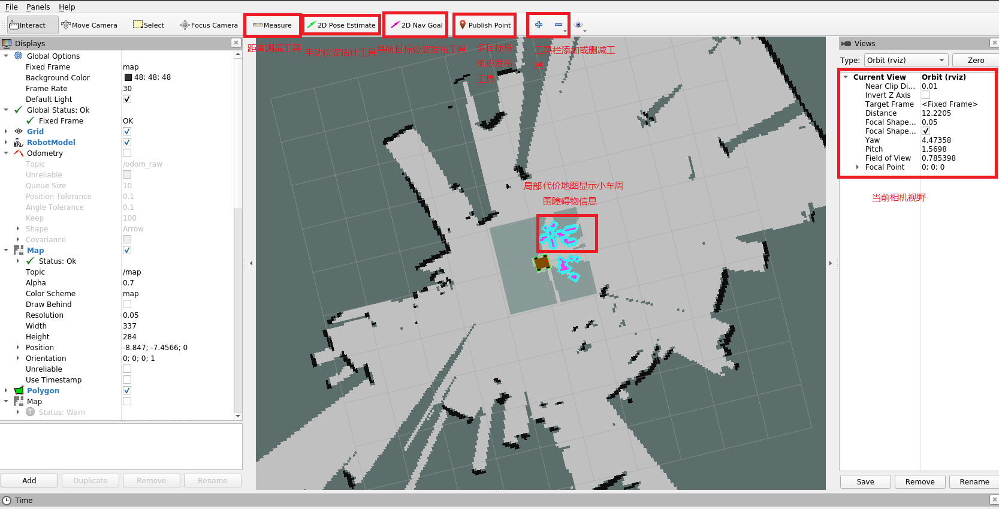

### 实现小车自主探索建图

在ROS中，有多种自主探索建图算法。其核心思想都是通过订阅slam节点发布的地图数据或通过movebase发布的代价地图数据找出当前已建立地图的边界，并发送导航目标指引小车移动过去，在移动的过程中，激光雷达的扫描范围不断扩大，不断扩大建图范围，并查找新的边界，直到指定区域扫描完毕或整个场景地图实现闭合。

在noetic中，最方便配置的是**explore_lite**, Explore-lite使用了一种名为模式自适应增量搜索（PAISS）的算法。它在行动选择方面和传统的探索-开发方法有所不同，并且具有快速学习特性。PAISS算法使用一种模式自适应的搜索方法，该搜索方法根据不同的环境条件选择最佳行动。它通过实时分析当前任务和环境因素来优化行动，并且可以快速学习新的要求，而无需重新训练。AISS算法的搜索过程可分为三个步骤：1：行动选择步骤，此步骤通过实时分析当前任务和环境因素来优化行动。2：根据优化后的行动执行步骤。3：将当前边界点保存至数据库中。PAISS算法和激光雷达可以将机器人自动导航到目标地点。此过程可以概括为。1：机器人使用激光雷达来采集信息。2：机器人使用PAISS算法根据当前任务和环境因素来优化行动并执行到下一个边界点。3：重复上述步骤直到机器人达到预定的目的地。

#### 启动explore_lite

选择一块相对宽敞的区域空间，将小车放置在没有障碍物包围的位置。确保场景中的障碍物高度能有效被激光雷达探测到，如下启动explore_lite.

```bash
    roslaunch zbot3_drive zbot3_slam.launch autoSlam:=true
```

等待zbot3机器人接收导航目标，不断扩大建图区域。可以在打开的rviz中查看实时建图过程。如下图，小车会等待计算完成后自动前往当前检测到的绿色边界点，并更新新的边界点。在此过程中，地图区域会不断扩大，直到结束。


## Zbot3 视觉SLAM建图

Zbot 机器人视觉建图依赖于奥比中光双目视觉相机。该相机ROS节点发布彩图图像话题信息和深度图像话题信息，结合使用可以获取图像素点的颜色和深度信息。

视觉SLAM建图使用ROS中的Rtabmap ROS包完成建图。该功能包同样包含一系列复杂的参数配置。具体参数配置和详细使用方法可参考：
[Rtabmap ROS](http://wiki.ros.org/rtabmap_ros)

### 运行Zbot3 视觉Slam建图

```bash
    roslaunch zbot3_drive zbot3_slam3d.launch

```

如下图可以看到，借助3d slam 建图，可以将周围场景中的3d物体点云数据展示在我们的Rviz地图显示上。同雷达2D Slam 建图 一样， 通过键盘控制或手柄控制控制小车移动，完成对整个周围场景的建图扫描。由于双目相机数据量在3维空间相比雷达2D空间数据量大的多，视觉Slam建图也更加消耗设备硬件资源。在建图时，应确保zbot机器人速度不宜过快。
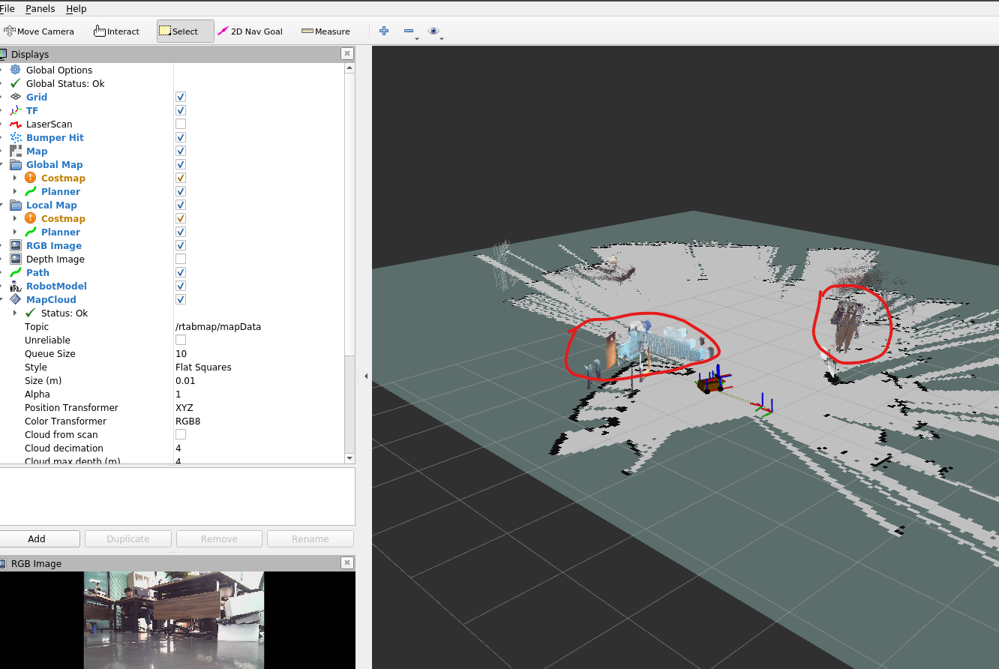

不同于雷达2D建图我们使用mapserver 包中的map_saver 功能节点保存地图，Rtabmap 建图会自动将建图过程中产生的点云信息存储在Rtabmap 节点配置的数据库文件中。我们无需再自己保存3d 地图。

同样，借助movebase节点和explore_lite功能包，我们可以实现视觉Slam 自动建图。其实现原理同上面2D 自动建图一样。可以看到，在 **zbot3_slam3d.launch** 启动参数中，仍有autoSlam 参数。如下启动自动建图。

```bash
roslaunch zbot3_drive zbot3_slam3d.launch autoSlam:=true
```

值得说明的是，双目相机的有效距离范围通常要比雷达要小的多，所以在3D建图中，我们可以借助雷达发布/scan 话题消息生成map地图，再使用双目相机生成场景物体的3D点云消息，优化视觉Slam建图。

```bash
    roslaunch zbot3_drive zbot3_slam3d.launch useLidar:=true
```

### 使用Rtabmap Ros 进行导航

在进行完视觉Slam 建图后，我们就可以用新建的地图进行导航了。Rtabmap ROS包不仅能够生成3d 点云图，还能够根据生成的3d点云数据提供定位，由此实现导航功能。 遗憾的是zbot小车只能在二维平面运动。但我们仍可以简单导航实验。

```bash
roslaunch zbot3_drive zbot3_navigation3d.launch 

```

该launch 文件同视觉Slam 卵巢文件没有区别，仅是把movebase 功能包加入进去,再借助locallization 参数确保Rtabmap 功能包再启动时不会清除上一次保存的3d点云数据文件。

## Zbot follow 功能包功能说明和使用

Zbot follow 功能包里面包含了一些zbot 跟随功能的节点实现。如下一一介绍。

1. 雷达最近物体跟随

   雷达最近物体跟随会让zbot机器人通过雷达点云数据判断周围最近物体的距离和方位。并控制zbot机器人向其靠近。由于仅使用雷达判断周围场景信息，感知到的信息非常有限，建议在空旷的场地使用该功能。如下启动zbot 雷达跟随功能,然后要跟随的人或物体站在雷达的有效扫描范围之内，待zbot小车朝向被跟随物体运动起来，让被跟随物体在周围场景中作移动，观察小车跟随。（注意，被跟随物体请始终处在雷达有效扫描范围以内。）

```bash
roslaunch zbot_follow zbot3_lidar_follow.launch
```

2. zbot 寻线运动

    借助双目相机，zbot 可以通过识别前方道路颜色实现zbot 寻线功能。如下图为zbot寻线功能使用。其中，两个窗口一个显示当前相机视野，另一个显示添加对应识别颜色后的图像遮罩。zbot 根据遮罩图像过滤后的颜色块位置控制小车方向，完成寻线效果。在遮罩图像下面，滑动滑块切换识别线路颜色。图示为巡线黄色线。为了更好的效果，请确保待识别颜色道路有合适的宽度,并确保周围环境光线均匀明亮且地面无反光。

```bash
roslaunch zbot_follow zbot3_line_follow.launch
```


3. Zbot 物体跟随

    借助双目相机，zbot 可以识别双目相机视野中的物体完成跟随。该方法比雷达跟随限制更少，准确度更高。物体识别算法采用的是。如下启动zbot物体跟随节点.

```bash
roslaunch zbot_follow zbot3_object_follow.launch

```

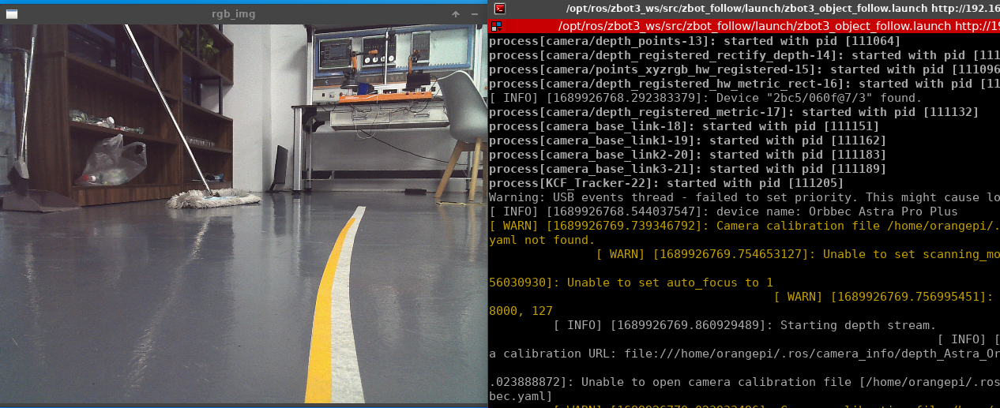
待节点启动后，在图像窗口上从左上角往右下角拉出一个合适大小矩形框框住待跟随物体。zbot便会跟随物体运动.
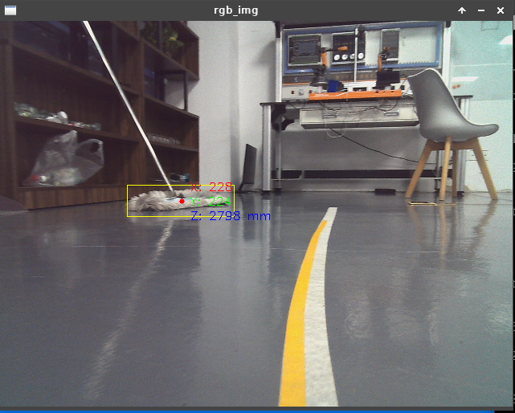

4. zbot 人体跟踪

    zbot 包含人体骨架检测网络。可以更加准确的识别到人体骨架，完成行人跟随。需要说明的是，当前行人跟踪功能无法区分多人骨骼节点。请确保使用该功能时，相机视野中仅有要跟随的人存在。

```bash
    roslaunch zbot_follow zbot3_people_follow.launch
```

## Zbot上的开塔四轴/六轴机器人使用

带开塔机器人的zbot上有一个开塔机器人。可以实现周围物体的抓取于搬运。开塔机器人结构及关机示意图如图所示。


开塔机器人通过串口与主控板进行通讯。支持Python SDK编程控制和图形化窗口控制。此外，zbot机器人基于python sdk 封装了ROS 驱动接口，可以实现对开塔机器人基于ROS 服务方式的功能控制。有关该部分实现方式，见zbot3_ws工作空间下的kata_drive ROS 包。驱动实现节点如下:

```bash
    roslaunch kata_drive kata_driver_ros.launch
```

注意，该launch配置文件会一并启动kata关节末端的usb相机。可以配合卡塔机器人实现对特定目标的抓取。
其中，kata ROS 驱动对外开放的ROS 服务如下：

- /kata/axis_home : 指定某一轴回零位
- /kata/connect     ：开启串口连接
- /kata/disconnect  ：断开串口连接
- /kata/go_camera_pose ：运动至指定USB相机拍照位置
- /kata/go_home     ：复位
- /kata/go_zero     ：回零
- /kata/pose_control ：运动控制
- /kata/save_camera_pose ：保存当前位置为拍照为
- /kata/set_speed        ：设定运动速度：mm/s
- /kata/set_tool_offset  :设置工具偏移量

- /kata_cam/set_logger_level
- /kata_cam/start_capture  :usb相机开始捕获
- /kata_cam/stop_capture   ：usb相机停止捕获

需要说明的是，开塔机器人末端吸盘驱动气泵由驱动板控制，所以气泵的控制服务在zbot地盘驱动节点上。控制吸盘气泵的开启与关闭，需要启动zbot底盘驱动服务

```bash
    roslaunch zbot3_drive zbot3_bringup.launch
```

现在，你可以通过**rosservice list** 指令查看到关于气泵的控制服务**/kata/pump_control**

现在简单介绍一下如何通过service服务方式控制开塔机器人。

启动kata机器人ROS驱动

```bash
roslaunch kata_drive kata_driver_ros.launch
```

1. 回零

    ```bash
    rosservice call /kata/go_zero
    ```

2. 移动到x=100,y=120,z=10,raw=0,pitch=0,yaw=0 绝对位置,速度15000

    ```bash
    rosservice call /kata/pose_control "{x: 100, y:120, z: 10, roll: 0.0, pitch: 0.0, yaw: 0, moveMethod: '', speed:15000,
    relative: false}"
    ```

3. y轴相对前向运动30 mm

    ```bash
    rosservice call /kata/pose_control "{x: 0, y:30, z: 0, roll: 0.0, pitch: 0.0, yaw: 0, moveMethod: '', speed:1500,
    relative: true}"
    ```

很多时候，通过这种方式控制是非常不方便的。通过服务方式调用适合用作程序接口嵌入到我们的自定义脚本中，但不适合用户直接控制。为此，在zbot_monitor UI 程序功能面板中集成了kata dashboard 插件。如下图所示

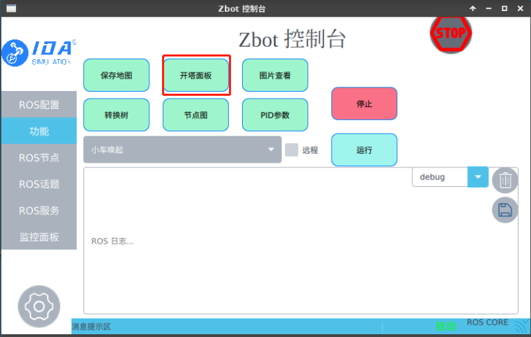

打开后界面如图所示

上图中，红色区域为各轴相对移动按钮。+代表在当前方向上前进移动，-代表在当前方向上后退移动。移动步长和速度可以在下面进行设置。绿色区域展示当前机器人各轴位姿，不可修改。洋红色区域为绝对运动到设定位置。

4.复位

```bash
rosservice call /kata/go_home
#注意：kata机器人在运动过程中如过被阻挡会出现位置偏差，此时需通过复位校正
```

以上各服务调用所需参数可以通过终端**Tab**建自动补全,然后在修改为合适的数值即可。

有关开塔机器人的官方使用手册，参考如下:

