# Zbot 实验指导书


## 1. <a name=''></a>搭建开发环境

### 1.1. <a name='VSCode'></a>VS Code 开发环境

Zbot3支持ssh远程登录后进行开发，如果大家不习惯远程命令行开发的话，也可以在PC端搭建一个可视化的开发环境，这里我们介绍如何使用VSCode进行远程开发。

操作环境及软硬件配置如下：

- Zbot3机器人
- PC：Windows/Linux  + VSCode


实验目的 ：
1. 能够完成ROS开发环境基础配置

步骤
1. 安装VSCode

    VSCode官方提供多种操作系统下的安装包，大家可以根据自己使用的操作系统选择下载:
    [VS code 下载链接](https://code.visualstudio.com/Download)
    下载完成后，双击安装包，按照提示的步骤完成安装即可。
2. 安装SSH插件
    打开安装好的VSCode，选择右侧的“Extensions”扩展插件，在搜索栏中输入“ssh”进行搜索，找到“Remote - SSH”插件，然后点击安装。
    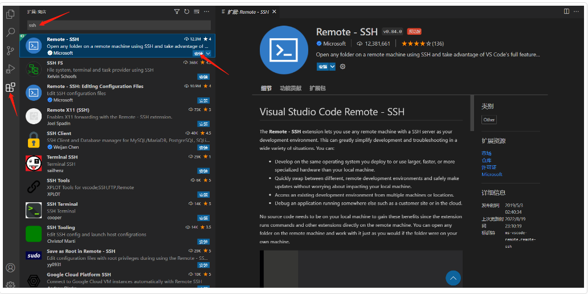
    安装好之后，在VSCode左侧出现一个“远程资源管理器”。
    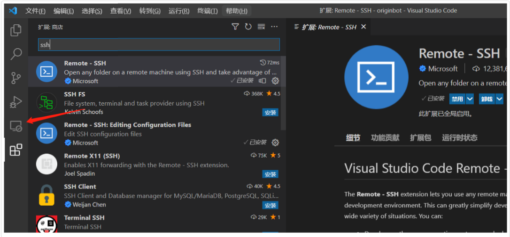
3. 配置远程连接
    点击VSCode左侧新出现的“远程资源管理器”，点击“+”添加按钮。
    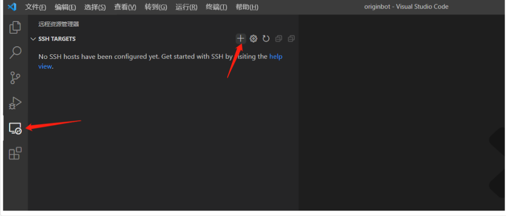
    在弹出的提示框中，输出ssh的完整命令，回车。
    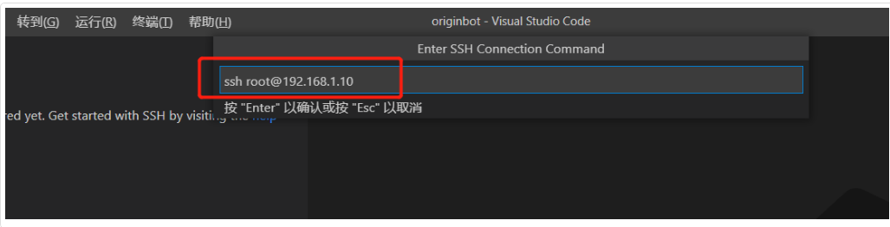
    然后选择第一项默认的配置文件，保存刚才输入的ssh命令信息。
    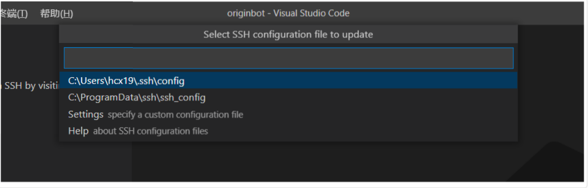
   保存成功后，也可以按照提示打开该配置文件，这样下次在远程登录，就不需要填写信息了。而且在左侧的列表中，也新增了远程目标的IP地址。
4. 连接远程服务器
   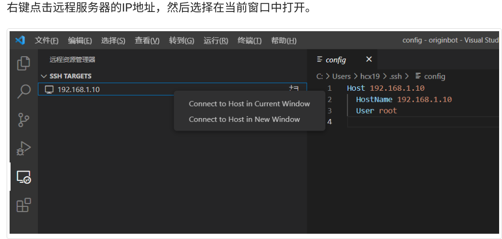
   选择Linux系统
   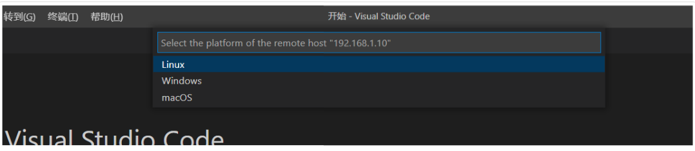
    填写目标服务器用户密码
    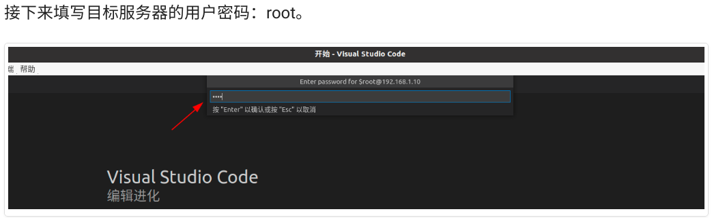
    稍等片刻便登录成功啦。
    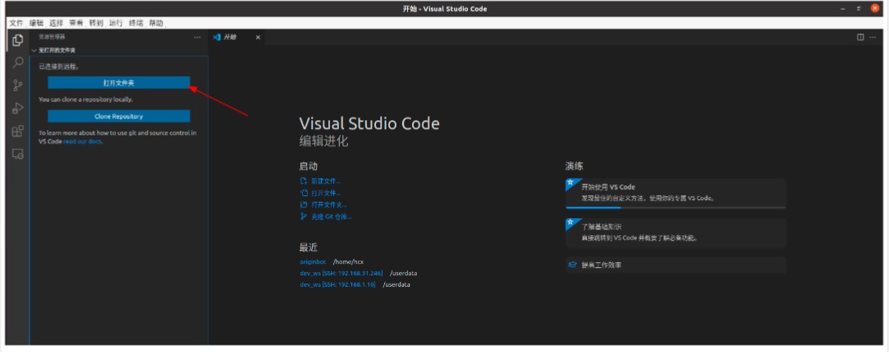
5. 选择打开文件夹，输入zbot3_ws工作空间
    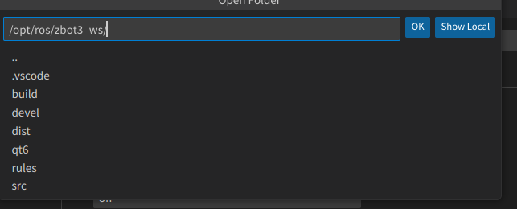

这样，我们就可以远程访问Zbot3上的代码啦，还可以随时修改，会实时同步到机器人端。此外，我们还可以在连接成功的VSCode中，启动多个终端，便于我们输入各种在Zbot3上运行的命令。

### 1.2. <a name='VNC'></a>VNC远程桌面工具

当我们使用自己的PC远程连接Zbot3 机器人时，有时候仅靠终端会显得非常不变。因为终端无法为我们提供图形化的显示界面。我们所运行的程序凡是有UI界面的都无法完全借助终端远程运行。此时，一款合适的远程桌面工具就会非常有用。VNCViewer 是一款通用远程桌面协议显示软件。不同于向日葵和toDesk，VNC不受会员约束，使用方便。其同样支持多种操作平台和操作系统
[RealVncViewer 下载地址]<https://www.realvnc.com/en/connect/download/viewer/>
请选择适合自己的系统版本下载和安装。

说明：
 香橙派默认已配置好vnc server端， vnc server 使用的为 ubuntu 20.04系统上的 **tigervnc-standalone-server**. 且已配置好系统服务脚本开机自启。默认运行在 5901端口。提供如下服务。

 ```bash
    #VNC 服务开机自启
    sudo systemctl enable vnc_auto_start.service
 ```

 ```bash
    #VNC 关闭自启服务
    sudo systemctl disable vnc_auto_start.service
 ```

 ```bash
    #VNC 重启服务
    sudo systemctl restart vnc_auto_start.service
 ```

 ```bash
    #VNC 停止当前服务
    sudo systemctl stop vnc_auto_start.service
 ```

  ```bash
    #VNC 手动启动服务
    sudo systemctl start vnc_auto_start.service
 ```

```bash
   #更改vnc连接密码
    vncpasswd
```

根据提示输入新密码。

 借助vnc Viewer 连接远程桌面：
 确保Zbot3 端启动了vnc服务。（默认开机自启）

1. 个人电脑上打开vncviewer.

    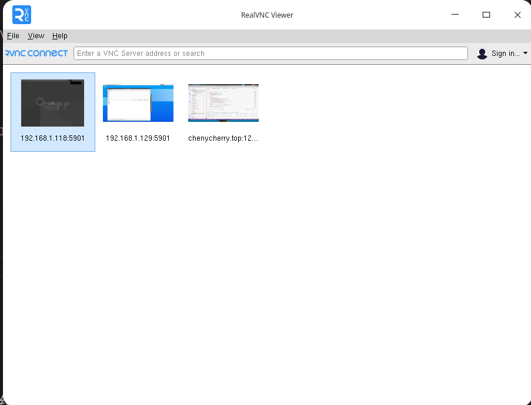
2. 输入zbot3 ip地址和vnc 服务端口。默认5901。中间用**英文标点**：隔开

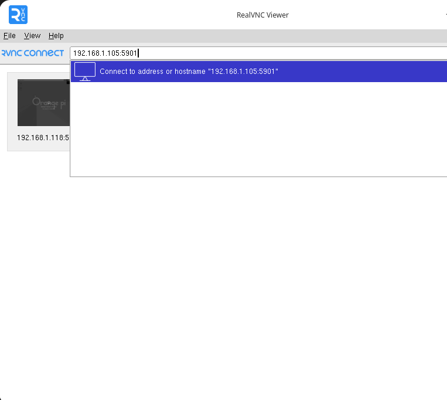

弹窗中输入密码,默认123456

点击“ok”完成连接打开远程桌面

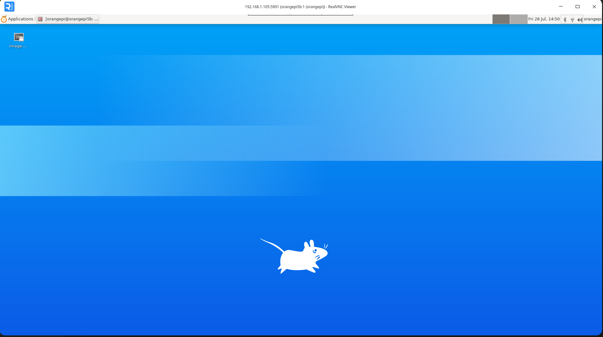

## 2. <a name='-1'></a>机器人启动与参数配置

### 2.1. <a name='Zbot3'></a>启动Zbot3 底盘

- 硬件需求

    zbot3 机器人

    带ssh，VNC桌面的个人电脑

- 实验目的
    掌握ROS 节点控制基础指令，了解ROS话题通讯机制. 

Zbot机器人上电开关位于Zbot尾部显示屏下方。Zbot系统默认上电后自动启动。


在PC端通过SSH连接Zbot3

```bash
ssh orangepi@192.168.1.105
```

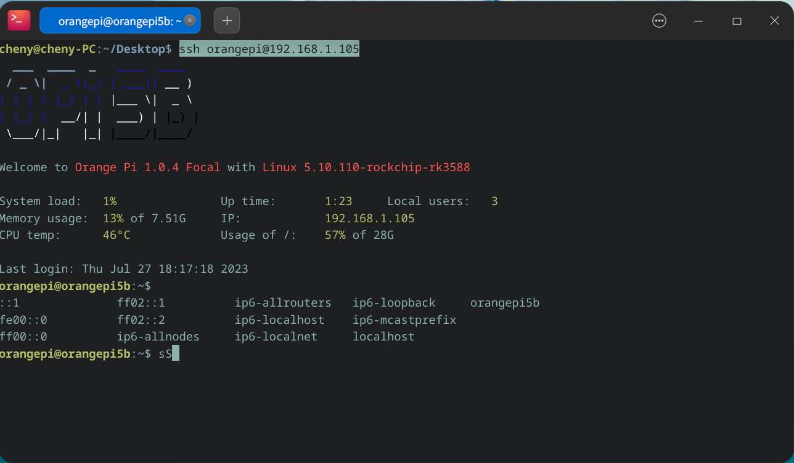

连接成功后，Zbot3机器人启动的命令为：

```bash
roslaunch zbot3_drive zbot3_bringup.launch disableEkf:=false

```

可选参数：
|参数名              |  功能说明                |  可选值
|disableEkf         |  禁用Robot Pose Ekf 功能 |  true / false

zbot3_bringup.launch 文件为zbot3 小车的唤起文件。该启动文件唤起zbot3小车基本控制功能。该文件根据**disableEkf**参数选择是否启动robot_pose_ekf 功能节点。

### 2.2. <a name='EKF'></a>EKF简介

EKF全称ExtendedKalmanFilter，即扩展卡尔曼滤波器，是一种高效率的递归滤波器(自回归滤波器)。

ROS中可以利用这种方式根据来自不同来源的（部分）姿态测量值来估计机器人的 3D 姿态。它可以使用具有 6D 模型（3D 位置和 3D 方向）的扩展卡尔曼滤波器来结合车轮里程计、IMU 传感器和视觉里程计的测量值。
其具有以下特征：

1. 可以融合任意数量的传感器。EKF节点不限制传感器的数量，如果机器人有多个 IMU 或多个里程计，则 robot_localization 中的状态估计节点可以将所有的传感器的数据进行融合。
2. 支持多种 ROS 消息类型。 robot_localization 中的状态估计节点可以接收多种常见的位姿相关的消息类型，比如： nav_msgs/Odometry、sensor_msgs/Imu、geometry_msgs/PoseWithCovarianceStamped 或 geometry_msgs/TwistWithCovarianceStamped 。
3. 可以设置每个传感器的输入数据。如果订阅的传感器消息包含不想融合到状态估计中的数据，则 robot_localization 中的状态估计节点可以设置每个传感器的输入数据。
4. 连续预估。 robot_localization 中的每个状态估计节点在接收到单个测量值后就会立即开始估计车辆的状态。如果传感器数据出现丢失，长时间未接收到数据，ekf节点将通过内部的运动模型来估计机器人的状态。

```yaml
    <!--robot_pose_ekf-->
    <group unless="$(arg disableEkf)" >
    <node pkg="robot_pose_ekf" type="robot_pose_ekf" name="robot_pose_ekf">
        <param name="output_frame" value="/odom"/>
        <param name="base_footprint_frame" value="base_footprint"/>
        <param name="freq" value="30.0"/>
        <param name="sensor_timeout" value="1.0"/>
        <param name="odom_used" value="true"/>
        <param name="imu_used" value="true"/>
        <param name="vo_used" value="false"/>
        <remap from="odom" to="odom_raw" />
        <remap from="imu_data" to="imu" />
    </node>
</group>
```

该节点发布/接受的话题如下：

* /battery zbot 电池话题信息,包含电压值与电量百分比
* /cmd_vel        速度控制话题消息，控制zbot的运动
* /imu            惯性传导单元话题信息，值由6轴陀螺仪传感器获得
* /joint_states   小车模型关节信息
* /odom_raw       里程计原始话题消息
* /robot_pose_ekf/odom_combined 经过rbot_pose_ekf 多传感器融合获得的里程计话题消息

该启动文件默认会发布机器人3d模型描述.

```yaml
<!--urdf model-->
<include file="$(find zbot3_description)/launch/zbot3_model.launch" />

```

打开rviz ,可以配置robot model 查看zbot简化后的3d模型。

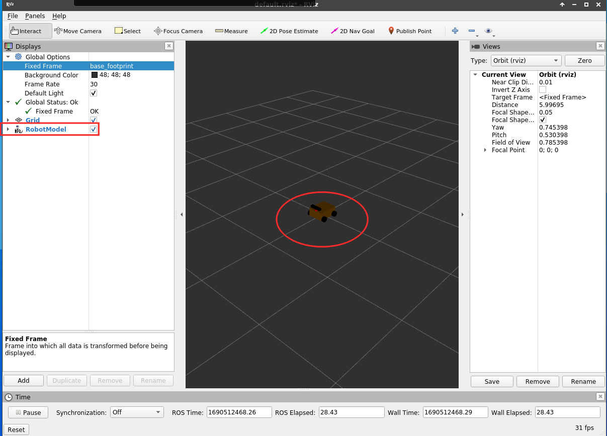

启动zbot 唤起文件，会运行起zbot底盘驱动。默认会启动键盘控制程序。需要说明的是开机时zbot 默认处于急停使能状态，无法进行运动控制。此时应手动取消急停状态。通过VNC连接远程桌面，或者在zbot显示屏上可以看到自动运行的zbot控制面板程序。可以找到急停控制按钮。点击该按钮即改变急停状态。取消急停状态后，即可使用键盘按钮控制zbot3机器人移动.方向按钮为 u,i,o,j,k,l,m,",","." 按键Q加速，按键Z减速。

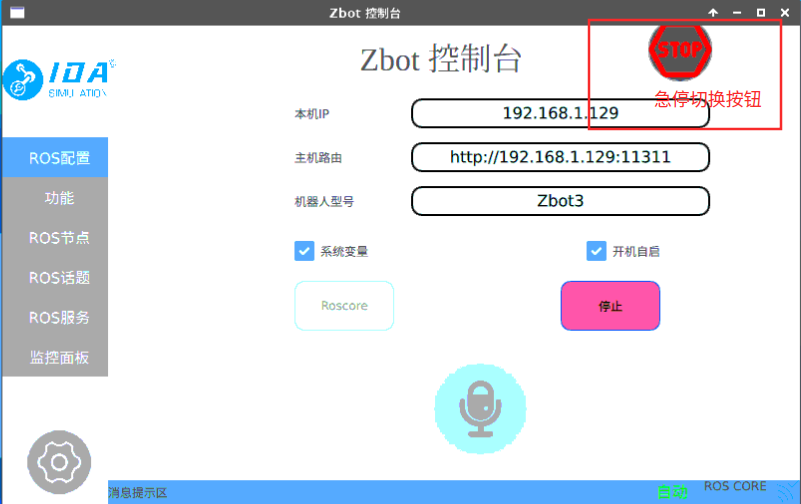


### 2.3. <a name='-1'></a>启动雷达

```bash
roslaunch lsn10_lidar lsn10.launch scan_topic:=/scan

```

可选参数：
|参数名              |  功能说明                |  可选值
|scan_topic         |  发布的雷达数据话题名称    |  默认为 /scan

在rviz 中查看 雷达数据

```bash
    rviz
```

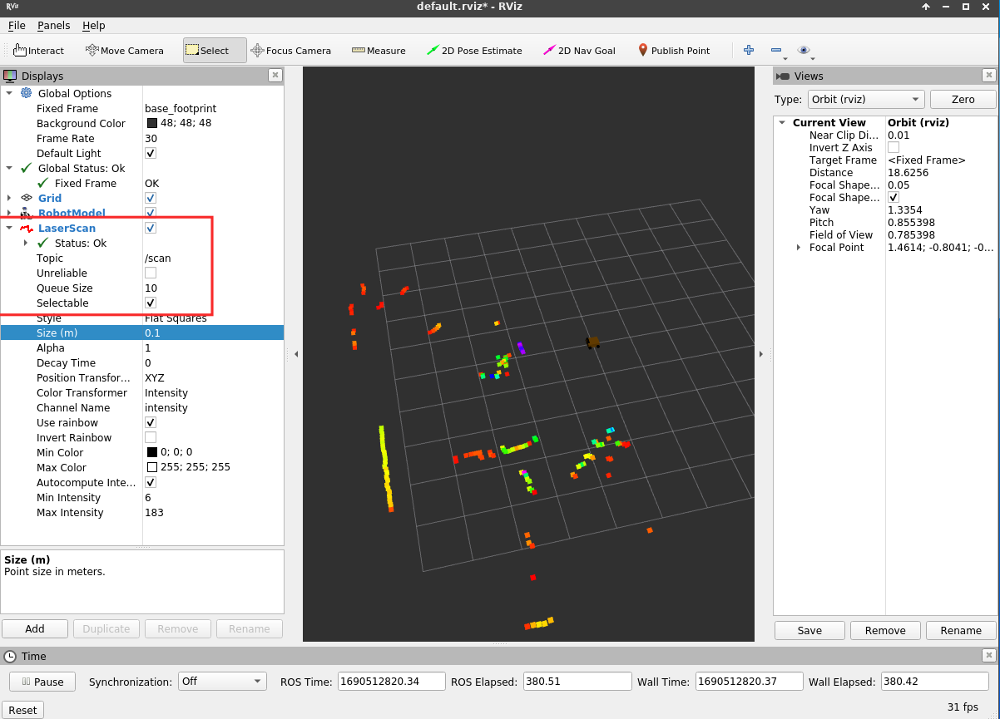

### 2.4. <a name='-1'></a>启动相机

```bash
roslaunch lsn10_lidar lsn10.launch scan_topic:=/scan

```

```bash
roslaunch astra_camera astra.launch
```

借助 rqt_image_view 查看图像话题

```bash
rosrun rqt_image_view rqt_image_View
```

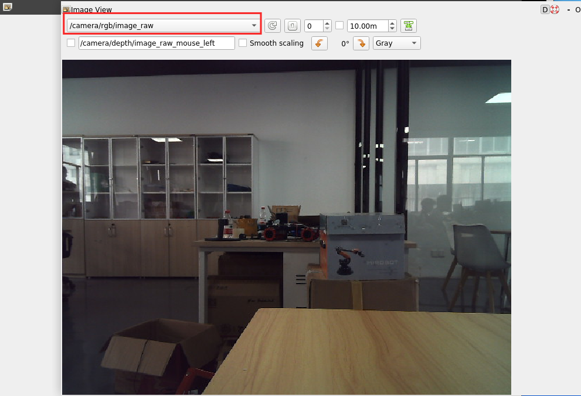
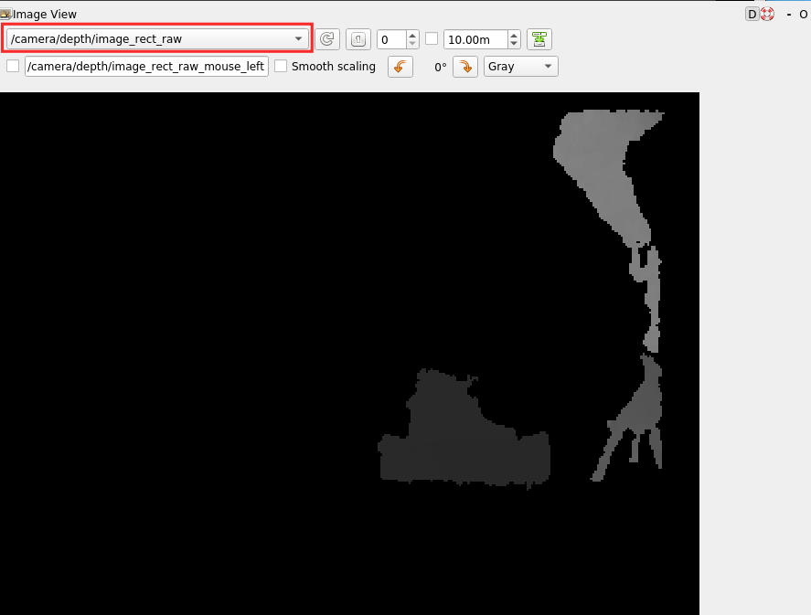

### 2.5. <a name='IMU'></a>查看IMU话题信息

安装rviz-imu可视化插件

```bash
 sudo apt install ros-${ROS_DISTRO}-rviz-imu-plugin
```

重新运行小车唤起节点

```bash
    roslaunch zbot3_drive zbot3_bringup.launch
```

### 2.6. <a name='-1'></a> 机器人充电方法

控制器程序中加入了电池保护，电压低于9.8V时蜂鸣器会常响报警，此时就需要尽快充电了。**请使用zbot3套件中自带的充电器进行充电。**
* 确定机器人电源开关处于“OFF”状态；

* 将充电器DC口插到控制器的充电口上；

* 将充电器的AC口插到220V市电插座上，充电器上的灯显示为红色，即为正在充电中；

* 完成充电后，充电器上的LED灯会变为绿色，充电结束，可以拔出充电器。
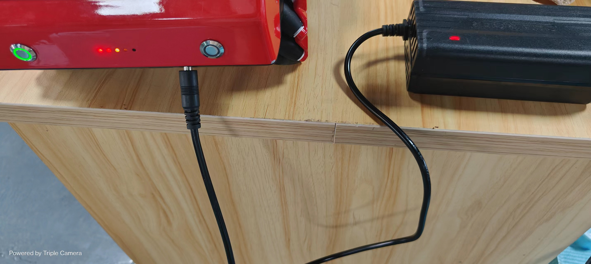

即可看到可视化的IMU信息，此时摇动机器人，Rviz中的坐标系也会跟随运动。
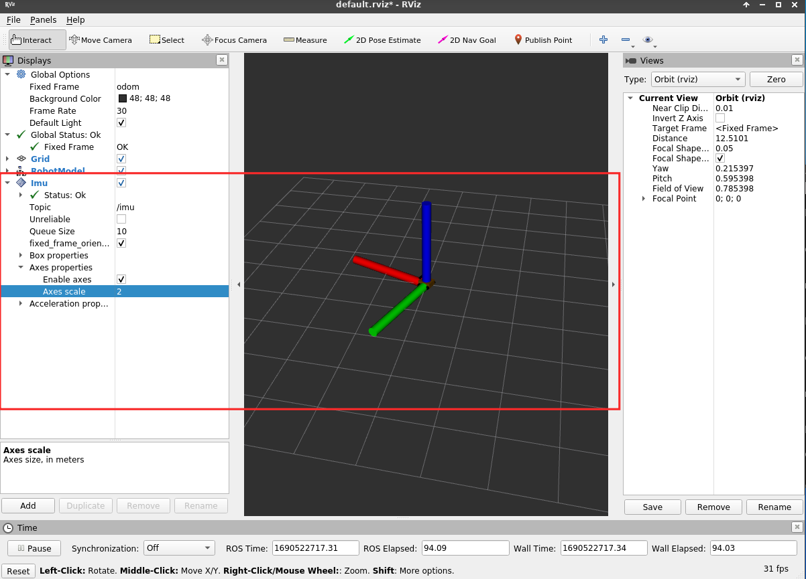

## 3. <a name='-1'></a>机器人遥控与可视化

操作环境及软硬件配置如下：

Zbot3 机器人
orangepi：Ubuntu (20.04) + ROS (Noetic)
键盘
手柄（可选）

### 3.1. <a name='-1'></a>键盘遥控


连接成功后，zbot3机器人启动的命令为：

```bash
roslaunch zbot3_drive zbot3_bringup.launch

```

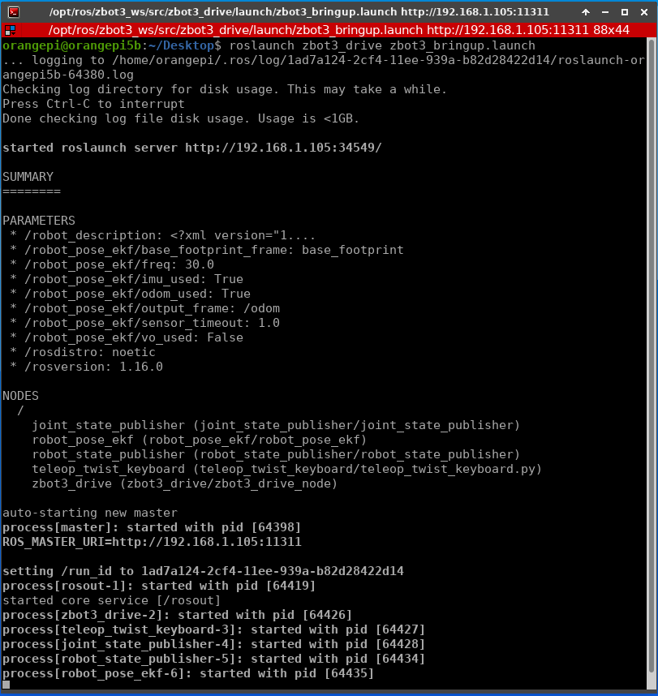

(可选启动方式)

```bash
roscore #启动roscore
rosrun zbot3_drive zbot3_drive_node #启动底盘驱动节点
rosrun teleop_twist_keyboard teleop_twist_keyboard.py #机器键盘控制节点
```

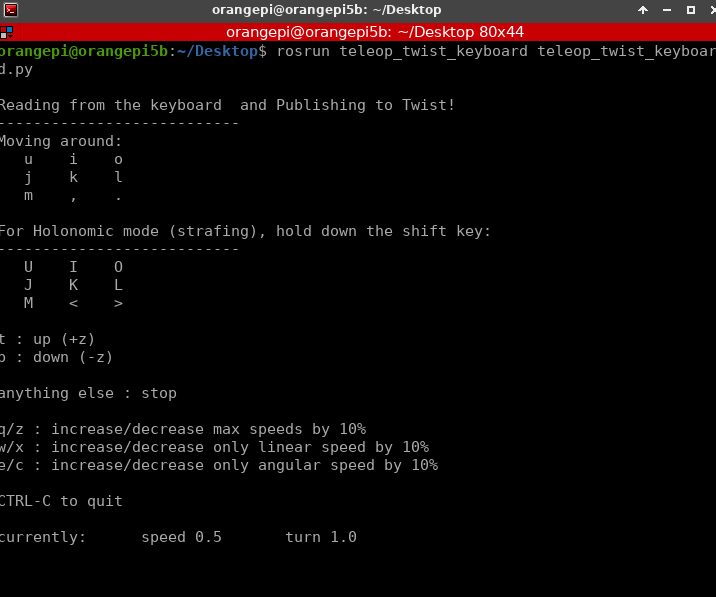

键盘控制按键说明：

方向键： u,i,o
        j,k,l
        m,",","."

直线速度与转速等比增减：q/z
直线速度增减： w/x
转速增减： e/c

停车： k

切换为全向轮控制： CapLock /Shift(保持按住)

### 3.2. <a name='-1'></a>手柄遥控

* 有线手柄；将手柄的usb接口插入Zbot3上香橙派派的USB接口
* 无线手柄；将手柄的无线接收器插入Zbot3香橙派派USB接口

连接完成后，在终端，使用如下命令确认系统是否成功识别：

```bash
ls /dev/input/
```

如识别到“js0”设备，则说明手柄识别成功。


手柄驱动包安装

```
    ros-noetic-joy ros-noetic-teleop-twist-joy xboxdrv  libbluetooth-dev

```

保持运行底盘驱动节点，然后运行手柄控制节点

```
roslaunch teleop_twist_joy teleop.launch

```

启动成功后，就可以使用手柄控制Zbot3运动.

通过rviz看到机器人在里程计坐标系下的位姿变化：

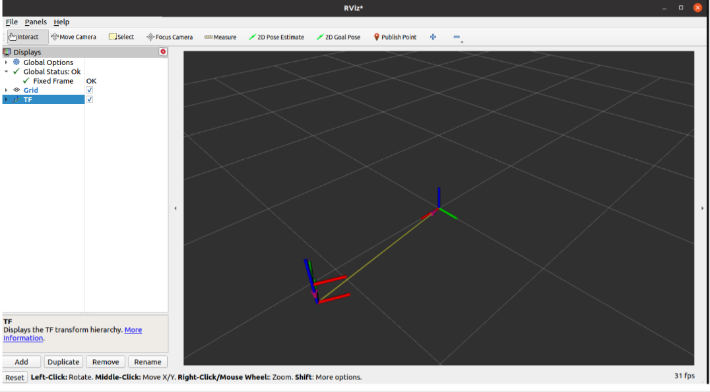

此处PC端如果使用虚拟机运行Ubuntu系统，为确保机器人与Ubuntu系统处于同一局域网中，需要将虚拟机的网络设置为桥接模式：
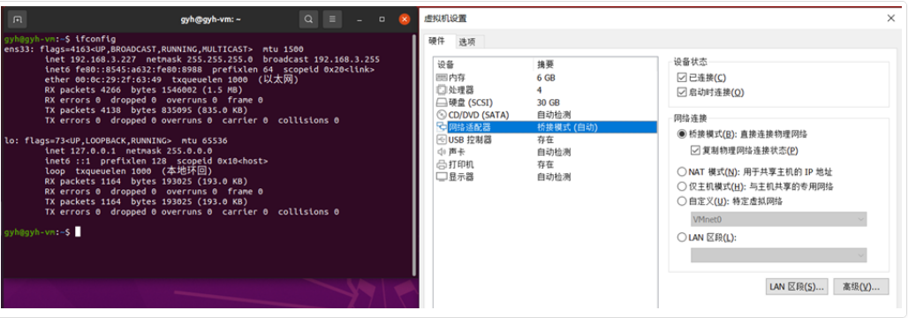

### 3.3. <a name='App'></a>手机App 遥控

#### 3.3.1. <a name='APP'></a>APP蓝牙连接

如下图，先点击搜索设备搜索当前区域的蓝牙，
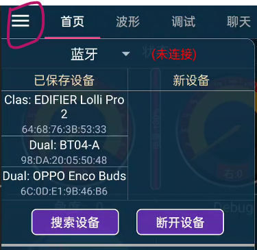

Zbot机器人使用的蓝牙模块为BT04系列。点击即可完成连接。


#### 3.3.2. <a name='APP-1'></a>APP 遥控方式简介

APP 默认遥控方式为遥感控制。拖拽遥感，小车即可朝向指定方向移动。
在遥控区域上方，可切换遥控方式和增减小车控制速度。如下图切换为按键控制方式。


按键控制时，双手同时按下向上箭头，小车向前行驶。
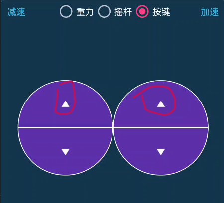

双手同时按下向下箭头，小车后退。
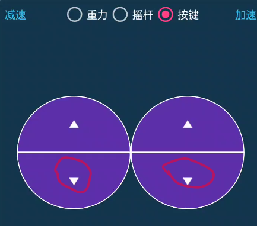

双手按着左上右下箭头，小车顺时针原地旋转。

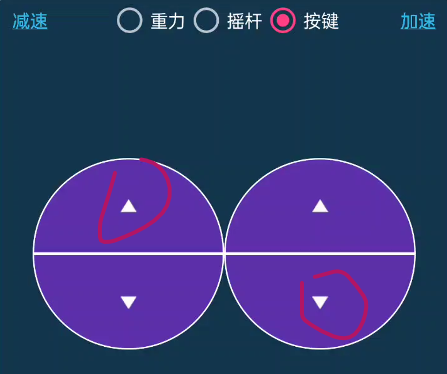
双手按着左下右上箭头，小车逆时针原地旋转。

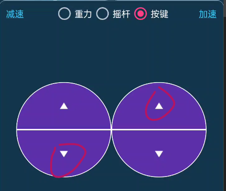

切换为重力控制时，倾斜手机朝向，即可改变小车前进方向。如下图为小车朝向左前方前进

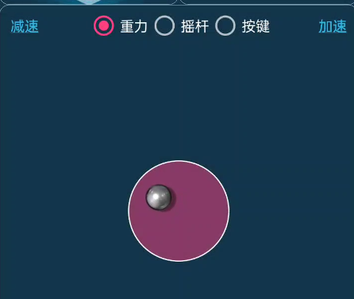
点击右上角隐藏菜单栏，可更改重力灵敏度。

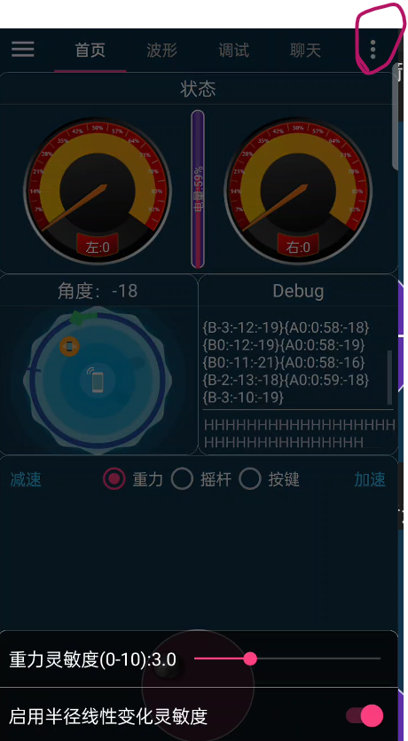

## 4. <a name='PID'></a>PID 调参

在APP导航栏选择调试选项卡即可进入参数调试界面。如下图所示。


在调试之前，先点击隐藏菜单栏选择获取参数，来更新串口发送来的最新数据。最好也点击开启实时发送参数，来实时观察小车参数改变后的运行状态。


然后拖动参数项对应的滑条来改变参数数值。
*注：各参数项对应的具体参数与小车驱动底盘对应位发送过来的数据有关。默认参数1：设定目标速度；参数2：PID算法比例环节放大系数Kp，参数3：PID积分积分系数Ki。其余参数项缺省*

在导航栏，选择波形界面，即可查看驱动底盘发送对应数据的变化波形。有关该部分设置需在zbot驱动板程序中自行设置。

## 5. <a name='-1'></a>控制器通信协议说明

### 5.1. <a name='-'></a>香橙派->驱动板控制协议

| 数据位 | 含义       | 默认值  |  说明                    |
|:---:|:--------:|:----:|:----------------------:|
| 1   | 帧头       | 0x7B | 固定值                    |
| 2   | 急停控制     | 0    | 1：使能急停 2：失能急停   0：不控制           |
| 3~4 | x方向目标速度值 |      | 放大1000倍，低位在前，高位在后，1位小数 |
| 5~6 | y方向目标速度值 |      | 放大1000倍，低位在前，高位在后，1位小数 |
| 7~8 | z方向目标速度值 |      | 放大1000倍，低位在前，高位在后，1位小数 |
| 9   | CRC校验值   |      | 1~8位参与运算               |
| 10  | 帧尾       | 0x7D | 固定值                    |
|     |          |      |                        |
|     |          |      |                        |

### 5.2. <a name='--1'></a>驱动板->香橙派数据协议

| 数据位   | 含义      | 默认值  |  说明                     |
|:-----:|:-------:|:----:|:-----------------------:|
| 1     | 帧头      | 0x7B | 固定值                     |
| 2     | 模式状态     |     |  0：自动 1：手动 2：自动，急停  3：手动急停     | 运行状态位   |                         |
| 3~4   | x方向速度值  |      | 放大1000倍，低位在前，高位在后，1位小数  |
| 5~6   | y方向速度值  |      | 放大1000倍，低位在前，高位在后，1位小数  |
| 7~8   | z方向速度值  |      | 放大1000倍，低位在前，高位在后，1位小数  |
| 9~10  | x方向加速度值 |      | 放大1000倍，低位在前，高位在后，1位小数  |
| 11~12 | x方向加速度值 |      | 放大1000倍，低位在前，高位在后，1位小数  |
| 13~14 | z方向加速度值 |      | 放大1000倍，低位在前，高位在后，1位小数  |
| 15~16 | x方向角速度值 |      | 放大1000倍，低位在前，高位在后，1位小数  |
| 17~18 | y方向角速度值 |      | 放大1000倍，低位在前，高位在后，1位小数  |
| 19~20 | z方向角速度值 |      | 放大1000倍，低位在前，高位在后，1位小数  |
| 21~22 | 电池电压值   |      |  放大1000倍，低位在前，高位在后，1位小数 |
| 23    | CRC校验位  |      | 1~22位参与运算               |
| 24    | 帧尾      | 0x7D | 固定值                     |

香橙派控制zbot3运动相关部分函数实现:

``` c++
uint8_t *ZbotSerial::twistToSerial()
    {
        uint8_t *serialData = new uint8_t[15];
        uint8_t *temp = new uint8_t[2];

        static int kp, ki;
        //get pid param from server
        nh.getParam("/zbot3_drive/Kp",kp);
        nh.getParam("/zbot3_drive/Ki",ki);

        memset(serialData, 0, 15); // initialize
        serialData[0] = 0x7B;      // frame header
        if (emergencyControl==EMERGENCY_ON)
        {
            // enable emergency stop.
            serialData[1] = 1;
        }
        else if(emergencyControl==EMERGENCY_CANCLE)
        {
            serialData[1] = 2;
            emergencyControl=0;
        }else{
            serialData[1]=0;
        }
        if (twist != nullptr)
        {
            temp = floatConvert(twist->linear.x);
            if (temp != nullptr)
            {
                memcpy(serialData + 3 * sizeof(uint8_t), temp, sizeof(ushort));
            }
            else
            {
                ROS_ERROR_STREAM("无效的x方向速度值");
            }
            temp = floatConvert(twist->linear.y);
            if (temp != nullptr)
            {
                memcpy(serialData + 5 * sizeof(uint8_t), temp, sizeof(ushort));
            }
            else
            {
                ROS_ERROR_STREAM("无效的y方向速度值");
            }
            temp = floatConvert(twist->angular.z);
            if (temp != nullptr)
            {
                memcpy(serialData + 7 * sizeof(uint8_t), temp, sizeof(ushort));
            }
            else
            {
                ROS_ERROR_STREAM("无效的z方向速度值!");
            }
            temp=shortConverter(kp);
            if (temp != nullptr)
            {
                memcpy(serialData + 9 * sizeof(uint8_t), temp, sizeof(ushort));
            }
            else
            {
                ROS_ERROR_STREAM("无效的kp参数!");
            }
            temp=shortConverter(ki);
            if (temp != nullptr)
            {
                memcpy(serialData + 11 * sizeof(uint8_t), temp, sizeof(ushort));
            }
            else
            {
                ROS_ERROR_STREAM("无效的ki参数!");
            }
            serialData[13] = checkSum(serialData, 13);

            serialData[14] = 0x7D;
            delete temp;
            return serialData;
        }
        return nullptr;
    }
```

香橙派解析zbot3 底盘发送的传感器数据相关函数实现

```c++
    void ZbotSerial::decodeSerial(uint8_t *data)
    {
        // decode serial data
        switch(data[1]){
            case 0:
                status->emergency=0;
                status->controlMode=AUTO_MODE;
                break;
            case 1 :
                status->emergency=0;
                status->controlMode=MANUAL_MODE;
                break;
            case 2:
                status->emergency=1;
                status->controlMode=AUTO_MODE;
                break;
            case 3:
                status->emergency=1;
                status->controlMode=MANUAL_MODE;
                break;
                    
        }
        status->velocity.x = shortToFloat(&data[2]) / 1000;
        status->velocity.y = shortToFloat(&data[4]) / 1000;
        status->velocity.z = shortToFloat(&data[6]) / 1000;
        // accleration
        status->acc.x = shortToFloat(&data[8]) / ACCEl_RATIO;
        status->acc.y = shortToFloat(&data[10]) / ACCEl_RATIO;
        status->acc.z = shortToFloat(&data[12]) / ACCEl_RATIO;
        // angularity
        status->angular.x = shortToFloat(&data[14]) * GYROSCOPE_RATIO;
        status->angular.y = shortToFloat(&data[16]) * GYROSCOPE_RATIO;
        status->angular.z = shortToFloat(&data[18]) * GYROSCOPE_RATIO;
        // battery
        status->battery = shortToFloat(&data[20]) / 1000.0;

        int kp_rec=int(shortToFloat(&data[22]));
        int ki_rec=int(shortToFloat(&data[24]));
        //ROS_INFO_STREAM("zbot3_drive Emergency:"<<status->emergency);

    }

```

## 6. <a name='-1'></a>开塔机器人操作实验

带开塔机器人的zbot上有一个开塔机器人。可以实现周围物体的抓取于搬运。开塔机器人结构及关机示意图如图所示。
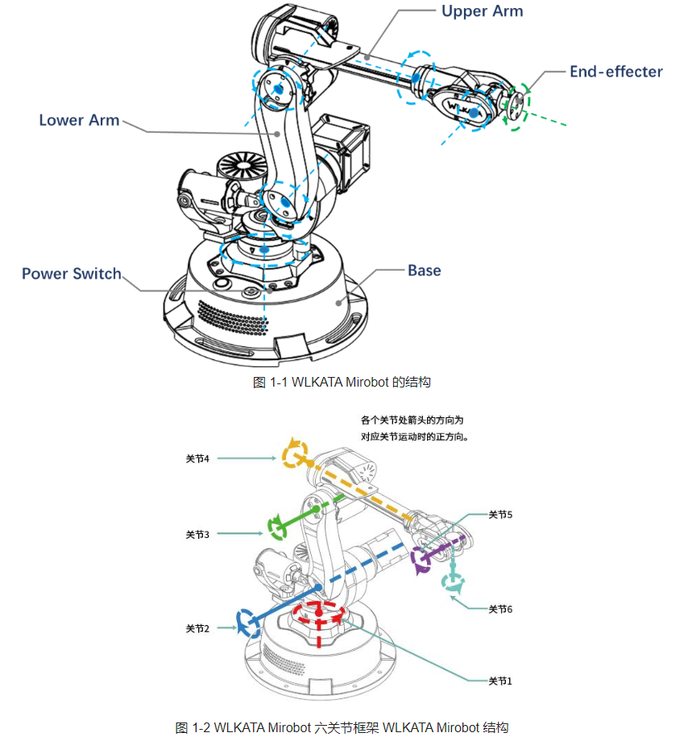

开塔机器人通过串口与主控板进行通讯。支持Python SDK编程控制和图形化窗口控制。此外，zbot机器人基于python sdk 封装了ROS 驱动接口，可以实现对开塔机器人基于ROS 服务方式的功能控制。有关该部分实现方式，见zbot3_ws工作空间下的kata_drive ROS 包。驱动实现节点如下:

```bash
    roslaunch kata_drive kata_driver_ros.launch
```

注意，该launch配置文件会一并启动kata关节末端的usb相机。可以配合卡塔机器人实现对特定目标的抓取。
其中，kata ROS 驱动对外开放的ROS 服务如下：

* /kata/axis_home : 指定某一轴回零位
* /kata/connect     ：开启串口连接
* /kata/disconnect  ：断开串口连接
* /kata/go_camera_pose ：运动至指定USB相机拍照位置
* /kata/go_home     ：复位
* /kata/go_zero     ：回零
* /kata/pose_control ：运动控制
* /kata/save_camera_pose ：保存当前位置为拍照为
* /kata/set_speed        ：设定运动速度：mm/s
* /kata/set_tool_offset  :设置工具偏移量

* /kata_cam/set_logger_level
* /kata_cam/start_capture  :usb相机开始捕获
* /kata_cam/stop_capture   ：usb相机停止捕获


现在简单介绍一下如何通过service服务方式控制开塔机器人。

启动kata机器人ROS驱动

```bash
roslaunch kata_drive kata_driver_ros.launch
```

1. 回零

    ```bash
    rosservice call /kata/go_zero
    ```

2. 移动到x=100,y=120,z=10,raw=0,pitch=0,yaw=0 绝对位置,速度15000

    ```bash
    rosservice call /kata/pose_control "{x: 100, y:120, z: 10, roll: 0.0, pitch: 0.0, yaw: 0, moveMethod: '', speed:15000,
    relative: false}"
    ```

3. y轴相对前向运动30 mm

    ```bash
    rosservice call /kata/pose_control "{x: 0, y:30, z: 0, roll: 0.0, pitch: 0.0, yaw: 0, moveMethod: '', speed:1500,
    relative: true}"
    ```

很多时候，通过这种方式控制是非常不方便的。通过服务方式调用适合用作程序接口嵌入到我们的自定义脚本中，但不适合用户直接控制。为此，在zbot_monitor UI 程序功能面板中集成了kata dashboard 插件。如下图所示

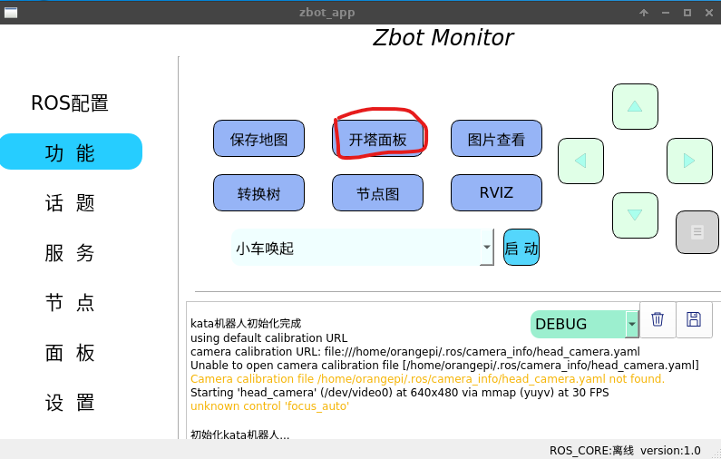

打开后界面如图所示
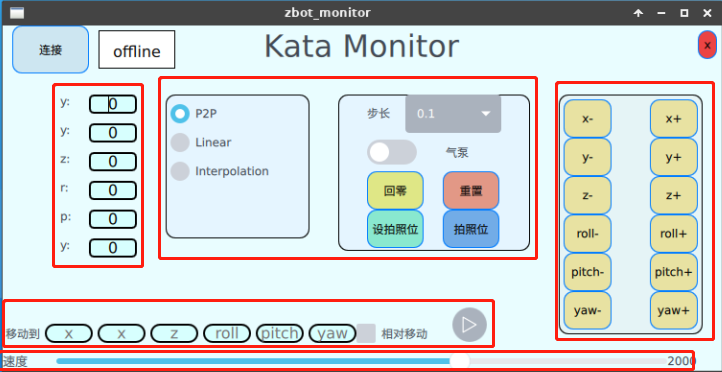
上图中，红色区域为各轴相对移动按钮。+代表在当前方向上前进移动，-代表在当前方向上后退移动。移动步长和速度可以在下面进行设置。绿色区域展示当前机器人各轴位姿，不可修改。洋红色区域为绝对运动到设定位置。

4.复位

```bash
rosservice call /kata/go_home
#注意：kata机器人在运动过程中如过被阻挡会出现位置偏差，此时需通过复位校正
```

以上各服务调用所需参数可以通过终端**Tab**建自动补全,然后在修改为合适的数值即可。

有关开塔机器人的官方使用手册，参考如下:
[开塔机器人用户手册](https://ojrjw1627z.k.topthink.com/@1epkq57pdv/1Mirobotkuaisurumenzhinan.html)

### 查看kata机器人urdf模型

带kata六轴机器人款zbot在运行“kata_driver_ros.launch” 启动文件时，会一并启动**kata_state_publisher**和**kata_joint_publisher**节点。发布kata机器人模型信息和轴关节TF变换信息。可以在RVIZ中查看kata机器人模型与实体kata机器人联动。如下图所示。在运动zbot3 bringup 启动文件后，运行
kata机器人启动文件**kata_driver_ros.launch**，等待kata机器人复位成功。打开rviz,添加两个RobotModel插件。将其中一个
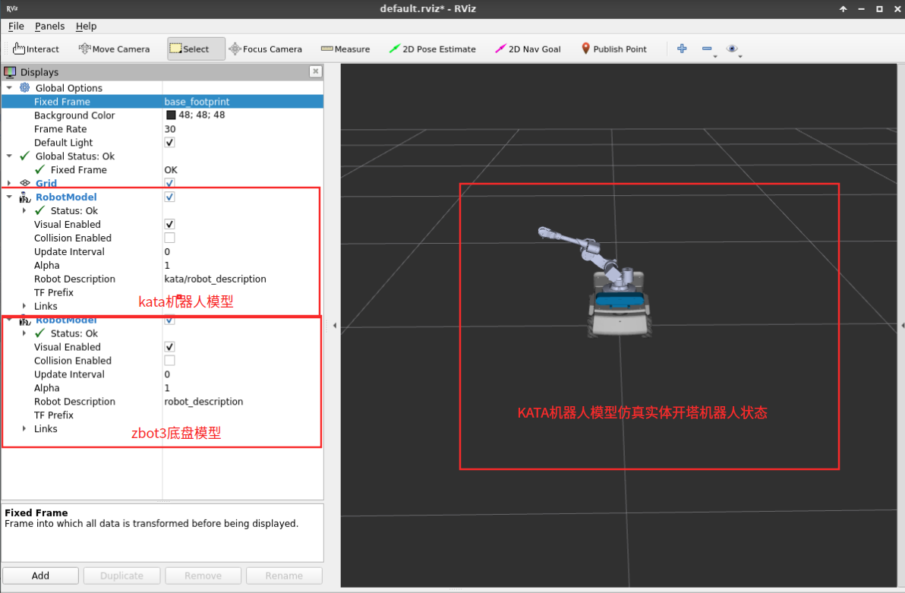

## 7. <a name='ROS'></a>ROS 基础工具与指令

1.**rosnode** -ROS节点管理工具

```bash
rosnode -h #查看rosnode 相关命令与使用方法
```

```bash
rosnode list #查看当前运行节点
```

```bash
rosnode info [节点名] #查看某一节点的相关信息
```

```bash
rosnode ping [节点名] #测试当前PC到 某一节点的连通性和延时
```

```bash
rosnode kill [节点名] #杀死某一节点
```

```bash
rosnode cleanup #清楚不可达节点的注册信息
```

```bash
rosnode mechine [主机hostname] #查看运行在某一机器上的节点列表
```

2.**rostopic** ROS话题管理工具

```bash
rostopic -h #查看rostopic 相关命令与使用方法
```

```bash
rostopic list #查看当前所有话题
```

```bash
rostopic echo [话题名] #实时输出该话题的发布消息内容
```

```bash
rostopic info [话题名] #查看该话题的详细信息
```

```bash
rostopic type [话题名] #查看该话题的类型
```

```bash
rostopic pub [话题名] [话题类型] [需要改的参数以及值] #发布一次话题,可指定参数-r 指定发布频率
```

```bash
rostopic find [话题类型] #根据话题类型查找话题消息
```

```bash
rostopic hz [话题名] #查看某一话题发布频率
```

3.**rosservice** ROS服务管理工具

```bash
rosservice -h #查看rosservice 相关命令及用法
```

```bash
rosservice args [服务名] #查看该服务相关参数
```

```bash
rosservice call [服务名] [参数] #调用该服务
```

```bash
rosservice info [服务名] #查看该服务的详细信息
```

```bash
rosservice list #查看当前所有服务列表
```

```bash
rosservice type [服务名] #查看服务类型
```

```bash
rosservice uri [服务名] #查看该服务的访问地址
```

```bash
rosservice find [服务类型] #根据服务类型查找相关服务
```

4.**rosparam** ROS参数管理工具

```bash
rosparam -h #查看rosparam 相关命令和用法
```

```bash
rosparam list #列出当前所有参数
```

```bash
rosparam set [参数名] [参数值] #设置或更新参数值
```

```bash
rosparam get [参数名] #获取参数当前值
```

```bash
rosparam load [文件名] [命名空间] #从文件中加载参数配置
```

```bash
rosparam dump [文件名] [命名空间] #将该命名空间的参数保存至文件
```

```bash
rosparam delete [参数名] #删除该参数
```

5.**rosmsg** ROS消息管理工具

```bash
rosmsg -h #查看rosmsg 相关命令和用法
```

```bash
rosmsg list #列出当前所有消息
```

```bash
rosmsg show [消息名] #查看关于该消息的描述
```

```bash
rosmsg info [消息名] #查看关于该消息的相关信息
```

```bash
rosmsg package [ros包名] #查看该ROS包下所有的消息
```

```bash
rosmsg packages #列出所有包含消息的ros包
```

6.**roscore** 运行ROS主节点，主节点负责其他节点的注册于管理

```bash
roscore
```

7.**rosrun** 运行ros节点

```bash
rosrun [ros包名] [ros节点名]
```

8.**roslaunch** 批量运行ros节点,当master节点未运行时，会自动开启一个master节点。

```bash
roslaunch [ros包名] [launch配置文件]
```

9.**rqt** 工具
一款用Qt制作的ROS 界面管理工具，里面包含许多方便好用的功能,包括但不限于动态参数调试、ros TF图查看 ros 节点关系图查看 ros 日志管理工具等。

```bash
rqt
```

10.**rqt_graph**  rqt中的节点关系图查看工具

```bash
rosrun rqt_graph rqt_graph
```

11.**rqt_tf_tree** rqt中的TF树（坐标变换树状图）查看工具

```bash
rosrun rqt_tf_tree rqt_tf_tree
```

12.rqt_image_view rqt中的图像话题查看工具

```bash
rosrun rqt_image_view rqt_image_view
```

## 8. <a name='launch'></a>理解launch文件

前面我们提到过可以通过roslaunch指令可以一次启动多个节点，现在，我们尝试通过roslaunch运行上述用键盘控制zbot3运动的功能。

ROS中的许多配置文件均为xml格式的。xml为类似网页文件html的标签配置语言。通过标签来指定内容和属性。标签由符号<>包裹，分为开始标签<标签>和结束标签</标签>。在标签中完成各项属性配置。更多关于xml文件参考[xml文件](https://baike.baidu.com/item/%E5%8F%AF%E6%89%A9%E5%B1%95%E6%A0%87%E8%AE%B0%E8%AF%AD%E8%A8%80/2885849?fromtitle=xml&fromid=86251&fr=aladdin)
对于xml无需学习，只需简单了解即可。
[label](Mini%E5%B0%8F%E8%BD%A6%E7%A1%AC%E4%BB%B6%E6%89%8B%E5%86%8C.docx)
现在，我们来写一个launch文件来运行上述两个节点。

为了方便开发，我们用VSCode连接zbot3。参考[快速搭建ROS开发环境中的VSCode安装与配置](./%E5%BF%AB%E9%80%9F%E6%90%AD%E5%BB%BAROS%E5%BC%80%E5%8F%91%E7%8E%AF%E5%A2%83.md)。

在 VScode 中打开zbot3 Ubuntu中的 zbot3_ws 工作空间，路径 /opt/ros/zbot3_ws，并找到zbot3_drive包中launch目录。鼠标选中该目录，右键->新建文件 在该目录中新建zbot3_keycontrol.launch文件。然后输入以下内容：

```xml
<launch>
    <node pkg="zbot3_drive" name="zbot3_drive" type="zbot3_drive_node" output="screen" respawn="true"/>
    <node pkg="teleop_twist_keyboard" name="teleop_twist_keyboard" type="teleop_twist_keyboard.py"/>
</launch>
```

查看文件内容，不难看出，launch内容文件由标签"<launch></launch>"包括，里面是两个节点启动配置的子标签。格式如下：

```xml
<node pkg=[节点所在ROS包名],name=[运行时的节点名称] type=[节点文件], output=[日志输出位置] ,respawn=["true"/"false"]>
```

其中，pkg,name,type是必须指定的，respawn=True设置该节点为必须节点，确保在意外停止运行后自动重新恢复该节点运行。保存该文件，
然后在终端中运行如下指令（先关闭前面运行的这两个节点）

```bash
roslaunch zbot3_drive zbot3_keycontrol.launch
```

现在，你已经自行实现了zbot3 键盘控制功能的启动文件。有关roslaunch文件及roslaunch指令更进一步的学习，参考下面连接:

* [roslaunch](http://wiki.ros.org/roslaunch/Commandline%20Tools)
* [launch文件格式](http://wiki.ros.org/roslaunch/XML)

### 8.1. <a name='TF'></a>机器人TF坐标变换解析

机器人系统通常具有随时间变化的许多 3D 坐标系，例如世界坐标系，基础
坐标系等。tf 随时间跟踪所有这些框架，是处理机器人不同坐标系的一个包，
机器人不同部位和世界的坐标系以 tree structure 的形式存储起来，tf 可以使
任何两个坐标系之间的点、向量相互转化。
对于从单片机控制转到 ROS 上的读者，ROS 自带的 tf 可以大大加深其对机
器人的理解。为了方便理解 tf 坐标变换，我们需要借助 rqt 工具，下面我们执
行如下指令可以查看TF树。

```bash
    rosrun rqt_tf_tree rqt_tf_tree
```

如图为zbot小车完整的TF树图
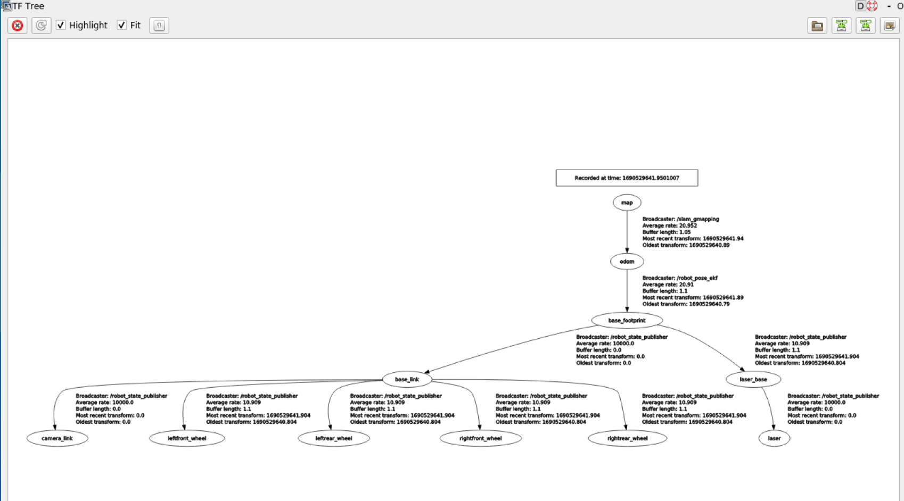

## 9. <a name='Slam'></a>Slam 建图实验

### 9.1. <a name='SLAM'></a>SLAM建图算法

操作环境及软硬件配置如下：

* zbot3机器人
* PC ：带有vnc viewer 远程桌面

ROS 开源社区汇集了多种 SLAM 算法，我们都可以直接使用或者对其进行二
次开发，gmapping 是基于滤波 SLAM 框架的常用开源 SLAM 算法，也是目前最为
常用和成熟的功能包。除了 gmapping 算法建图之外，我们也提供了 hector 和
karto 的建图算法。
*常用建图方法对比*
    gmapping 可以实时构建室内地图，在构建小场景地图所需的计算量较小且
    精度较高。相比 hector SLAM 对激光雷达频率要求低、鲁棒性高，Hector 在机
    器人快速转向时很容易发生错误匹配，建出的地图发生错位，原因主要是优化算
    法容易陷入局部最小值。而相比 cartographer 在构建小场景地图时，gmapping
    不需要太多的粒子并且没有回环检测因此计算量小于 cartographer 而精度并没
    有差太多。gmapping 有效利用了车轮里程计信息，这也是 gmapping 对激光雷达
    频率要求低的原因：里程计可以提供机器人的位姿先验。karto 建图算法与
    gmapping 原理相同，都是主要依赖里程计信息来完成建图。
    相对于以上的两种建图算法，hector 和 cartographer 的设计初衷不是为了
    解决平面移动机器人定位和建图，hector 主要用于救灾等地面不平坦的情况，
    因此无法使用里程计。而 cartographer 是用于手持激光雷达完成 SLAM 过程，也
    就是说可以完全不需要里程计的信息。

在zbot3_drive_node 节点中，我们已经实现了将ROS速度消息发送到驱动板，并接受驱动板反馈的传感器数据来发布 **/odom_raw** 里程计话题和 **/imu**惯导传感器话题。感兴趣的可在 /opt/ros/zbot3_ws/src/zbot3_drive/include/zbot3.hpp文件中查看源代码学习。这里不做过多讲解。我们的驱动节点通过发布这两个话题即可实时将zbot3小车的位姿信息和运动状态信息发送给其他订阅相应话题的节点。有关此部分代码实现如下

```c++
void ZbotSerial::publishImu()
    {
        sensor_msgs::Imu imuMsg;
        imuMsg.header.stamp = ros::Time::now();
        imuMsg.header.frame_id = "base_footprint";
        static float orien_x = 0., orien_y = 0., orien_z = 0.;
        float *quat = quatSolution(status->angular.x, status->angular.y, status->angular.z,
                                   status->acc.x, status->acc.y, status->acc.z);
        imuMsg.orientation.w = quat[0];
        imuMsg.orientation.x = quat[1];
        imuMsg.orientation.y = quat[2];
        imuMsg.orientation.z = quat[3];
        imuMsg.orientation_covariance[0] = 1e6;
        imuMsg.orientation_covariance[4] = 1e6;
        imuMsg.orientation_covariance[8] = 1e-6;
        imuMsg.angular_velocity_covariance[1] = 1e6;
        imuMsg.angular_velocity_covariance[4] = 1e6;
        imuMsg.angular_velocity_covariance[8] = 1e-6;
        imuMsg.linear_acceleration.x = status->acc.x;
        imuMsg.linear_acceleration.y = status->acc.y;
        imuMsg.linear_acceleration.z = status->acc.z;

        imuMsg.angular_velocity.x = status->angular.x;
        imuMsg.angular_velocity.y = status->angular.y;
        imuMsg.angular_velocity.z = status->angular.z;

        imuPub.publish(imuMsg);
    }
```

```c++
void ZbotSerial::publishOdometry()
    {
        nav_msgs::Odometry odomMsg;
        static float dist_x = 0., dist_y = 0., delth = 0.;

        current = ros::Time::now();
        dist_x += (status->velocity.x * cos(delth) + status->velocity.y * sin(delth)) * (current - last).toSec();
        dist_y += (status->velocity.x * sin(delth) + status->velocity.y * cos(delth)) * (current - last).toSec();
        delth += status->angular.z * (current - last).toSec();

        odomMsg.header.stamp = current;
        odomMsg.header.frame_id = "odom";
        odomMsg.child_frame_id = "base_footprint";
        odomMsg.pose.pose.position.x = dist_x;
        odomMsg.pose.pose.position.y = dist_y;
        odomMsg.pose.pose.position.z = 0;
        geometry_msgs::Quaternion quat = tf::createQuaternionMsgFromYaw(delth);
        odomMsg.pose.pose.orientation = quat;
        odomMsg.twist.twist.linear.x = status->velocity.x;
        odomMsg.twist.twist.linear.y = status->velocity.y;
        odomMsg.twist.twist.angular.z = status->velocity.z;
        if (status->velocity.x == 0 && status->velocity.y == 0 && status->velocity.z == 0)
        {
            memcpy(&odomMsg.pose.covariance, odom_pose_covariance2, sizeof(odom_pose_covariance2)),
            memcpy(&odomMsg.twist.covariance, odom_twist_covariance2, sizeof(odom_twist_covariance2));
        }
        else
        {
            memcpy(&odomMsg.pose.covariance, odom_pose_covariance, sizeof(odom_pose_covariance)),
            memcpy(&odomMsg.twist.covariance, odom_twist_covariance, sizeof(odom_twist_covariance));
        }
        odomPub.publish(odomMsg);
       
    }
```

在运行建图节点之前我们先打开建图节点的 launch 文件查看里面的内容，文件名为 **zbot3_slam.launch**,可以看到支持建图的方式选择，默认是使用 gmapping 方式建图，也可以自定义修改成使用 karto 和 hector 方式建图。在运行时可以指定**slamMethod** 参数切换其他建图算法。

**后续带有图形界面显示的请运行在VNC桌面中，后续不再提示**
示例：启动gmapping建图(请在VNC桌面中执行)

```bash
roslaunch zbot3_drive zbot3_slam.launch
```

上述launch文件运行了多个launch子文件。功能包括：
* 启动zbot3 小车底盘驱动程序
* 启动键盘控制节点
* 启动雷达
* 启动slam算法中的gmapping 节点
* 打开配置好对应插件的Rviz显示环境

启动Gmapping建图后如图所示
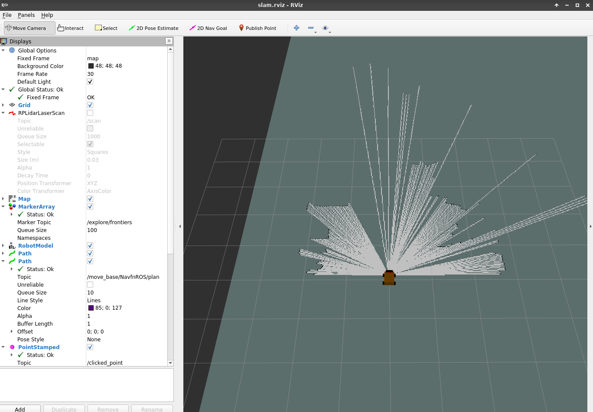
用键盘控制小车，使他建图完周围场景。
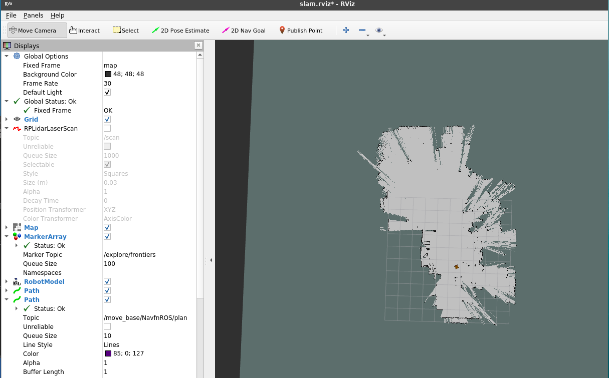

### 9.2. <a name='Gmapping'></a>Gmapping 配置文件一览

针对每种不同的SLAM建图方法，都有对应的配置文件。合理的参数配置能提高建图效果。现在，以Gmapping建图方法为例，我们查看其配置文件。在 **zbot3_slam**包中，打开slam_gmapping.launch, 在gmapping 节点下，我们可以看到具体配置内容。
以下作简单说明：

```xml
    base_frame: 指定机器人基础坐标系，通常为base_link或base_footprint
    odom_frame:里程计坐标系
    map_frame:地图坐标系
    maxUrange: 激光有效照射范围
    maxRange:激光最大照射范围
    delta:地图分辨率
    particles: 粒子数
    minimumScore:最小匹配得分，决定激光数据匹配置信度
    linearUpdate:机器人移动该距离，进行一次扫描匹配
    angularUpdate:机器人旋转angularUpdate,进行一次扫描匹配
    lskip：跳过的扫描光束数，尽可能为0
    lstep：平移优化步长
    astep：旋转优化步长
```

有关gmapping更详细的配置说明，参考：[gmapping roswiki](http://wiki.ros.org/gmapping#External_Documentation)

### 9.3. <a name='-1'></a>保存地图

```bash
roslaunch zbot3_drive zbot3_savemap.launch
```

地图文件的保存位置可以通过 **file_name** 参数指定。
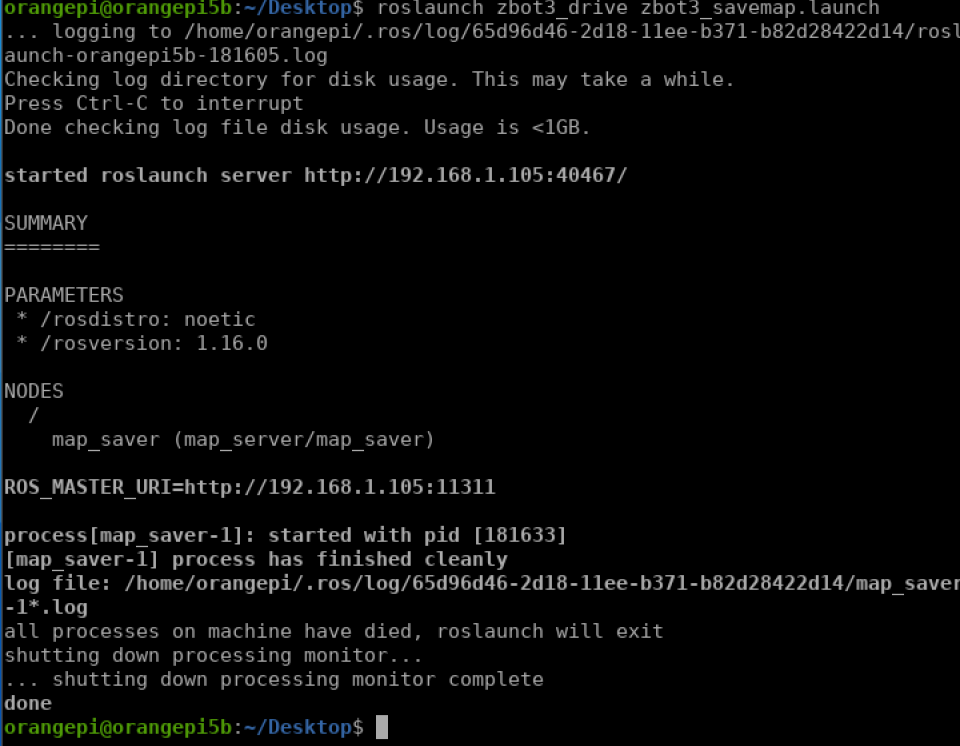

默认地图文件保存位置为zbot3_drive/maps 目录。文件名 default。
现在，我们可以转到 maps文件夹，查看保存到此处的地图文件。可以看到里面有两个文件，分别为地图的图像文件和地图的配置文件。图像文件可以用图片查看器打开。配置文件包含了地图的配置信息，如分辨率，地图大小等。
如下图所以，地图文件实际上是一张图片文件。


### 9.4. <a name='hector'></a>使用hector建图

**zbot3_slam.launch** 启动文件可以指定 slamMethod 参数切换建图算法。如下使用hector建图方法

```
   roslaunch zbot3_drive zbot3_savemap.launch slamMethod:=hector 

```

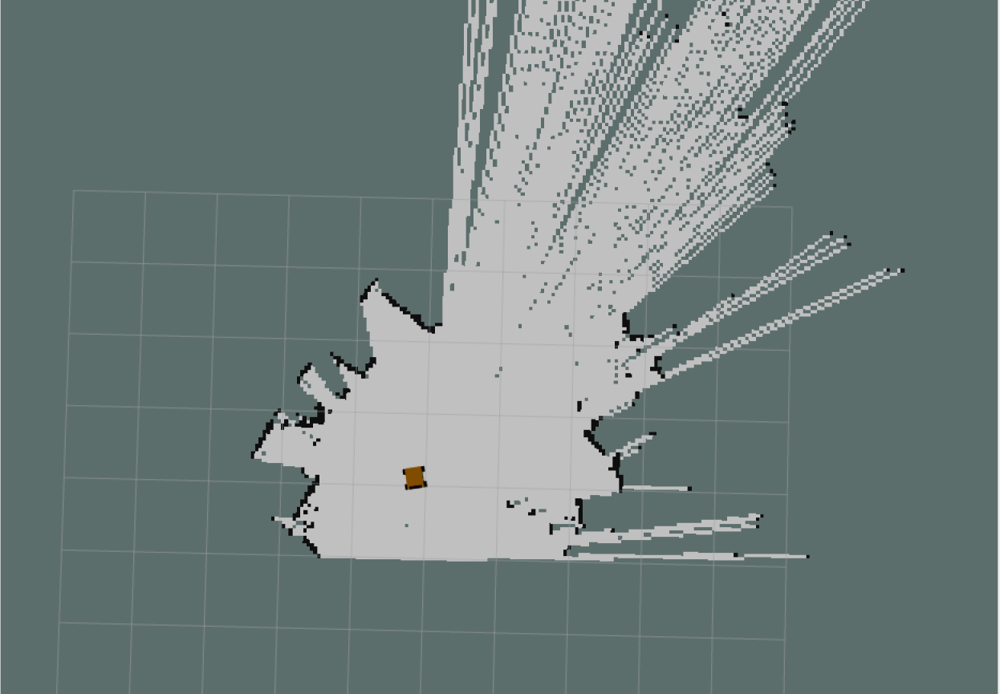

### 9.5. <a name='Cartograpger'></a>使用Cartograpger 建图

Cartographer是Google推出的一套基于图优化的激光SLAM算法，它同时支持2D和3D激光SLAM，可以跨平台使用，支持Laser、IMU、Odemetry、GPS等多种传感器配置。该算法可以实现实时定位和建图。Cartographer建立的栅格地图可以达到5cm的精度，该算法广泛应用于服务机器人、扫地机器人、仓储机器人、自动驾驶等领域，是最优秀的激光SLAM框架之一。

```bash
    roslaunch zbot3_drive zbot3_slam.launch slamMethod:=cartographer
```

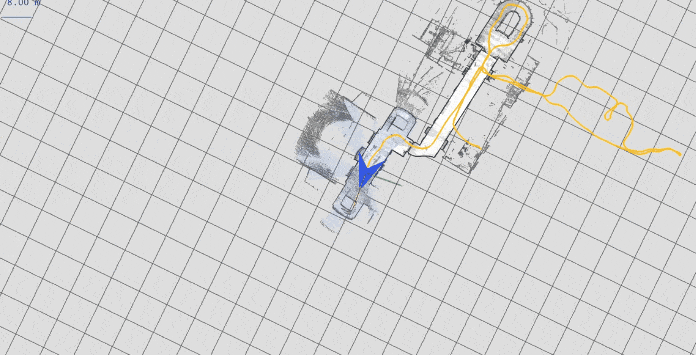

Cartographer 建图在各平台和各Ubuntu版本配置较为复杂，且需要自行解决部分动态链接库依赖问题。难以有通用的配置教程。但Google 官方还是给出了在ROS中使用Cartographer的通用指导。有关Cartographer的原理和配置请参考

* 
  
* 

Cartographer 建图方法有着较高精度的建图分辨率，甚至对精度要求不高的场合可以进行手持建图。如下启动Cartographer ROS建图：

```bash
roslaunch zbot3_drive zbot3_slam.launch slamMethod:=cartographer
```

下图为Cartographer建图启动后Rviz中显示的状态。用键盘控制小车移动，雷达扫过的建图区域地图会逐渐加深。具体表现为空白区域呈现白色，障碍物区域呈现黑色。

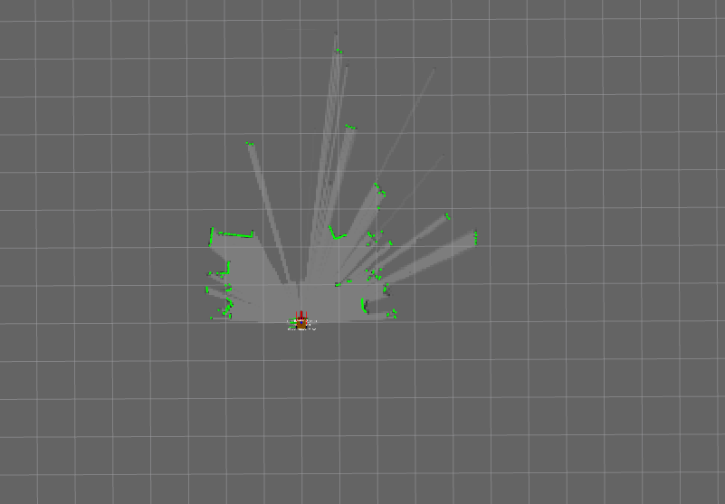
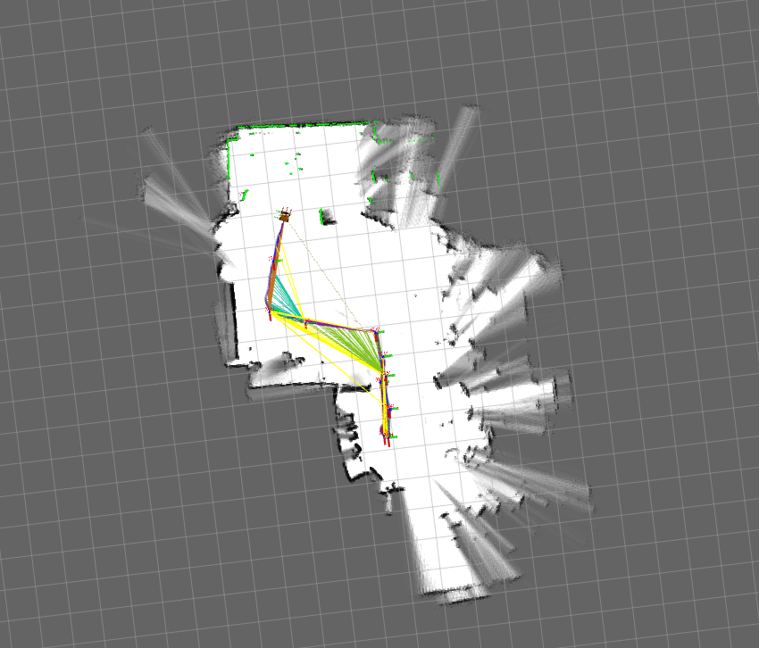
Cartographer ROS 作为Cartographer在ROS上的移植，其默认数据保存方式为通过rosbag 文件将建图过程中的各传感器数据写入rosbag文件。这使我们难以在导航中使用这些数据。但我们仍可以在建图过程中通过mapserver 节点保存地图。此外，zbot也提供了Cartographer 默认的传感器数据写入文件的方法。如下

```bash
roslaunch zbot3_drive zbot3_cartographer_savemap.launch
```

## 10. <a name='Zbot3-1'></a>Zbot3 导航

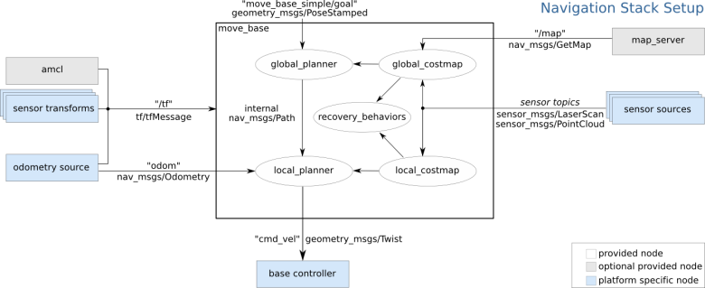

机器人导航的关键是实现自身定位和路径规划。在实现自主导航之前，我们需要配置如下两个包，实现机器人在导航过程中的定位和路径规划。此处需要确保已安装功能包 ros-noetic-navigation。

* **move_base** 功能包整合了导航的全局路径规划、局部路径规划以及恢复行为模块。
* **amcl** 自适应蒙特卡洛定位法，实现机器人在2维空间中的定位。
  
为了实现机器人全局最优路径规划与实时避障路径规划，move_base需要订阅机器人发布的深度传感器信息（sensor_msgs/LaserScan或 sensor_msgs/PointCloud）和里程计信息（nav_msgs/Odometry），同时完整的TF坐标变换也是实现路径规划的重要基础。

导航框架最终的输出是控制机器人的速度指令（geometry_msgs/Twist），这就要求机器人控制节点具备解析控制指令中线速度、角速度的能力，并且控制机器人完成相应的运动。

### 10.1. <a name='movebase'></a>配置movebase

 move_base 是一个开源 2D 移动机器人导航包，用于将机器人在指定的导航框架内运动到任务位置。 move_base 包执行一个完成给定导航任务的ROS行为，基于全局地图的路径规划是在机器人向下一个目的地出发前开始的，这个过程会考虑到已知的障碍物和被标记成“未知"的区域。要使机器人实际执行动作行为，本地路径规划器会监听传回来的传感器数据，并选择合适的线速度和角速度来让机器人完整地执行完全局路径规划上的当前段路径。

 movebase路径规划包括全局路径规划和局部路径规划。全局路径规划常用Dijkstra算法和A*算法。Dijkstra算法深度优先，往往可以找到全局最优路径，不过搜索时间长、消耗资源多，而A*算法加入了启发函数，虽然不一定可以找到全局最优路径，但搜索时间更快，适合大空间范围的规划。移动机器人大部分是在室内有限范围内使用，两者搜索时间和消耗资源的差距并不明显。

 本地实时规划常用Dynamic Window Approaches（DWA）和Time Elastic Band（TEB）算法，两种算法的核心思想如下。

 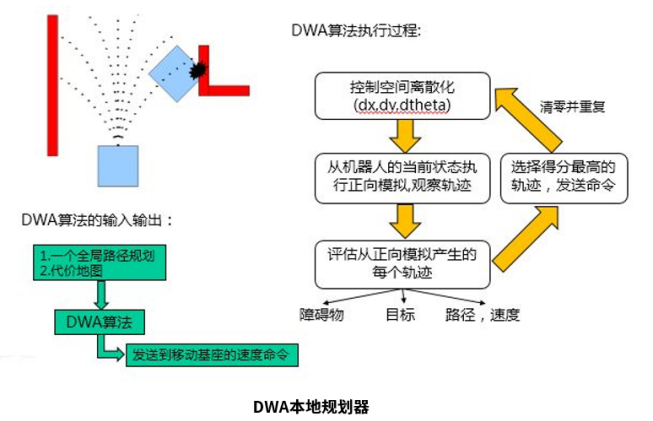
 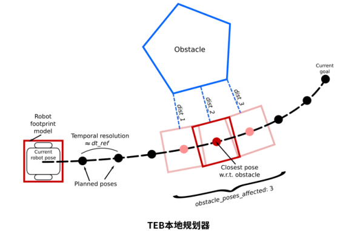

 move_base导航使用两种代价地图存储周围环境中的障碍信息：一种用于全局路径规划（global_costmap），一种用于本地实时路径规划（local_costmap）。两种代价地图需要使用一些共用的或独立的配置文件：通用配置文件（costmap_common_params）、全局规划配置文件（global_costmap_params）和本地规划配置文件（local_costmap_params）。

 有关movebase的参数配置，见 **zbot3_drive/params/** 文件夹下几个文件。

* base_local_planner_params.yaml 配置局部路径规划器的相关参数
* global_planner_params.yaml 配置全局路径规划器的相关参数
* costmap_common_params.yaml 全局代价地图和局部代价地图共有参数
* local_costmap_params.yaml 局部代价地图参数
* global_costmap_params.yaml 全局代价地图参数

在这几个文件中，一些关键参数在后面都做了说明，可自行打开查看，此处不再过多赘述。

 **给定导航目标**
 使用MoveBaseActionGoal消息类型来指定目标，目标由一个包含一个frame_id的ROS标准header、一个goal_id和一个PoseStamped消息类型的goal组成。其中，PoseStamped消息类型是由一个header和一个包含position和orintation的pose组成。

### 10.2. <a name='amcl'></a>配置amcl

导航功能的顺利进行，离不开机器人的精准定位。自主定位即机器人在任意状态下都可以推算出自己在地图中所处的位置。ROS为开发者提供了一种自适蒙特卡罗定位方法（Adaptive Monte Carlo Localization，amcl），这是一种概率统计方法，针对已有地图使用粒子滤波器跟踪一个机器人的姿态。


给定初始位姿后，AMCL会在机器人周围随机撒一些粒子，随着机器人的运动，每个粒子也会实时跟随机器人的速度更新位姿，当粒子周边的环境状态与机器人差距较大时，就会被逐渐淘汰，反之，则会在机器人周边产生更多粒子。以此类推，粒子都集中在机器人所在位置可能性高的地方，也就是定位的结果。

### 10.3. <a name='map_server'></a>使用map_server 加载地图

导航时需要我们加载我们前面已经建图生成的地图文件，并将zbot3小车放到对应的现实场景中。加载地图文件可以用如下命令：

```bash
    rosrun map_server map_server -f /[path]/[map_name].yaml
```

### 10.4. <a name='zbot3'></a>运行zbot3 导航

为了方便启动，zbot3的整个导航启动配置都写在了zbot3_drive 包 **zbot3_navigation.launch**文件中。经过前面的学习，相信现在你已经能够轻松的理解该文件的内容。我们直接运行即可。

```bash
    roslaunch zbot3_drive zbot3_navigation.launch
```

在打开的rviz中，我们添加RobotModel，Map插件，让插件订阅**/map**话题。
不出意外，地图和小车模型都已出现在了rviz窗口中。在线，借助姿态评估工具**pose estimate** 手动在rviz中指定小车在场景中的初始位置。然后，利用 导航工具在rviz中指定目标点和目标位姿，观察小车已开启向着目标点移动过去。

有关movebase的参数配置远不止这些。更多参数及其说明，可以在运行movebase节点后，通过rqt动态调参进行查看。后续其余节点的详细参数配置也可以借助此工具。
  
使用此工具前，我们得先运行需要调参或查看参数的节点。此处以movebase为例。

```bash
    roslaunch zbot3_drive zbot3_movebase.launch
```

然后，在vnc中，打开rqt gui工具

```bash
    rosrun rqt_gui rqt_gui
```

在菜单栏中，逐级找到plugins(插件)->Configurations(配置)->动态调参(Dynamic Reconfigure)
在左侧列表中选择对应项，右侧即可看到各种可配置参数。将鼠标放置在对应参数上稍作停留，会有关于该参数的说明。
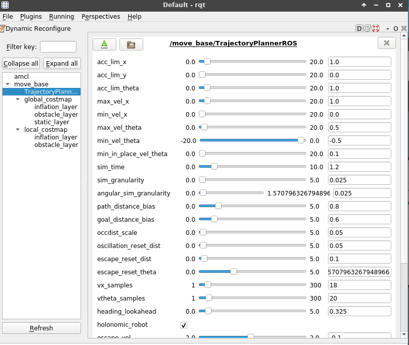

### 10.5. <a name='-1'></a>实现多点往复导航

rviz上有一系列工具，如下图。按照前面教程，通过位姿评估工具校正小车在地图上的初始位置。不同于单目标导航，这次我们用发布导航点工具（publish point）在地图上分开点击几个位置，然后右键点击，可以看到小车开始依次往点击的对应位置移动过去。


### 10.6. <a name='-1'></a>实现小车自主探索建图

在ROS中，有多种自主探索建图算法。其核心思想都是通过订阅slam节点发布的地图数据或通过movebase发布的代价地图数据找出当前已建立地图的边界，并发送导航目标指引小车移动过去，在移动的过程中，激光雷达的扫描范围不断扩大，不断扩大建图范围，并查找新的边界，直到指定区域扫描完毕或整个场景地图实现闭合。

在noetic中，最方便配置的是**explore_lite**, Explore-lite使用了一种名为模式自适应增量搜索（PAISS）的算法。它在行动选择方面和传统的探索-开发方法有所不同，并且具有快速学习特性。PAISS算法使用一种模式自适应的搜索方法，该搜索方法根据不同的环境条件选择最佳行动。它通过实时分析当前任务和环境因素来优化行动，并且可以快速学习新的要求，而无需重新训练。AISS算法的搜索过程可分为三个步骤：1：行动选择步骤，此步骤通过实时分析当前任务和环境因素来优化行动。2：根据优化后的行动执行步骤。3：将当前边界点保存至数据库中。PAISS算法和激光雷达可以将机器人自动导航到目标地点。此过程可以概括为。1：机器人使用激光雷达来采集信息。2：机器人使用PAISS算法根据当前任务和环境因素来优化行动并执行到下一个边界点。3：重复上述步骤直到机器人达到预定的目的地。

#### 10.6.1. <a name='explore_lite'></a>启动explore_lite

选择一块相对宽敞的区域空间，将小车放置在没有障碍物包围的位置。确保场景中的障碍物高度能有效被激光雷达探测到，如下启动explore_lite.

```bash
    roslaunch zbot3_drive zbot3_slam.launch autoSlam:=true
```

等待zbot3机器人接收导航目标，不断扩大建图区域。可以在打开的rviz中查看实时建图过程。如下图，小车会等待计算完成后自动前往当前检测到的绿色边界点，并更新新的边界点。在此过程中，地图区域会不断扩大，直到结束。

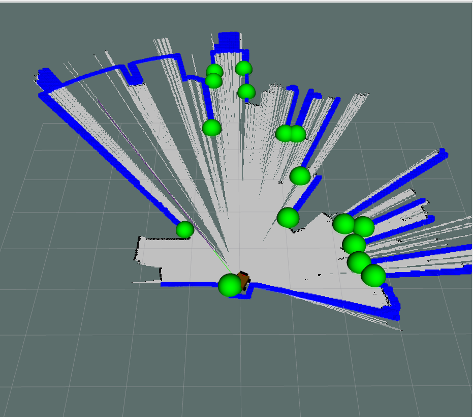

#### 10.6.2. <a name='RRT-Exploration'></a>使用RRT-Exploration建图

除了explore——lite自主探索建图方法还，还有常用的RRT-Exploration 自主探索建图。rrt_exploration”是实现移动机器人的多机器人地图探索算法的ROS包。 它是基于快速探索随机树（RRT）算法。 它使用占用网格作为地图表示。该包具有5个不同的ROS节点：

1. 全局RRT边界点检测器节点。
2. 局部RRT边界点检测器节点。
3. 基于OpenCV的边界检测器节点。
4. 滤波器节点。
5. 分配器节点。

RRT exploration是基于RRT路径规划算法实现的搜索算法。RRT算法对于未知区域有着强烈的倾向，在RRT exploration中，RRT主要用于生成边界点，这样对于探索边界点是很有好处的。所谓的边界点就是已经探索过的和未知的区域的交界点，在这里做一个定义:对于所有的区域，如果是探索过的，没有障碍物的区域记为0，有障碍物的记为1，未知的区域记为-1，开始时，整个区域都是记为-1.

rrt-exploration 框架如图所示
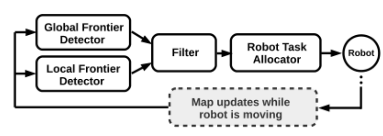

可以看到，整个搜索过程是由四个模块构成的:其中局部探测器和全局探测器负责探测边缘点，然后把探测到的边缘点发送给过滤模块，经过过滤后，再把信息传递给任务分配模块，最终指导机器人的行动。下面我们分别看一下各自模块:

局部探测器
局部探测器是用来探测边界点的，它的思路与RRT路径规划的思路大致相同，都是通过树的生长来实现对周围环境的探测，当树枝生长到了未知区域，那么当前点就可以认为是边界点。局部探测的流程如下:

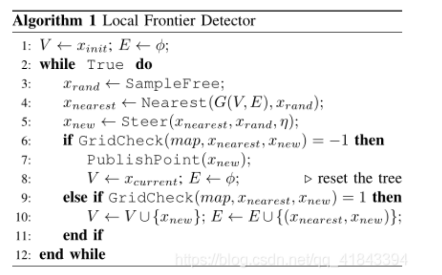

全局探测器
全局探测器与局部探测器唯一的区别就在于树的更新中，如果探测到了边界点，全局探测器并不会更新树的根节点的位置，而是继续生长:
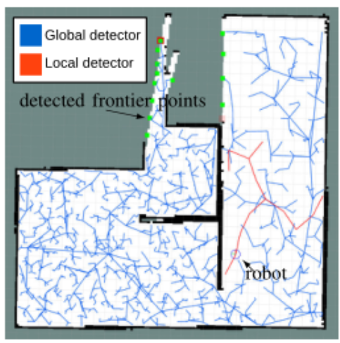

全局探测器看起来效率很低，但其实它是局部探测器的重要补充，局部探测器可以很快找到边界点，但也会同时忽略一些小角落，全局探测器存在的意义就是为了实现全方位的搜索。

过滤模块
过滤模块会接受局部和全局探测器找到的全部边界点，并且对其进行聚类，只保留聚类的中心点发送给任务分配模块，其余的边界点全部删除。

任务分配模块
这个模块主要是用于寻找机器人下一步需要到达的点。对于每一个过滤后的边界点，对其进行收益计算，其公式如下:

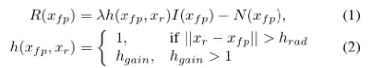

其中λ为用户定义的权重常数，h为滞回增益，用户设置一个半径hrad，在半径之外h设置为1，在半径内h设置为一个大于1的常数，这么设置的意义在于让机器人优先探索附近的边界点。I为信息增益，即给定边界点后，到达那里所能获得新视野.

启动 RRT-Exploration

```bash
    roslaunch zbot3_drive zbot3_rrt_exploration.launch
```

## 11. <a name='Zbot3SLAM'></a>Zbot3 视觉SLAM建图

Zbot 机器人视觉建图依赖于奥比中光双目视觉相机。该相机ROS节点发布彩图图像话题信息和深度图像话题信息，结合使用可以获取图像素点的颜色和深度信息。

视觉SLAM建图使用ROS中的Rtabmap ROS包完成建图。该功能包同样包含一系列复杂的参数配置。具体参数配置和详细使用方法可参考：
[Rtabmap ROS](http://wiki.ros.org/rtabmap_ros)

### 11.1. <a name='Zbot3Slam'></a>运行Zbot3 视觉Slam建图

```bash
    roslaunch zbot3_drive zbot3_slam3d.launch

```

如下图可以看到，借助3d slam 建图，可以将周围场景中的3d物体点云数据展示在我们的Rviz地图显示上。同雷达2D Slam 建图 一样， 通过键盘控制或手柄控制控制小车移动，完成对整个周围场景的建图扫描。由于双目相机数据量在3维空间相比雷达2D空间数据量大的多，视觉Slam建图也更加消耗设备硬件资源。在建图时，应确保zbot机器人速度不宜过快。
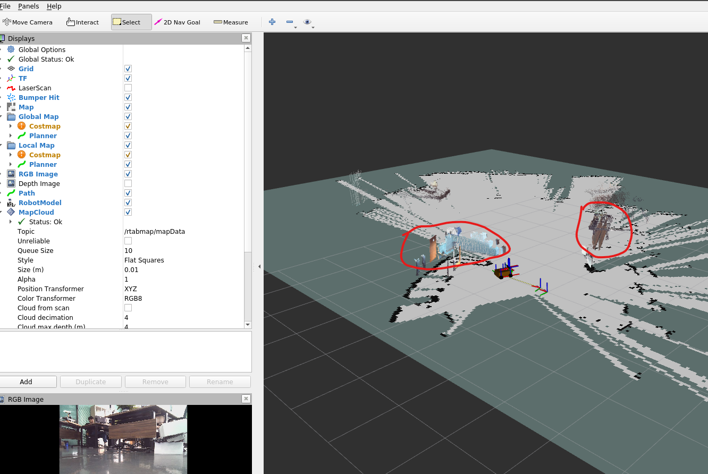

不同于雷达2D建图我们使用mapserver 包中的map_saver 功能节点保存地图，Rtabmap 建图会自动将建图过程中产生的点云信息存储在Rtabmap 节点配置的数据库文件中。我们无需再自己保存3d 地图。

同样，借助movebase节点和explore_lite功能包，我们可以实现视觉Slam 自动建图。其实现原理同上面2D 自动建图一样。可以看到，在 **zbot3_slam3d.launch** 启动参数中，仍有autoSlam 参数。如下启动自动建图。

```bash
roslaunch zbot3_drive zbot3_slam3d.launch autoSlam:=true
```

值得说明的是，双目相机的有效距离范围通常要比雷达要小的多，所以在3D建图中，我们可以借助雷达发布/scan 话题消息生成map地图，再使用双目相机生成场景物体的3D点云消息，优化视觉Slam建图。

```bash
    roslaunch zbot3_drive zbot3_slam3d.launch useLidar:=true
```

### 11.2. <a name='RtabmapRos'></a>使用Rtabmap Ros 进行导航

在进行完视觉Slam 建图后，我们就可以用新建的地图进行导航了。Rtabmap ROS包不仅能够生成3d 点云图，还能够根据生成的3d点云数据提供定位，由此实现导航功能。 遗憾的是zbot小车只能在二维平面运动。但我们仍可以简单导航实验。

```bash
roslaunch zbot3_drive zbot3_navigation3d.launch 

```

该launch 文件同视觉Slam 卵巢文件没有区别，仅是把movebase 功能包加入进去,再借助locallization 参数确保Rtabmap 功能包再启动时不会清除上一次保存的3d点云数据文件。

## 12. <a name='Zbotfollow'></a>Zbot follow 功能包功能说明和使用

Zbot follow 功能包里面包含了一些zbot 跟随功能的节点实现。如下一一介绍。

1. 雷达最近物体跟随

   雷达最近物体跟随会让zbot机器人通过雷达点云数据判断周围最近物体的距离和方位。并控制zbot机器人向其靠近。由于仅使用雷达判断周围场景信息，感知到的信息非常有限，建议在空旷的场地使用该功能。如下启动zbot 雷达跟随功能,然后要跟随的人或物体站在雷达的有效扫描范围之内，待zbot小车朝向被跟随物体运动起来，让被跟随物体在周围场景中作移动，观察小车跟随。（注意，被跟随物体请始终处在雷达有效扫描范围以内。）

```bash
roslaunch zbot_follow zbot3_lidar_follow.launch
```

2. zbot 寻线运动

    借助双目相机，zbot 可以通过识别前方道路颜色实现zbot 寻线功能。如下图为zbot寻线功能使用。其中，两个窗口一个显示当前相机视野，另一个显示添加对应识别颜色后的图像遮罩。zbot 根据遮罩图像过滤后的颜色块位置控制小车方向，完成寻线效果。在遮罩图像下面，滑动滑块切换识别线路颜色。图示为巡线黄色线。为了更好的效果，请确保待识别颜色道路有合适的宽度,并确保周围环境光线均匀明亮且地面无反光。

```bash
roslaunch zbot_follow zbot3_line_follow.launch
```

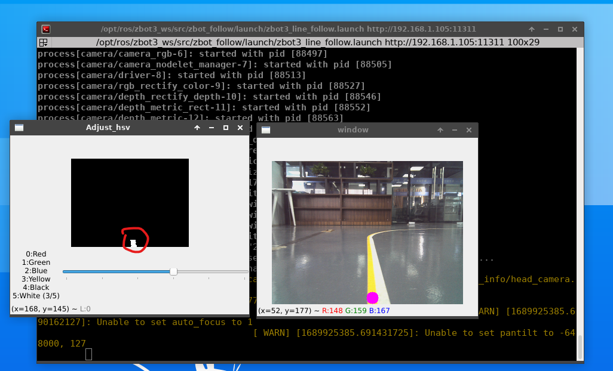

3. Zbot 物体跟随

    借助双目相机，zbot 可以识别双目相机视野中的物体完成跟随。该方法比雷达跟随限制更少，准确度更高。物体识别算法采用的是。如下启动zbot物体跟随节点.

```bash
roslaunch zbot_follow zbot3_object_follow.launch

```

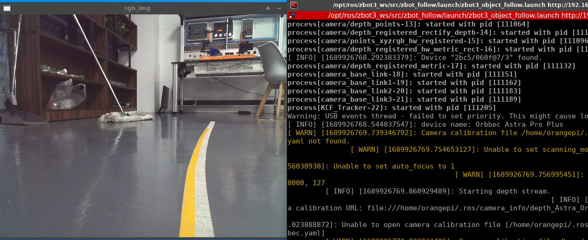
待节点启动后，在图像窗口上从左上角往右下角拉出一个合适大小矩形框框住待跟随物体。zbot便会跟随物体运动.
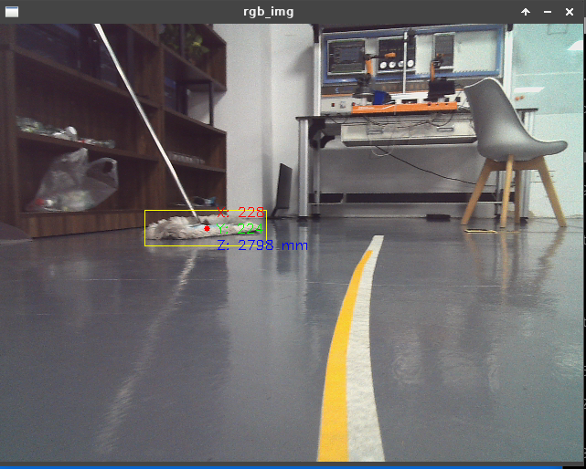

4. zbot 人体跟踪

    zbot 包含人体骨架检测网络。可以更加准确的识别到人体骨架，完成行人跟随。需要说明的是，当前行人跟踪功能无法区分多人骨骼节点。请确保使用该功能时，相机视野中仅有要跟随的人存在。

```bash
    roslaunch zbot_follow zbot3_people_follow.launch
```

!

## 13. <a name='ZbotMonitor'></a>Zbot Monitor 使用说明

Zbot Monitor 是基于Qt写的Zbot 机器人用户界面交互程序。可方便用户快速打开基本功能。对Zbot机器人进行配置与状态监测。其主界面如下图所示：
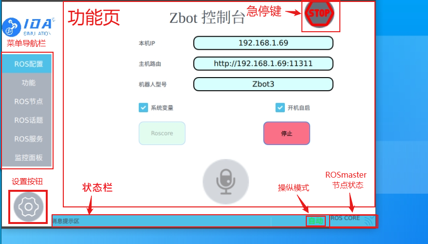

主页面可分为如下几个区域：左侧为菜单导航区域，点击对应菜单按钮，切换到不同菜单页。
底部左下角为软件设置按钮，点击可打开/关闭软件设置界面。
右侧主区域为对应导航菜单按钮的主页。底部为状态栏，显示一些状态消息和ROS 节点管理器状态。
接下来分别介绍各菜单页：

1. Configure zbot Monitor主界面，界面如下图所示
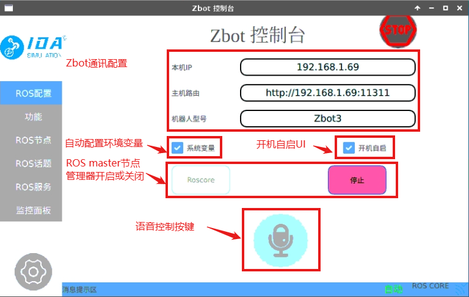

上面三个文本框方便用户配置ROS多机通信功能。分别对应ROS 多机通信中的**ROS_IP** , **ROS_MASTER_URI**,**ROS_MASTER_NAME**三个环境变量。
中间两个选择框：

* sysEnv (System Environment) 勾选则每次启动ROS指令时自动加载用户环境变量。
* AutoStart 勾选以后软件开机自启。

底部麦克风按钮为语音指令功能，用户可通过点击按钮对着麦克风说话完成基础语音指令。

online 按钮 启动ROS节点管理器(roscore)
stop 按钮： 停止所有当前在运行ros节点

2. Functions 功能页

     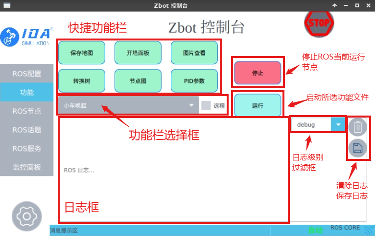

    如下图所示，顶部为ROS快捷功能按钮。按下可快速启动对应ROS功能。分别对应如下:
    * 保存地图： 快速将当前场景建图保存到默认位置。
    * 开塔面板： 点击开启开塔机器人控制面板（仅适合带开塔四轴、六轴机器人的Zbot）
    * 图片查看： 快速打开rqt图片查看工具
    * 转换树： 快速打开rqt_tf_tree,方便查看坐标转换关系
    * 节点图： 快速打开rqt_graph节点查看工具，查看节点关系
    * rviz ： 快速打开新的rviz空白配置窗口。

    Zbot功能下拉框可以方便用户快速启动Zbot 功能启动文件，免去繁琐的终端命令输入。勾选Remote 远程按钮，可以将指令运行在远程Master端，适合多机通信。点击Run 启动按钮，运行选择的功能。

    底部为ROS日志显示区域，集合显示ROS各节点日志信息。可以通过右上角下来框过滤日志级别。两个功能按钮分别可以清除当前日志显示区域和保存日志到文件。

3. Nodes ROS节点页。

    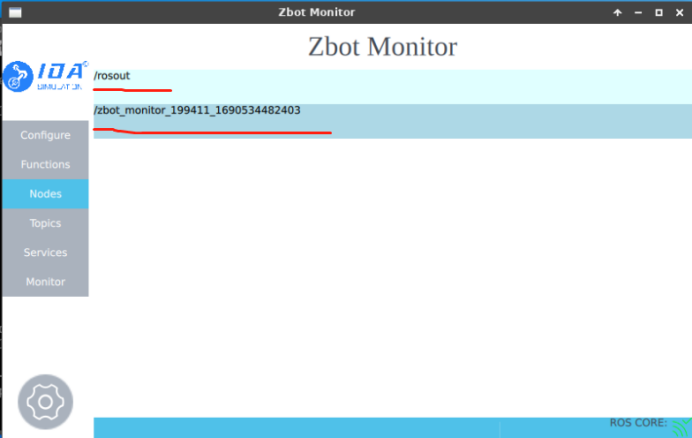

    以列表形式展示当前节点管理器可访问节点。右键唤起右键菜单可关闭对应节点。

4. Topics ROS话题页

    以列表形式展示当前所有话题和类型。

5. Services ROS服务页

    以列表形式展示当前在线服务

5. Monitor 监控面板

    展示zbot机器人的一些状态信息，如速度信息，电池电量信息。
    

6. 设置页

    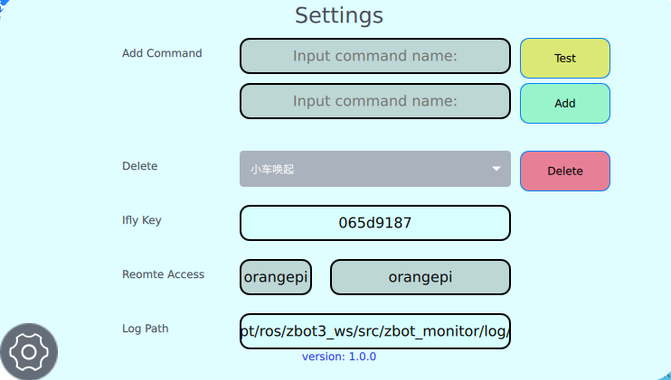

    点击后打开软件设置页，顶部添加命令区域可以为功能页功能选择下拉框加入新功能配置。点击Test 测试按钮测试测试启动功能测试对应指令是否输入正确。点击添加按钮完成添加。删除命令下拉框则可以删除对应功能。讯飞语音API密匙需要填入从讯飞语音识别服务平台的API密码，方可支持语音指令功能。远端账号设置区域则可以设置多机通讯时主机端账号和密码，使功能运行在远端。
    日志保存位置则指定点击日志保存按钮时日志文件的默认保存位置。

### 13.1. <a name='Zbot'></a>Zbot 语音控制

功能介绍
随着电子产品的日益发展，语音识别技术广泛出现在不同的场景中，例如智能家居、语音助手、电话客服和机器人导游等。而随着技术的不断发展，机器人的语音识别正在变得越来越准确和可靠，这进一步促进机器人在各种领域的应用。

本次开发的语音控制功能基于讯飞语音识别SDK.Zbot3 将用户的声音上传至讯飞云端，然后获取返回识别到的字符串结果。根据字符串内容，执行对应的指令。
Zbot3的语音控制功能集成在Zbot Moitor 程序上。参考上面Zbot Monitor使用教程。其次，其还依赖讯飞语音识别API 密匙。需要用户前往科大讯飞开放平台平台申请。[讯飞开放平台]<https://passport.xfyun.cn/login>

语音指令识别过程如下：
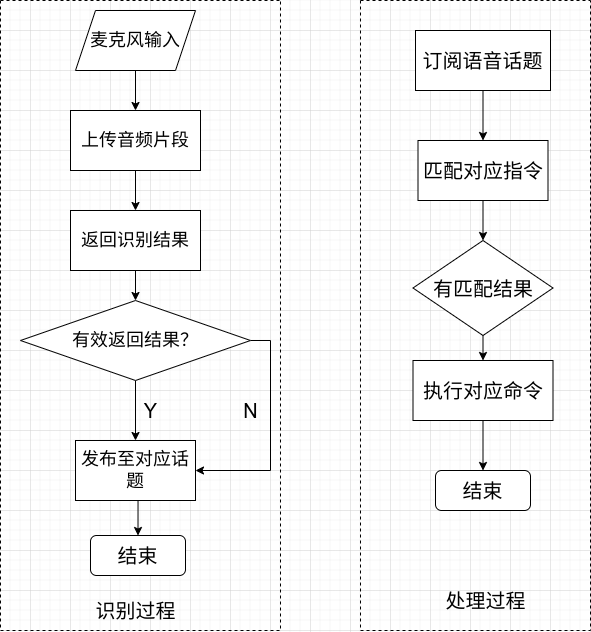

语音识别结果发布的话题在 **/zbot_monitor/voice_cmd** 上，用户可以方便的订阅该话题实现语音功能扩展。

### 13.2. <a name='ZbotMonitor-1'></a>Zbot Monitor 开塔机器人面板

操作环境及软硬件配置如下：

* zbot3机器人（kata机器人版)

如图，点击功能页开塔面板快捷按钮，打开开塔控制面板。

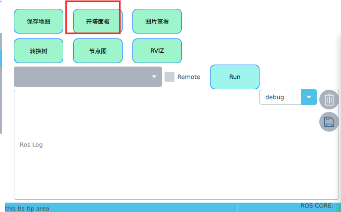

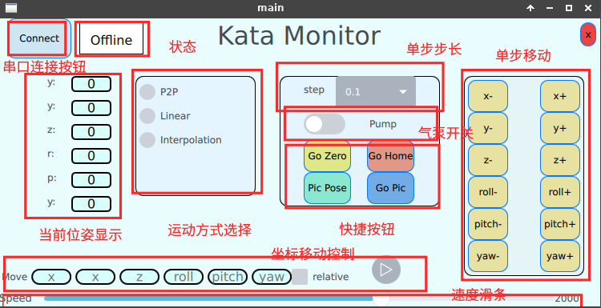
左上角为开塔机器人连接/断开按钮与状态显示。下方为开塔机器人当前空间位姿状态。右边为运动方式选择单选框。参考开塔机器人说明手册。四个快捷按钮功能如下：
* GoZero : 开塔机器人各轴回零
* GoHome : 开塔机器人复位回初始点
* PickPose: 设置当前位姿为拍照位置
* Go Pic: 运动到当前设置拍照位

底部为坐标运动控制区域：分别在对应位置输入机器人最终运动位姿的**x,y,z,roll,pitch,yaw**空间坐标， 点击右侧执行按钮即可运动至对应位姿。勾选relative 相对运动选择框，则开塔机器人以当前位姿为基准，进行各坐标上的相对移动。底部速度滑条可以设置开塔机器人运动的速度。默认为2000 mm/s.

右侧单步移动按钮可以控制机器人在各坐标上进行单步移动，移动步长为step 下拉框当前选择的步长。

## 14. <a name='-1'></a>开塔机器人快速上手

1. 指令说明

   * Mirobot采用USB串口方式进行通信。波特率为115200，数据位8，停止位1。
   * Mirobot采用基于G代码的指令控制。
   * 指令中各个字母不区分大小写。
   * Mirobot能够对外输出两组PWM信号用于控制末端夹手或者吸盘。
   * 用户可通过WlkataStudio或串口工具向机械臂发送指令，每条指令以'\n'换行符为结束

2. 开塔机器人坐标系如下
    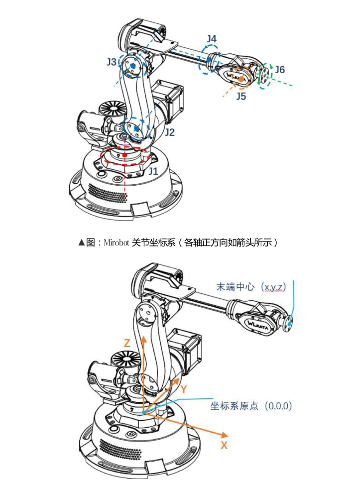

    开塔机器人运动空间：
    开塔机器人使用时需注意机械臂的工作空间为环形，当出现轨迹超出工作空间时，机械臂无法正常执行该指令，即使起始点A与目标点B都在工作空间内。（如下图所示），此种情况请使用G00快速运动；
    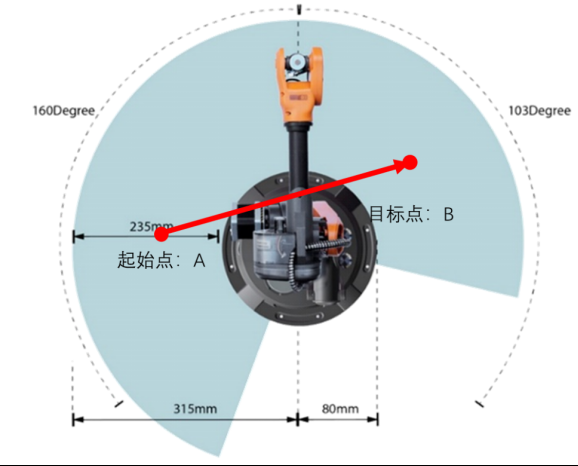

3. 运动方式介绍

* 直线插补运动（末端运动轨迹为直线）
    
* 快速运动 (控制机械臂以各轴设定最大速度运动)
  
* 顺时针圆弧插补/逆时针圆弧插补（XY平面）；
  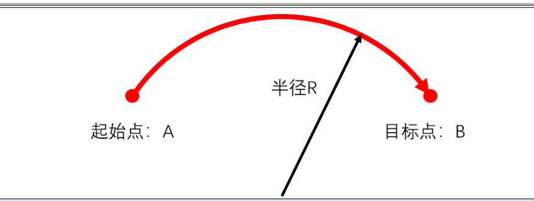

4. 机械臂状态

|Alarm          |   锁定        |锁定状态，不执行运动指令   |
|Home           |   回零        | 机械臂回零中            |
|Run            |   运行        |     机械臂运动中        |
|Hole           |   暂停        |       机械臂暂停中      |
|Idle           |   空闲        |       机械臂待机中      |

5. 归零相关


6. DH参数(六轴)

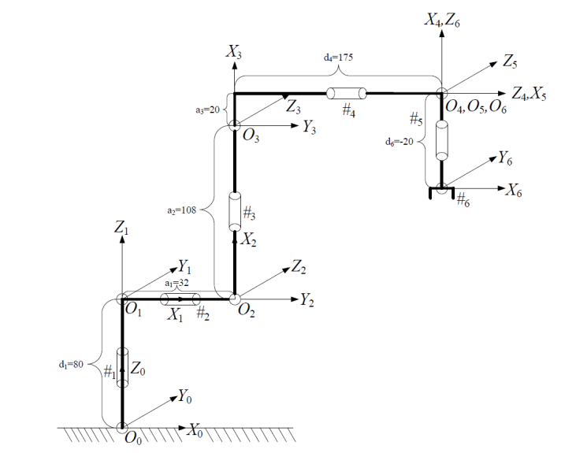

7. 基坐标原点偏移

机械臂原始的坐标原点在圆形底座的正中央，机械臂无法到达，在激光雕刻等软件中，下发坐标是相对于这个原点的，因此使用非常不方便。以下三个偏移量就是调整原点在XYZ坐标轴方向上的偏移量，从而挪动机械臂原点的位置。


默认机械臂第6关节末端法兰盘底面中心点为工具坐标原点，如果安装其他工具，则可以根据需要选取工具上某一点为参考点，并设定其相对于法兰盘中心的XYZ偏移量，则笛卡尔坐标模式下控制的机械臂末端位姿即为该点位姿。
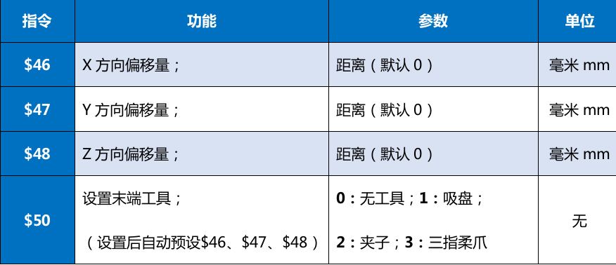

8. 限位

    机械臂运动触发软限位后，机械臂停止运动，此时反方向运动即可解除；
    机械臂触发硬限位后机械臂锁死，需重启机械臂；

9. 校准位置参数

    机械臂归零后运动至初始姿态（大臂直立，小臂水平），规定当前姿态下各轴的位置为0度位置，各轴自触发行程开关的位置运动至当前位置所转过的角度即为校准位置参数。调整校准位置参数时，可观察各轴校准刻度标线是否对齐。第6轴没有行程开关，因此无需校准，默认以上电时的位置为6轴0度位置，如需调整，可通过上位机控制旋转或手动调整。

    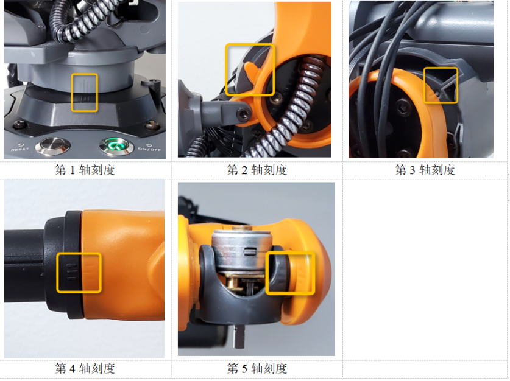

    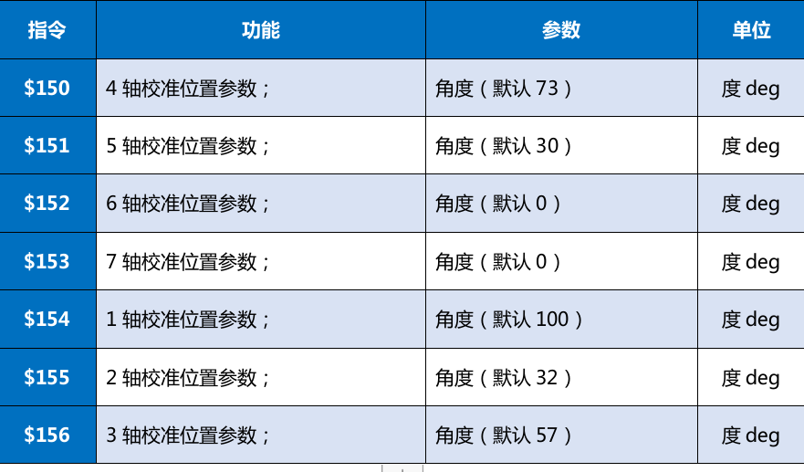

10. 背隙补偿参数

    机械臂各轴减速器等机械结构在运动时存在重复性误差，可通过设置进行补偿.
    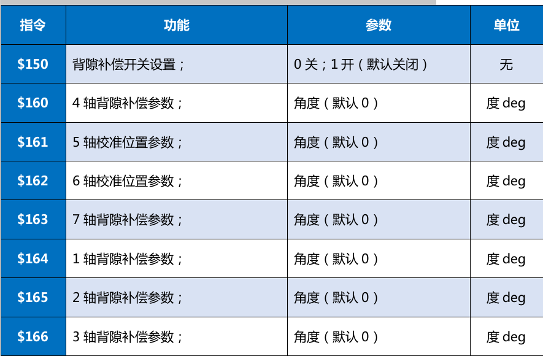


