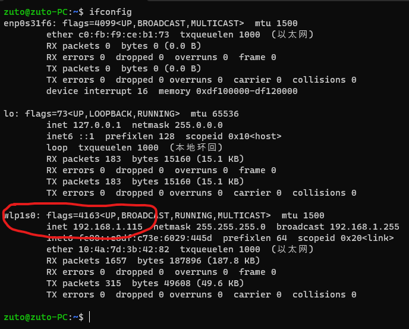

# 快速搭建ROS开发环境

## 前提条件

1. 已安装Ubuntu操作系统

## 设置软件源

```Bash
sudo echo "deb <http://mirrors.ustc.edu.cn/ros/ubuntu> buster main" >> /etc/apt/sources.list.d/ros-latest.list

sudo apt-key adv --keyserver keyserver.ubuntu.com --recv-keys 16126D3A3E5C1192

sudo apt-get update

```

## 安装ROS相关包 （以Noetic版本为例）

**ROS 版本与Ubuntu版本相互对应，Ubuntu20.04LTS 对应Noetic 版本ROS**

```Bash
sudo apt-get install ros-noetic-desktop-full
sudo apt-get install python-rosdep python-rosinstall-generator python-wstool python-rosinstall build-essential ros-noetic-serial liborocos-bfl-dev ros-noetic-mbf-msgs ros-noetic-pointcloud-to-laserscan ros-noetic-libuvc-*  ros-noetic-rgbd-launch ros-noetic-usb-cam  ros-noetic-camera-calibration build-essential freeglut3 freeglut3-dev libsfml-dev ros-noetic-nodelet ros-noetic-urdf ros-noetic-xacro ros-noetic-tf ros-noetic-pcl-ros ros-noetic-rosbash ros-noetic-joint-state-publisher ros-noetic-robot-state-publisher ros-noetic-gmapping ros-noetic-rviz ros-noetic-depthimage-to-laserscan ros-noetic-rtabmap-ros python3-wstool python3-rosinstall python3-rosinstall-generator python3-rosdep ros-noetic-laser-scan-matcher ros-noetic-navigation
```

*以上各包安装完毕可以满足绝大多数ROS功能的进一步开发与使用*

## 编译安装noetic版uvc-camera

```bash
git clone https://github.com/libuvc/libuvc.git
cd libuvc
mkdir build && cd build
cmake .. && make -j4
sudo make install
sudo ldconfig

sudo apt install libv4l-dev
mkdir -p /opt/ros/catkin_ws/src
cd /opt/ros/catkin_ws/src/
git clone https://github.com/ros-drivers/camera_umd.git
cd ../
catkin_make
echo "source /opt/ros/catkin_ws/devel/setup.bash" >> ~/.bashrc
```

## 安装VSCode

[VScode 下载地址](https://code.visualstudio.com/download)

## 在VSCode 中安装相关插件

如图所示安装ROS插件，以下各插件均是微软官方插件，请注意Microsoft标识


依次安装CMAKE 、Python 插件


**如需远程开发，请按上述步骤额外安装remoteSSH、remote Explore 插件**

## 安装并配置 VNC

VNC 是类似于向日葵和toDesk的远程桌面共享软件。不同于向日葵和ToDesk，VNC在局域网中使用有着较大的优势。它不受会员限制，比Ubuntu远程桌面响应更快，支持会话保存，支持多开。在远程运行带有图形界面显示的程序时用VNC会非常方便。

- 在Ubuntu20.04上安装并配置VNC Server
  
  首先安装依赖组件

  ```Bash
  sudo apt-get install gnome-session-flashback  tigervnc-standalone-server
  ```
  配置VNCServer

  ```Bash
  #输入vncpasswd 根据提示设置密码
  vncpasswd
  ```

  ```
  #初次运行自动生成配置文件
  # :1代表开启第二个窗口会话，0默认被占用。端口号对应从 5901开始
  vncserver -geometry 1920x1024 -localhost no :1
  ```

  ```
  #关闭开启的vncserver并修改配置文件解决白屏问题
  vncserver -kill 1 #1 对应上面的 :1
  用Vim或nano 打开配置文件并修改
  nano ~/.vnc/xstartup
  ```

  修改xstartup 文件内容如下

```PlainText
#!/bin/sh

unset SESSION_MANAGER
unset DBUS_SESSION_BUS_ADDRESS
export XKL_XMODMAP_DISABLE=1
export XDG_CURRENT_DESKTOP="GNOME-Flashback:GNOME"
export XDG_MENU_PREFIX="gnome-flashback-"
[ -x /etc/vnc/xstartup ] && exec /etc/vnc/xstartup
[ -r $HOME/.Xresources ] && xrdb $HOME/.Xresources
xsetroot -solid grey
vncconfig -iconic &
#gnome-terminal &
#nautilus &
gnome-session --session=gnome-flashback-metacity --disable-acceleration-check &
```

配置修改完成后如需运行vncserver，只需执行如下命令,1920x1080为指定的显示分辨率 :1 可依次往后增加，则对应的端口号为从5901依次往后增加

```Bash
vncserver -geometry 1920x1080 -localhost no :1
```

## 在自己电脑上安装VNCViewer

这里推荐两款VNCViewer,任选其一：

- [RealVNC 的VNCViewer](https://www.realvnc.com/en/connect/download/viewer/)
- [TightVNC](https://www.tightvnc.com/)

以RealVNC 的VNCviewer 为例子通过远程桌面连接Zbot

1.参考上述步骤在Zbot上开启VNCServer
2.查看zbot的局域网ip地址
```Bash
    ifconfig
    #如提示安装net-tools,则先安装net-tools
    sudo apt install net-tools
```


2.打开VNCViewer,按下图配置，输入格式 ip:端口，分割符为英文标点: ,按Enter连接

3.根据提示输入密码进入远程桌面。
