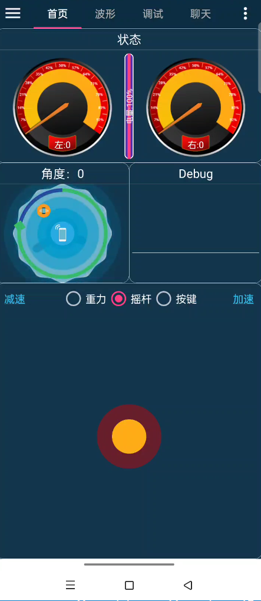
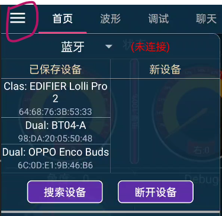
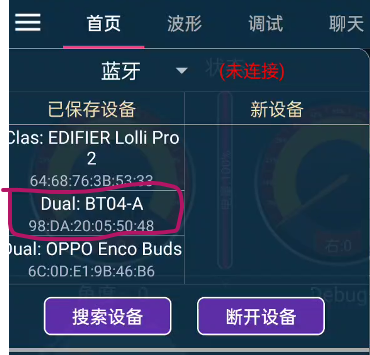
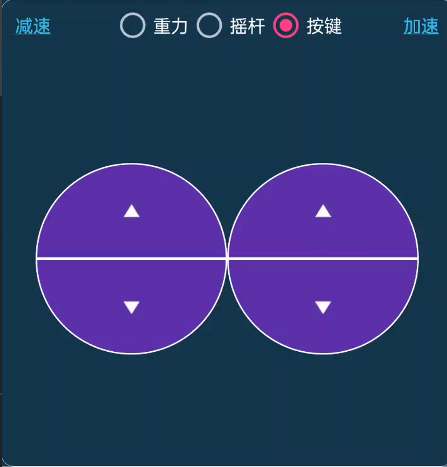
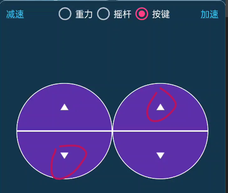

# Zbot 手机APP遥控教程 

Zbot 小车提供APP手机遥控程序，可以完成一些基本功能。

APP主页面如图所示：

上面为状态显示区域，可显示速度，电量，角度和串口调试信息。底部区域为移动控制区域。默认为如图所示的摇杆控制。小车上电后无需启动ROS节点，即可控制。在使用APP各功能之前，请先在菜单栏通过蓝牙配置完成蓝牙配对连接

## APP蓝牙连接
如下图，先点击搜索设备搜索当前区域的蓝牙，

Zbot机器人使用的蓝牙模块为BT04系列。点击即可完成连接。

## APP 遥控方式简介

APP 默认遥控方式为遥感控制。拖拽遥感，小车即可朝向指定方向移动。
在遥控区域上方，可切换遥控方式和增减小车控制速度。如下图切换为按键控制方式。

按键控制时，双手同时按下向上箭头，小车向前行驶。

双手同时按下向下箭头，小车后退。

双手按着左上右下箭头，小车顺时针原地旋转。

双手按着左下右上箭头，小车逆时针原地旋转。

切换为重力控制时，倾斜手机朝向，即可改变小车前进方向。如下图为小车朝向左前方前进

点击右上角隐藏菜单栏，可更改重力灵敏度。

## 参数调试

在APP导航栏选择调试选项卡即可进入参数调试界面。如下图所示。

在调试之前，先点击隐藏菜单栏选择获取参数，来更新串口发送来的最新数据。最好也点击开启实时发送参数，来实时观察小车参数改变后的运行状态。

然后拖动参数项对应的滑条来改变参数数值。
*注：各参数项对应的具体参数与小车驱动底盘对应位发送过来的数据有关。默认参数1：设定目标速度；参数2：PID算法比例环节放大系数Kp，参数3：PID积分积分系数Ki。其余参数项缺省*

在导航栏，选择波形界面，即可查看驱动底盘发送对应数据的变化波形。有关该部分设置需在zbot驱动板程序中自行设置。