# 香橙派使用说明

## 香橙派简介

Orange Pi 5B 采用了瑞芯微 RK3588S 新一代八核 64 位 ARM 处理器，具体为四
核 A76 和四核 A55，采用的三星 8nm LP 制程工艺，大核主频最高可达 2.4GHz，集
成 ARM Mali-G610 MP4 GPU，内嵌高性能 3D 和 2D 图像加速模块，内置高达 6 Tops
算 力 的 AI 加 速 器 NPU ， 拥 有 4GB/8GB/16GB （ LPDDR4/4x ） 内 存 和
32GB/64GB/128GB/256GB 板载 eMMC，具有高达 8K 显示处理能力。

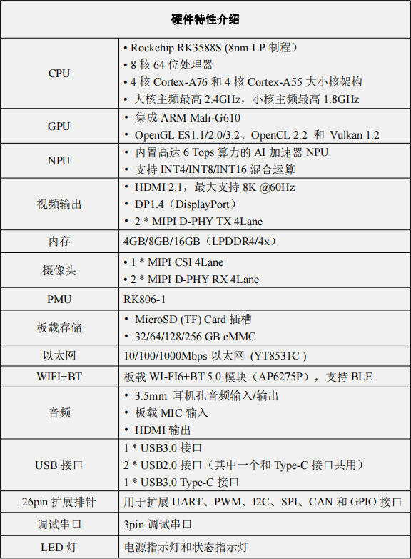

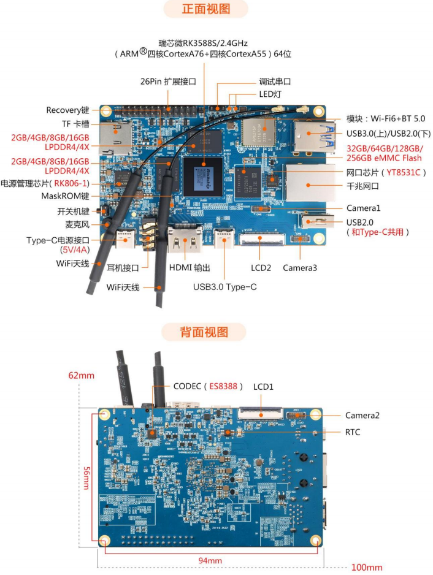

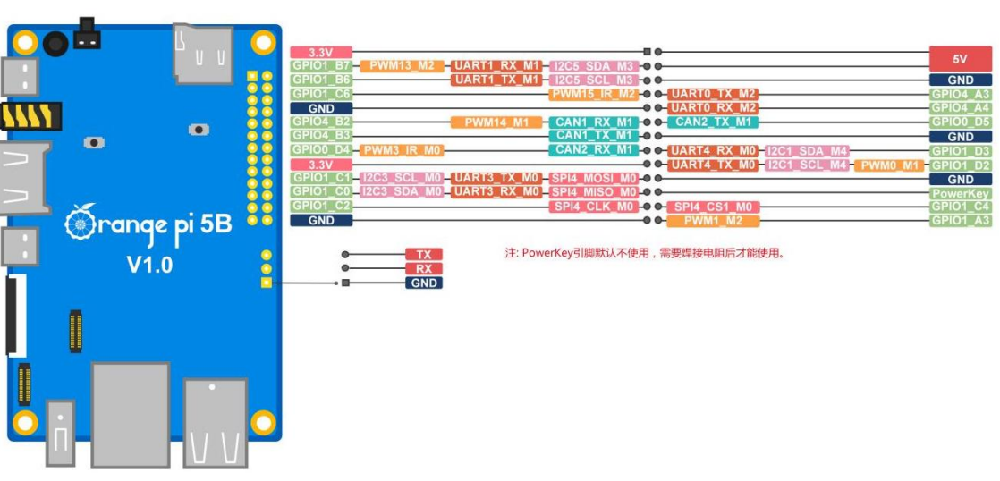

## 将Zbot 客制化镜像烧录到 香橙派EMMC存储芯片中

**所需工具：**

- RKDevTools
  
1. 安装驱动工具：

    用解压软件解压 DriverAssitant_v5.12.zip，再在解压后的文件夹中找到
    DriverInstall.exe 可执行文件并打开即可。点击驱动安装即可完成安装。
    
    

2. 打开RKDevTool 烧录工具
    然后解压 RKDevTool_Release_v2.96.zip，此软件无需安装，在解压后的文件夹
中找到 **RKDevTool** 打开即可.打开 RKDevTool 烧录工具后，因为电脑此时还没有通过 Type-C 线连接上开发
板，所以左下角会提示“没有发现设备”.

3. 通过 Type-C 数据线连接好开发板与 Windows 电脑
    开发板 Type-C 接口的位置如下图所示.确保开发板没有插入 TF 卡，没有连接电源，竖着的白色 USB2.0 接口没有插入 USB 设备。然后按住开发板的 MaskROM 按键不放，MaskROM 按键在开发板的位置如下图所示。
    
    
    然后给开发板接上 Type-C 接口的电源，并上电，然后就可以松开 MaskROM按键了.等待识别到MaskROM设备。如下图所示
    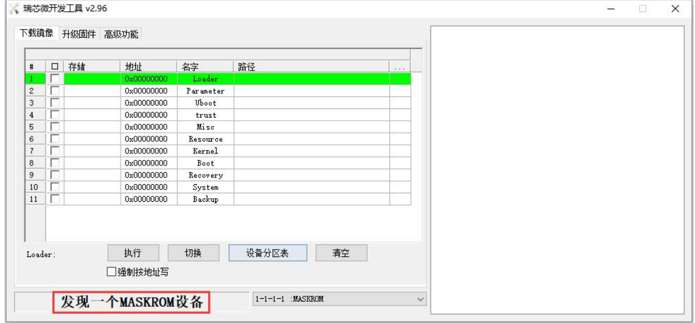

4. 导入emmc配置文件

    然后将鼠标光标放在下面的这片区域中，(boot 路径选项卡上)，点击右键，选择导入配置，然后选择前面下载的 MiniLoader 文件夹中的 rk3588_linux_emmc.cfg 配置文件，再点击打开。然后点击确定，导入配置成功。
    [!导入emmc.cfg](./pics/46.png)
    [!导入emmc.cfg2](./pics/47.png)
    [!导入emmc.cfg3](./pics/48.png)
    [!导入emmc.cfg4](./pics/49.png)
    [!导入emmc.cfg5](./pics/50.png)

5. 导入loader二进制文件

    然后点击下图所示的位置
    
    在打开文件夹中选择MiniLoader 文件夹中 MiniLoaderAll.bin，点击打开
    

6. 下载客制化镜像。
   点击下图位置，在文件管理器中选择要使用的镜像，选择打开,镜像文件扩展名为*.img
   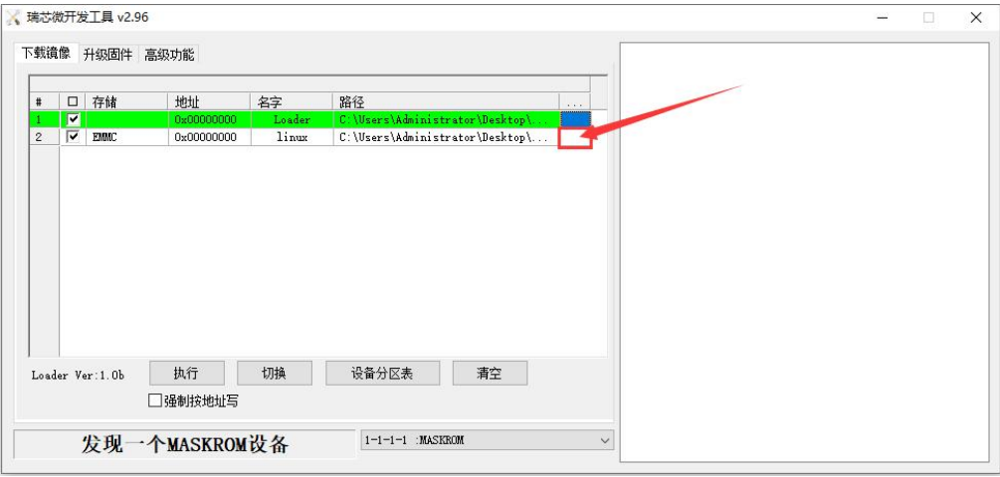
   如下图勾选强制按地址写,点击执行，过程取决于镜像文件大小，耐心等待完成。
   
   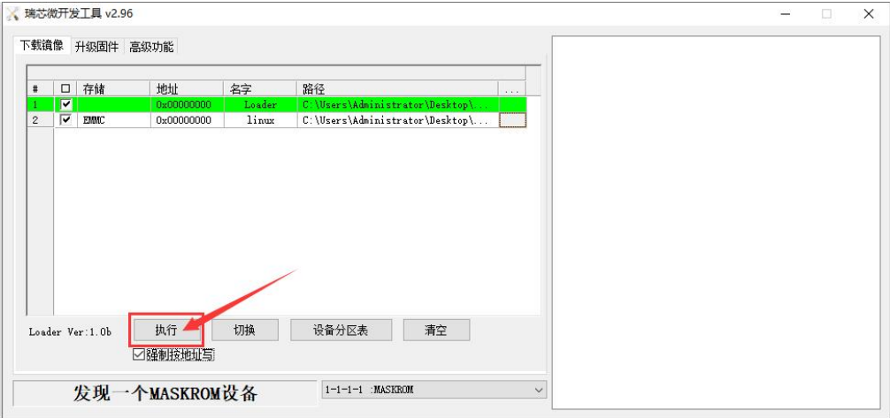

## wifi连接

**请不要通过修改/etc/network/interfaces 配置文件的方式来连接 WIFI，通过这种
方式连接 WIFI 网络使用会有问题。**

当开发板没有连接以太网，没有连接 HDMI 显示器，只连接了串口时，推荐使用此小节演示的命令来连接 WIFI 网络。因为 nmtui 在某些串口软件（如 minicom）中只能显示字符，无法正常显示图形界面。当然，如果开发板连接了以太网或者HDMI 显示屏，也可以使用此小节演示的命令来连接 WIFI 网络的。

1. 先登录 linux 系统，有下面三种方式：

    a. 如果开发板连接了网线，可以通过 ssh 远程登录 linux 系统
    b. 如果开发板连接好了调试串口，可以使用串口终端登录 linux 系统
    c. 如果连接了开发板到HDMI显示器，可以通过HDMI显示的终端登录到linux系统

2. 使用 nmcli dev wifi 命令扫描周围的 WIFI 热点.

```bash
nmcli dev wifi
```


3. 然后使用 nmcli 命令连接扫描到的 WIFI 热点

    wifi_name 需要换成想连接的 WIFI 热点的名字,
    wifi_passwd 需要换成想连接的 WIFI 热点的密码

```bash
nmcli dev wifi connect wifi_name password wifi_passwd
```   

4. 等待连接成功，输出如下提示

    *Device 'wlan0' successfully activated with 'cf937f88-ca1e-4411-bb50-61f402eef293'*

### 桌面版通过图形化连接

1. 点击桌面右上角的网络配置图标（测试 WIFI 时请不要连接网线）


2. 在弹出的下拉框中点击 More networks 可以看到所有扫描到的 WIFI 热点，然后选择想要连接的 WIFI 热点。

3. 在弹窗的对话框中输入WiFi 密码完成连接
   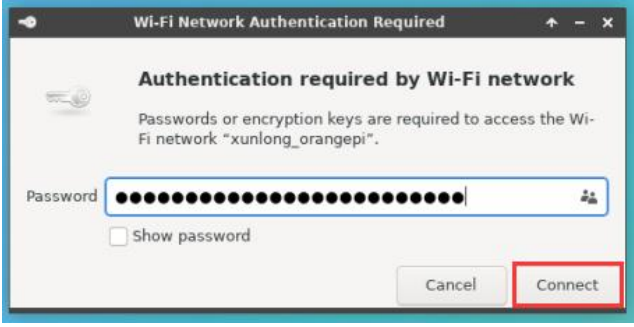 

## 26Pin 接口引脚说明

Orange Pi 5B 开发板 26 pin 接口引脚的顺序请参考下图


下面是 26pin 完整的引脚图:
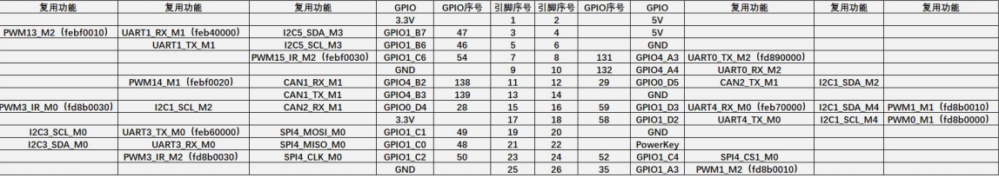
26pin 接口中总共有 16 个 GPIO 口，所有 GPIO 口的电压都是 3.3v

 ### wiringOP 使用控制26Pin IO

 注意，Orange Pi 发布的 linux 镜像中已经预装了 wiringOP，除非 wiringOP 的
代码有更新，否则无需重新下载编译安装，直接使用即可。进入系统后可以运行下 gpio readall 命令，如果能看到下面的输出，说明wiringOP 已经预装并且能正常使用。


*wiringOP 目前主要适配了设置 GPIO 口输入输出，设置 GPIO 口输出高低电平
以及设置上下拉电阻的功能。像硬件 PWM 这样的功能是用不了的.*

### 26pin 接口 GPIO、I2C、UART、SPI 和 PWM 测试

*注意，如果需要设置 overlays 同时打开多个配置，请像下面这样使用空格隔开
写在一行即可。*

```bash
    sudo vim /boot/orangepiEnv.txt
    overlays=i2c1-m2 lcd1 ov13850-c1 pwm13-m2 spi4-m0-cs1-spidev uart0-m2 #写入的配置内容

```

Orange Pi 发布的 linux 系统中有预装一个 blink_all_gpio 程序，这个程序会设
置 26pin 中的所有 16 个 GPIO 口不停的切换高低电平。
运行 blink_all_gpio 程序后，当用万用表去测量 GPIO 口的电平时，会发现 GPIO
引脚会在 0 和 3.3v 之间不停的切换。使用这个程序我们可以来测试 GPIO 口是否能
正常工作。
运行 blink_all_gpio 程序的方式如下所示：

```bash
    sudo blink_all_gpio #需要sudo权限
```

开发板 26pin 中总共有 16 个 GPIO 口可以使用，下面以 7 号引脚——对应 GPIO
为 GPIO1_C6 ——对应 wPi 序号为 2——为例演示如何设置 GPIO 口的高低电平。

 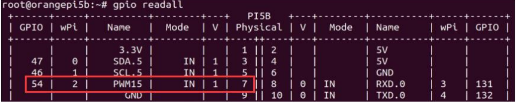
首先设置 GPIO 口为输出模式，其中第三个参数需要输入引脚对应的 wPi 的序号,然后设置 GPIO 口输出低电平，设置完后可以使用万用表测量引脚的电压的数值，
如果为 0v，说明设置低电平成功.

```bash
    gpio mode 2 out
    gpio write 2 0
```

使用 gpio readall 可以看到 7 号引脚的值(V)变为了 0.


#### 26pin GPIO 口上下拉电阻的设置方法
注意，Orange Pi 5B 只有下面 4 个 GPIO 引脚可以正常设置上下拉电阻功能，
其它的 GPIO 引脚因为外部有 3.3V 上拉，所以设置下拉是无效的。


下面以 11 号引脚——对应 GPIO 为 GPIO4_B2 ——对应 wPi 序号为 5——为例
演示如何设置 GPIO 口的上下拉电阻。
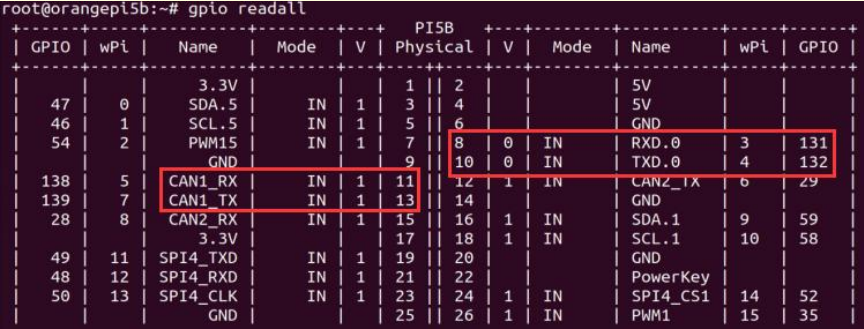
首先需要设置 GPIO 口为输入模式，其中第三个参数需要输入引脚对应的 wPi 的
序号
```bash
#首先需要设置 GPIO 口为输入模式，其中第三个参数需要输入引脚对应的 wPi 的序号
gpio mode 5 in
#设置上拉
gpio mode 5 up
#或者设置下拉
gpio mode 5 down
```

## 26pin 的 UART串口 测试
由下表可知，Orange Pi 5B 可用的 uart 为 uart0、uart1、uart3 和 uart4 共四组 uart
总线。在 linux 系统中，26pin 中的 uart 默认都是关闭的，需要手动打开才能使用。
```
sudo vim /boot/orangepiEnv.txt
overlays=uart0-m2 uart1-m1 uart3-m0 uart4-m0
```
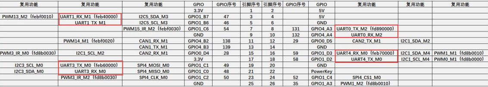
进入 linux 系统后，先确认下/dev 下是否存在对应 uart 的设备节点。uart0、uart1、uart3 和 uart4分别对应
/dev/ttyS0 /dev/ttyS1 /dev/ttyS3 /dev/ttyS4.
可通过如下命令查看是否存在以上设备
```bash
    ls /dev/ttyS*
```


然后开始测试 uart 接口，先使用杜邦线短接要测试的 uart 接口的 rx 和 tx.
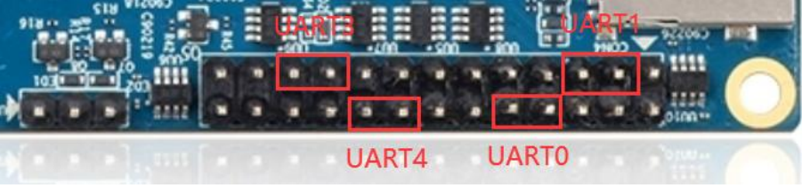
使用 gpio serial 命令测试串口的回环功能如下所示，以串口0为例子，如果能看到下面的打印，说
明串口通信正常.
```bash
    sudo gpio serial /dev/ttyS0
```
出现如下格式的输出说明测试的该串口收发正常。
Out: 0: -> 0
Out: 1: -> 1
Out: 2: -> 2
Out: 3: -> 3
Out: 4: -> 4
Out: 5: -> 5^C


